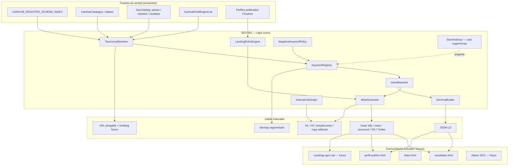

# SEO-001 — Sistema Maestro de Keyword Research / Análisis de Palabras Clave

| Campo | Valor |
|-------|-------|
| **ID** | SEO-001 |
| **Versión** | 1.0.0 |
| **Fecha** | 2026-07-04 |
| **Estado** | Diseño maestro — **sin implementación de código** |
| **Alcance** | Keyword research, taxonomía SEO, metadatos, landings geo+categoría, enlazado interno |
| **Consume** | `OBSERVACION-ARQUITECTONICA-SEO`, `PLAN-MAESTRO-SEO-LANDINGS`, ADR URL canónica, ADR Render Strategy |
| **No redefine** | FieldEngine, RenderEngine, schema de registro, reglas Firebase, capas congeladas |

---

## 0. Objetivo

Diseñar una **capa SEO escalable** para CariHub que cubra las **462 subcategorías**, **15 sectores**, **geo jerárquica** (país → estado → ciudad → zona futura) y **expansión internacional**, sin duplicar fuentes de verdad ni generar thin content.

El sistema debe poder:

1. Inventariar y clasificar keywords (head, long tail, local, negativas).
2. Resolver sinónimos y variantes regionales de forma canónica.
3. Generar automáticamente metadatos on-page y datos estructurados **derivados** de datos publicados.
4. Decidir cuándo crear o indexar una landing SEO automática.
5. Orquestar enlazado interno coherente con la navegación real del producto.

---

## 1. Arquitectura completa

### 1.1 Principio rector

> **SEO = capa transversal de presentación indexable.**  
> Toda keyword, slug, title o schema se **deriva** de: `CARIHUB_REGISTRO_SCHEMA_INDEX` + catálogo geo + perfiles publicados + política de sector.  
> Nunca se almacena HTML libre ni keywords huérfanas que contradigan el schema de registro.

### 1.2 Diagrama de capas



### 1.3 Módulos internos (responsabilidad única)

| Módulo | Responsabilidad |
|--------|-----------------|
| **KeywordRegistry** | Almacén canónico de keywords por entidad (sector, subcategoría, geo, combinación). |
| **TaxonomyResolver** | Resuelve `subcategoriaId` ↔ label ↔ alias ↔ sectorId ↔ slugs. Anti-contaminación entre sectores. |
| **IntentResolver** | Clasifica intención: informacional, comercial, navegacional, transaccional. |
| **MetaGenerator** | Title, meta description, H1, H2, slug, OG, Twitter Cards — plantillas por arquetipo. |
| **SchemaBuilder** | JSON-LD: Person, LocalBusiness, ProfessionalService, FAQ, Review, BreadcrumbList, ItemList, WebSite. |
| **LandingRulesEngine** | Umbral de contenido, thin-content guard, index/noindex, canonical entre variantes. |
| **InternalLinkGraph** | Reglas de enlazado: hub → spoke, geo ↑↓, categoría ↔ resultados, perfil ↔ landing. |
| **NegativeKeywordPolicy** | Lista negativa global y por sector (adultos, spam, PII, términos prohibidos). |
| **GeoSeoMapper** | Combina categoría + país + estado + ciudad en clústeres locales indexables. |
| **HreflangResolver** | (Fase 4) variantes idioma/región. |
| **SeoIAAdvisor** | Sugiere keywords y copy editorial; **requiere aprobación humana** antes de persistir. |
| **IndexationController** | robots, noindex, noarchive (adultos), override admin auditado. |
| **SitemapGenerator** | Segmentos por tipo de superficie; excluye noindex y adultos restringidos. |

### 1.4 Tipos de keyword soportados

| Tipo | Ejemplo | Uso principal |
|------|---------|---------------|
| **Head** | `escorts monterrey`, `restaurantes cdmx` | H1, title corto, landings estado+ciudad |
| **Long tail** | `escort vip hotel san pedro garza garcía` | Meta description, FAQs, filtros indexables limitados |
| **Local compuesto** | `{subcategoría} + {ciudad} + {estado} + {país}` | Landings geo+cat (mayor valor SEO) |
| **Sinónimo / alias** | `cariñosas` → `escort` | Resolución de búsqueda y canonical; no URL duplicada |
| **Variante regional** | `departamento` (CO) vs `estado` (MX) | Copy y H2; slug estable en español neutro |
| **Negativa** | términos ilegales, PII, adultos no permitidos | Exclusión de generación automática |
| **Marca / navegacional** | `carihub`, `cariñosas resultados` | Home, resultados; no competir con perfiles |

### 1.5 Intención de búsqueda (matriz)

| Intención | Señal en CariHub | Superficie | CTA |
|-----------|------------------|------------|-----|
| **Informacional** | "qué es", "cómo", guías | Hub sector, FAQ schema | Explorar categorías |
| **Comercial** | comparar, "mejores", reseñas | Resultados, ItemList | Ver perfiles |
| **Navegacional** | marca, nombre negocio | Perfil publicado | Contactar |
| **Transaccional** | "contratar", "cerca de mí", teléfono | Perfil + LocalBusiness | Registro anunciante |

Cada keyword en el registry lleva `intentPrimary` y opcionalmente `intentSecondary`.

### 1.6 SEO local — combinaciones geo

Jerarquía alineada al geo-picker y catálogos `paises.js` / `estados.js` / `ciudades.js`:

```
País
 └── Estado / Departamento / Provincia
      └── Ciudad / Municipio
           └── (futuro) Zona / Colonia — solo con umbral alto
```

**Clústeres indexables (prioridad):**

1. `{subcategoriaId} + {ciudad} + {estado} + {país}` — máxima prioridad comercial.
2. `{subcategoriaId} + {estado} + {país}` — cuando ciudad no tiene umbral.
3. `{sectorId} + {ciudad}` — hub sectorial local.
4. `{país}` / `{estado}` — hubs geo puros (editorial admin obligatorio).

**Regla:** "Cerca de mí" **no genera URL indexable**; canonical a landing ciudad o ciudad+categoría equivalente.

### 1.7 Métricas por keyword (estimadas)

Cada registro en KeywordRegistry incluye:

| Campo | Origen | Uso |
|-------|--------|-----|
| `volumeEstimate` | IA advisor + import CSV/API futuro | Priorizar landings |
| `difficultyEstimate` | 0–100 heurístico | Decidir long tail vs head |
| `competitionLevel` | low / medium / high | Plan editorial |
| `priorityScore` | f(volume, difficulty, perfilesCount, sectorRevenue) | Cola de landings |
| `lastReviewedAt` | Admin | Caducidad de sugerencias IA |

En fase 1 las métricas pueden ser **manuales o IA-asistidas**; en fase 3 integración con herramientas externas (opcional).

### 1.8 Generación automática de metadatos

Plantillas por **arquetipo de presentación** (`componenteResultados`, `vistaPerfil`, `esAdultoPersona`):

| Artefacto | Fuente de datos | Límites |
|-----------|-----------------|---------|
| **Title** | subcategoría label + geo + marca | ≤ 60 caracteres recomendado |
| **Meta description** | plantilla + USP sector + geo | ≤ 155 caracteres |
| **H1** | label canónico subcategoría (+ geo si aplica) | único por página |
| **H2** | secciones: resultados, cómo funciona, zonas cercanas | 1–3 por landing |
| **Slug** | slugify(subcategoriaId) + slugify(geo) | sin PII; ASCII + guiones |
| **Canonical** | URL estable sin parámetros de sesión | self o padre geo |
| **Open Graph** | title, description, image sectorial moderada | og:image ≥ 1200px |
| **Twitter Card** | `summary_large_image` | mismo pack OG |

**Adultos / LGBT:** previews OG moderados; indexación restringida según política legal; `noarchive` / `nosnippet` donde aplique.

### 1.9 Schema.org por superficie

| Superficie | Schema principal | Condición |
|------------|------------------|-----------|
| Perfil persona | `Person` | `esAdultoPersona === true` |
| Perfil negocio | `LocalBusiness` / `ProfessionalService` | `ResultCardNegocio` |
| Resultados | `ItemList` + `BreadcrumbList` | ≥ 1 perfil o landing con umbral |
| Hub categoría | `WebPage` + `FAQPage` (opcional) | copy editorial aprobado |
| Home | `WebSite` + `SearchAction` | siempre |
| Reseñas futuras | `Review` / `AggregateRating` | solo datos verificados reales |

**Prohibido:** schema con NAP, horarios o ratings que no existan en `camposPublicosPerfil`.

### 1.10 Enlazado interno

| Desde | Hacia | Regla |
|-------|-------|-------|
| Home | Hubs sector + geo popular | Footer + rail categorías |
| Resultados | Perfiles listados | follow |
| Resultados | Padre estado / ciudad | breadcrumb |
| Perfil | Subcategoría + ciudad | contextual |
| Landing geo+cat | Perfiles + landings hermanas | máx 8 enlaces contextuales |
| Landing sin umbral | Padre geo o sector | canonical, no enlaces profundos spam |

`InternalLinkGraph` consume el mismo `TaxonomyResolver` que resultados para evitar enlaces a categorías incorrectas (anti-contaminación).

### 1.11 Reglas de creación automática de páginas SEO

Una landing **se crea y indexa** solo si `LandingRulesEngine` aprueba:

```
indexable = (
  perfilesPublicosCount >= UMBRAL[tipoLanding]
  AND copyEditorialApproved == true (para hubs)
  AND NOT negativeKeywordMatch
  AND NOT adultRestricted(sector, subcategoriaId)
  AND NOT duplicateCanonicalExists
)
```

**Umbrales sugeridos (configurables en Admin):**

| Tipo landing | Umbral mínimo perfiles | Editorial |
|--------------|------------------------|-----------|
| Ciudad + subcategoría | 3–5 | opcional |
| Estado + subcategoría | 5–8 | recomendado |
| Solo subcategoría | 10+ nacional o copy único | obligatorio |
| Solo ciudad | 8+ multi-sector | obligatorio |

Si no alcanza umbral → `noindex` + canonical al padre más cercano con contenido.

### 1.12 Multiidioma e internacional

| Fase | Alcance |
|------|---------|
| **Fase 1–2** | Español (es-MX base); slugs en español neutro |
| **Fase 3** | `es-AR`, `es-CO`, `es-CL`, `es-PE`, `es-UY` — variantes léxicas en KeywordRegistry |
| **Fase 4** | `hreflang` + URLs por locale (`/es-mx/...`, `/es-ar/...`) o subdominio |

Variantes regionales viven en `KeywordRegistry.variants[]` con `locale` y `term`, no en URLs duplicadas sin hreflang.

---

## 2. Estructura de datos

### 2.1 Entidad principal: `SeoKeyword`

```json
{
  "id": "kw_escort_monterrey_nl_mx",
  "type": "local_longtail",
  "intentPrimary": "commercial",
  "intentSecondary": "transactional",
  "term": "escort monterrey",
  "termNormalized": "escort monterrey",
  "locale": "es-MX",
  "variants": [
    { "locale": "es-MX", "term": "cariñosas monterrey", "aliasOf": "escort" }
  ],
  "bindings": {
    "sectorId": "adultos",
    "subcategoriaId": "escort",
    "pais": "México",
    "estado": "Nuevo León",
    "ciudad": "Monterrey"
  },
  "metrics": {
    "volumeEstimate": 2400,
    "difficultyEstimate": 58,
    "competitionLevel": "medium",
    "priorityScore": 72
  },
  "negative": false,
  "status": "approved",
  "source": "schema_derived | ia_suggested | admin_manual | import",
  "canonicalLandingId": "landing_mx_nl_monterrey_escort",
  "updatedAt": "2026-07-04T00:00:00Z"
}
```

### 2.2 Entidad: `SeoLanding`

```json
{
  "id": "landing_mx_nl_monterrey_escort",
  "landingType": "ciudad_subcategoria",
  "slug": "/mexico/nuevo-leon/monterrey/escort",
  "bindings": {
    "sectorId": "adultos",
    "subcategoriaId": "escort",
    "pais": "México",
    "estado": "Nuevo León",
    "ciudad": "Monterrey"
  },
  "indexation": {
    "index": true,
    "follow": true,
    "canonical": "self",
    "thinContentGuard": "passed"
  },
  "content": {
    "h1": "Escorts en Monterrey, Nuevo León",
    "editorialBlocks": [],
    "faqIds": []
  },
  "meta": {
    "title": "...",
    "description": "...",
    "og": {},
    "twitter": {}
  },
  "schemaTypes": ["ItemList", "BreadcrumbList"],
  "perfilesCount": 12,
  "keywordIds": ["kw_escort_monterrey_nl_mx"],
  "approvedBy": "adminUid",
  "approvedAt": "..."
}
```

### 2.3 Entidad: `SeoNegativeTerm`

```json
{
  "id": "neg_pii_phone",
  "pattern": "\\d{10}",
  "scope": "global",
  "reason": "pii",
  "action": "block_generation"
}
```

### 2.4 Entidad: `SeoMetaTemplate`

Plantillas por `sectorId` + `landingType` + `intentPrimary`:

```json
{
  "id": "tpl_restaurantes_ciudad_commercial",
  "sectorId": "restaurantes",
  "landingType": "ciudad_subcategoria",
  "intentPrimary": "commercial",
  "title": "{{subcategoria}} en {{ciudad}}, {{estado}} | CariHub",
  "description": "Encuentra {{subcategoria}} en {{ciudad}}. {{perfilesCount}} opciones verificadas. Explora en CariHub.",
  "h1": "{{subcategoria}} en {{ciudad}}",
  "ogImagePolicy": "sector_banner"
}
```

### 2.5 Índices Firestore propuestos (futuro)

| Colección | Índices compuestos |
|-----------|-------------------|
| `seo_keywords` | `bindings.subcategoriaId` + `bindings.ciudad` |
| `seo_keywords` | `status` + `metrics.priorityScore` DESC |
| `seo_landings` | `bindings.sectorId` + `indexation.index` |
| `seo_landings` | `slug` UNIQUE |

### 2.6 Relación con schema de registro

Cada fila de `CARIHUB_REGISTRO_SCHEMA_INDEX.byId` genera **automáticamente** (derivación, no duplicación):

- 1 keyword head: `subcategoria` (label público).
- N keywords local: producto cartesiano con geo **activo** (países con catálogo cargado).
- Aliases desde `CariHubCatalogos.aliases`.
- `sectorId`, `componenteResultados`, `esAdultoPersona` → plantilla meta y schema.

---

## 3. Integración con la arquitectura actual de CariHub

### 3.1 Mapa de consumo

| Componente actual | Integración SEO-001 |
|-------------------|---------------------|
| `CARIHUB_REGISTRO_SCHEMA_INDEX` | Fuente canónica subcategoría → sector → render |
| `CariHubFieldEngineLite` | `presentacionDeCategoria`, anti-contaminación |
| `CariHubCatalogos` | Aliases keyword (`cariñosas` → `escort`) |
| `carihub-resultados-sector.js` | Tema, banners, `data-sector`, LGBT — meta OG por sector |
| `resultados-demo.js` → `segmentosBusquedaSeo` | Prototipo de segmentos geo+cat para title/H1 |
| `carihub-public-render-lite.js` | Datos públicos tarjeta → no leakage a meta |
| Geo (`carihub-geo-picker.js`, catálogos) | Misma jerarquía que `GeoSeoMapper` |
| `banner-resultados-principales.js` | Imágenes OG sectoriales existentes |
| `PLAN-MAESTRO-SEO-LANDINGS` | Landings tipadas — SEO-001 alimenta contenido y keywords |
| RenderEngine (futuro) | `MetaGenerator` + `SchemaBuilder` en snapshot SSR/SSG |
| Admin (futuro) | Aprobación IA, indexación manual, thin content |

### 3.2 Flujo resultados (estado actual → objetivo)

```
URL: resultados.html?categoria=&pais=&estado=&ciudad=
         ↓
TaxonomyResolver → subcategoriaId, sectorId
         ↓
MetaGenerator → <title>, <meta description>, canonical
         ↓
SchemaBuilder → BreadcrumbList + ItemList (si hay perfiles)
         ↓
Render lista o mensaje vacío (misma shell — sin pantalla dedicada)
```

### 3.3 URLs amigables (transición)

| Hoy | Canónico futuro |
|-----|-----------------|
| `resultados.html?categoria=Antro+%2F+Restaurant+Bar+LGBT&pais=Perú` | `/peru/escort-gay` o `/peru/lima/antro-restaurant-bar-lgbt` |
| `perfil-publico.html?id=` | `/perfil/{perfilId}/{slug}` |

Durante migración: **301** de query a slug; `canonical` en query hasta completar hosting rewrite.

### 3.4 Qué NO toca SEO-001

- Blocks de registro, `mapToPerfil`, persistencia privada.
- Dashboard rentero, mensajes, datos INE/fiscales.
- Pink sheen / temas visuales (solo consume imágenes para OG).
- Inventario `sin_resultados_*` como **producto publicitario** (ortogonal a indexación).

---

## 4. Plan de implementación por fases

### Fase 0 — Fundaciones (2–3 semanas)

- [ ] Aprobar SEO-001 y registrar en MPS.
- [ ] Definir `SeoMetaTemplate` mínimo para `resultados.html` y `perfil-publico.html`.
- [ ] `robots.txt` + `sitemap.xml` estático con URLs actuales.
- [ ] Canonical y meta description dinámicos en resultados (cliente; preparar contrato para RenderEngine).
- [ ] Extender `segmentosBusquedaSeo` → `MetaGenerator.generateForResultados(Q)`.

**Entregable:** resultados con title/description/canonical correctos por categoría+geo.

### Fase 1 — Keyword Registry estático (3–4 semanas)

- [ ] Generar `seo-keywords-index.json` derivado de schema index + geo MX, UY, CL, CO, PE, AR, BR.
- [ ] Importar aliases de `catalogos-carihub.js`.
- [ ] Clasificar intent por sector (tabla configuración).
- [ ] NegativeKeywordPolicy v1 (lista global).
- [ ] QA gate: ninguna keyword de mascotas contamina adultos.

**Entregable:** archivo versionado en repo + script de regeneración en CI.

### Fase 2 — Metadatos y Schema en perfiles (4–6 semanas)

- [ ] MetaGenerator para perfil público según `componenteResultados`.
- [ ] SchemaBuilder: Person vs LocalBusiness.
- [ ] OG/Twitter desde imagen pública moderada del perfil.
- [ ] BreadcrumbList en resultados y perfil.
- [ ] Política adultos: noindex subset + OG moderado.

**Entregable:** Rich Results válidos en perfiles no restringidos.

### Fase 3 — Landings geo+categoría (6–10 semanas)

- [ ] LandingRulesEngine + ThinContentGuard.
- [ ] Firestore `seo_landings` + Admin aprobación.
- [ ] Rutas amigables + Firebase Hosting rewrites.
- [ ] Sitemap segmentado (perfiles, landings, hubs).
- [ ] InternalLinkGraph en landings y resultados.
- [ ] Cola SeoIAAdvisor (sugerencias long tail — aprobación humana).

**Entregable:** primeras 50 landings ciudad+subcategoría con umbral en MX.

### Fase 4 — Escala internacional (continuo)

- [ ] Variantes `es-AR`, `es-CO`, etc. en KeywordRegistry.
- [ ] hreflang + plantillas localizadas.
- [ ] Integración opcional volumen/dificultad (API externa).
- [ ] FAQ schema en hubs sectoriales.
- [ ] Review schema solo con moderación verificada.

**Entregable:** expansión país a país sin reescribir arquitectura.

---

## 5. Riesgos y conflictos accionables

| Nivel | Riesgo | Mitigación |
|-------|--------|------------|
| **Bloqueador** | URLs query-param indexadas con contenido duplicado | Canonical agregado en Fase 0; 301 en Fase 3 |
| **Bloqueador** | Anti-contaminación SEO (veterinaria → escort) | `TaxonomyResolver` obliga `subcategoriaId` canónico; mismo contrato que `esBusquedaAdulta` |
| **Importante** | Thin content en landings geo automáticas | `LandingRulesEngine` + umbral mínimo; noindex por defecto |
| **Importante** | CSR sin snapshot — crawlers sin meta | Contrato RenderEngine; prerender mínimo en Fase 0 para resultados |
| **Importante** | Adultos indexados indebidamente | Política sector `adultos` + LGBT en `IndexationController`; revisión legal |
| **Importante** | IA genera keyword stuffing | SeoIAAdvisor solo sugiere; `status: approved` requiere admin |
| **Mejora futura** | 462 × N ciudades = explosión combinatoria | Generación bajo demanda; solo geo con tráfico o perfiles |

---

## 6. Anexos

### A. Convención de slugs

```
slugify(subcategoriaId) → "antro-restaurant-bar-lgbt"
slugify(geo) → "nuevo-leon", "monterrey", "peru"
Ruta: /{pais}/{estado}/{ciudad}/{subcategoria-slug}
```

### B. Campos mínimos para QA SEO por PR

- [ ] `subcategoriaId` resuelve al sector correcto.
- [ ] Title único por URL.
- [ ] Canonical presente.
- [ ] Sin PII en slug.
- [ ] Schema no afirma datos no publicados.

### C. Documentos relacionados

- `scripts/OBSERVACION-ARQUITECTONICA-SEO.md`
- `scripts/PLAN-MAESTRO-SEO-LANDINGS.md`
- `scripts/SPEC-SEO-LANDINGS.md`
- `public/js/data/registro-schema-index.js`

---

*SEO-001 v1.0.0 — diseño maestro. Siguiente paso autorizado: Fase 0 (metadatos resultados) sin expandir scope.*
