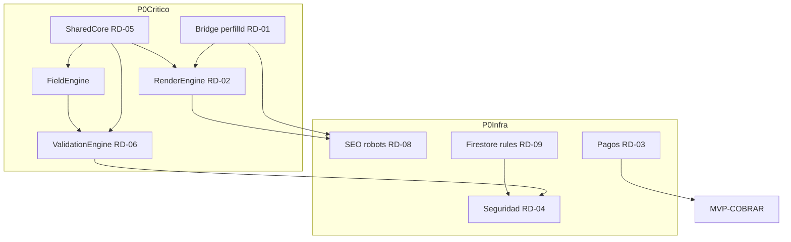

# Acta de evaluación — P0 Runtime Foundation CariHub/Cariñosas

| Campo | Valor |
|-------|-------|
| **Versión acta** | 1.0.0 |
| **Fecha** | 2026-06-11 |
| **Estado** | **EVALUACIÓN READINESS** |
| **Tipo** | Readiness sin autorización runtime |
| **Veredicto** | **PARCIALMENTE, 72%** |
| **Modo** | Solo documentación — **sin runtime/Firestore/deploy/commit; no modifica documentos existentes** |

Canónico: [`ACTA-CONGELAMIENTO-P0-RUNTIME-FOUNDATION.json`](./ACTA-CONGELAMIENTO-P0-RUNTIME-FOUNDATION.json)

---

## Propósito

Determinar si CariHub/Cariñosas posee **suficiente arquitectura aprobada y congelada** para iniciar construcción real de la fase **P0 Runtime Foundation**.

**Este acta NO autoriza runtime.** Certifica readiness documental únicamente. La autorización de implementación requeriría un acta operacional futuro separado.

### Fuentes evaluadas

- [`AUDITORIA-MAESTRA-CARIHUB.json`](./AUDITORIA-MAESTRA-CARIHUB.json)
- [`MATRIZ-MADUREZ-CARIHUB.json`](./MATRIZ-MADUREZ-CARIHUB.json)
- [`MATRIZ-DEPENDENCIAS-CARIHUB.json`](./MATRIZ-DEPENDENCIAS-CARIHUB.json)
- [`ROADMAP-MAESTRO-CARIHUB.json`](./ROADMAP-MAESTRO-CARIHUB.json)
- [`MATRIZ-MVP-CARIHUB.json`](./MATRIZ-MVP-CARIHUB.json)
- [`ANALISIS-REVISION-MVP-DASHBOARD.json`](./ANALISIS-REVISION-MVP-DASHBOARD.json)
- **10 actas** ACTA-CONGELAMIENTO-* + [`ACTA-MIGRACION-USUARIOS-PERFILES.json`](./ACTA-MIGRACION-USUARIOS-PERFILES.json)
- **3 ADRs**

---

## Veredicto explícito

**¿Tenemos suficiente arquitectura aprobada para comenzar construcción?**

### Parcialmente, 72%

| Sub-área | Respuesta | % |
|----------|-----------|---|
| Motores congelados (SC, FE, VE, RE) | **SÍ** | 86 |
| Infraestructura P0 (MIG, SEO, SEC, CAT, CU) | **PARCIALMENTE** | 65 |
| MVP-OPERAR completo | **PARCIALMENTE** | 68 |
| Capas excluidas MVP (social, i18n) | **NO REQUERIDO** | — |

**Motores:** diseño PASS, fixtures golden, auditorías completas — **listos para construcción documental**.

**Gaps:** Pagos y Registro sin SPEC formal; panel dashboard mínimo sin SPEC; migración y Firestore rules sin runtime.

---

## Evaluación global (%)

| Dimensión | % | Notas |
|-----------|---|-------|
| Arquitectura documental | **76** | AUDITORIA-MAESTRA |
| Arquitectura congelada (global) | **45** | 10/22 dominios |
| Arquitectura congelada (alcance P0) | **82** | Capas P0 + migración auditada |
| Especificaciones | **62** | 8 SPECs / 13 dominios MVP |
| Seguridad | **53** | 80% diseño / 25% runtime |
| SEO | **53** | 90% diseño / 15% runtime |
| Dashboards | **53** | 70% diseño / 35% P0-ready |
| Pagos | **45** | Plan + schemas |
| Banners | **50** | Plan + prod parcial |
| Interacciones | **35** | Fuera P0 |
| Agentes IA | **55** | Fuera P0 |
| Economía Social | **40** | Excluido MVP |
| Internacionalización | **15** | Excluido MVP |
| Runtime Foundation | **57** | 74% diseño / 18% implementado |

---

## Preparación para construcción

| Métrica | % |
|---------|---|
| **Listo para construcción P0** | **72** |
| Pendiente documentación | 18 |
| Pendiente especificación | 22 |
| Pendiente validación | 12 |
| Pendiente implementación | 92 |

**Fórmula global P0:** engines congelados 40% + deps P0 30% + MVP doc 20% + migración diseño 10% ≈ **72%**

**Pendiente documentación:** SPEC Registro, SPEC Pagos, SPEC panel dashboard mínimo, plan adopción física Shared/Core.

---

## Análisis por capa (resumen)

| Capa | % | Estado | Riesgo | Bloqueador principal |
|------|---|--------|--------|----------------------|
| Shared/Core | 88 | CONGELADO | medio | BLK-08 extracción |
| RenderEngine | 84 | CONGELADO | medio | BLK-01 MIG, BLK-03 deploy |
| FieldEngine | 86 | CONGELADO | medio | SPOF snapshot |
| ValidationEngine | 88 | CONGELADO | medio | rules server |
| Seguridad MVP | 53 | CONGELADO diseño | **alto** | BLK-05, BLK-10 |
| SEO-Landings | 53 | CONGELADO | **alto** | BLK-04, BLK-06 |
| Catálogo | 85 | CONGELADO | medio | SPOF runtime |
| Cuentas | 70 | CONGELADO | **crítico** | BLK-01 perfilId |
| Migración | 70 | AUDITADO diseño | **crítico** | BLK-01 runtime |
| Dashboards | 53 | CONGELADO shell | medio | Panel mínimo sin SPEC |
| Registro-Cuenta | 55 | PLAN | **alto** | Sin SPEC |
| Pagos-Contratos | 45 | PLAN | **crítico** | BLK-02, sin SPEC |
| Banners | 50 | PLAN+parcial | medio | Pasarela V1.1 |
| Admin | 60 | PLAN+parcial | alto | BLK-07 RBAC |
| App Pública | 40 | PLAN+monolito | **crítico** | BLK-04 client-side |
| Messenger | 75 | CONGELADO fuera P0 | bajo | Esperar V1.1 |
| Interacciones / Social / i18n | 37 | PLAN fuera P0 | bajo | Excluido MVP |

Detalle completo en JSON sección `analisisPorCapa`.

---

## Bloqueadores reales

### Impide comenzar (total o parcial)

- **BLK-01** — Migración perfilId sin runtime (crítico)
- **GAP-SPEC-REG** — Registro sin SPEC (alto)
- **GAP-SPEC-PAY** — Pagos sin SPEC (alto)
- **BLK-04** — Resultados client-side (crítico)
- **BLK-05** — Firestore rules desalineadas (alto)

### Puede construirse hoy (diseño listo)

- ValidationEngine server-side (88%)
- FieldEngine wizard runtime (86%)
- RenderEngine renderHead (84%)
- Shared/Core extracción mínima (88%)
- Fixtures golden CI (6 archivos)
- robots.txt/sitemap estático (85%)
- Turnstile gates config (80%)

### Debe esperar

- Messenger, shell dashboard completo → **V1.1**
- Economía Social, propinas, red contactos → **V1.2**
- i18n, cripto, landings dinámicas → **V2.0+**

---

## Alcance P0 — readiness por ítem (ROADMAP)

| ID | Ítem | Readiness | Estado |
|----|------|-----------|--------|
| RD-01 | Bridge perfilId | 70% | AUDITADO |
| RD-02 | RenderEngine head | 84% | CONGELADO |
| RD-03 | Pasarela pagos | 45% | PLAN |
| RD-04 | Seguridad gates | 80% | CONGELADO |
| RD-05 | Shared/Core extracción | 88% | CONGELADO |
| RD-06 | VE server-side | 88% | CONGELADO |
| RD-07 | Resultados server-side | 75% | SPEC SEO |
| RD-08 | robots + sitemap | 90% | CONGELADO |
| RD-09 | Firestore rules | 55% | PARCIAL |
| RD-10 | Slug canónico | 80% | ADR+SEO |

---

## Recomendación final — 6 preguntas

| # | Pregunta | Respuesta | % |
|---|----------|-----------|---|
| 1 | ¿Listos para estructura física (carpetas/módulos)? | **PARCIALMENTE** | 58 |
| 2 | ¿Listos para modelos reales Firestore? | **PARCIALMENTE** | 55 |
| 3 | ¿Listos para ValidationEngine real? | **SÍ** | 88 |
| 4 | ¿Listos para FieldEngine real? | **SÍ** | 86 |
| 5 | ¿Listos para RenderEngine real? | **SÍ** | 84 |
| 6 | ¿Listos para implementación MVP completa? | **PARCIALMENTE** | 68 |

**Preparación global estimada para construcción: 72%**

### Secuencia P0 recomendada

1. Bridge perfilId (RD-01)
2. Shared/Core extracción (RD-05)
3. FieldEngine + ValidationEngine server (RD-06)
4. RenderEngine head + resultados server-side (RD-02, RD-07)
5. Firestore rules + Seguridad gates (RD-09, RD-04)
6. SEO robots/sitemap + slug (RD-08, RD-10)
7. Pasarela pagos + panel `/cuenta/perfil` mínimo (RD-03)
8. SPEC Registro/Pagos (paralelo, acelera pero no bloquea engines)

---

## MVP acordado (referencia)

Excluido correctamente del P0: Economía Social, Propinas, Cripto, Lives, Stories, Red contactos, IA avanzada, i18n, Marketplace.

- **MVP-COBRAR:** 14–17 sem (beta privada)
- **MVP-OPERAR:** 18–24 sem (panel mínimo obligatorio)

Ver [`MATRIZ-MVP-CARIHUB.json`](./MATRIZ-MVP-CARIHUB.json) y [`ANALISIS-REVISION-MVP-DASHBOARD.json`](./ANALISIS-REVISION-MVP-DASHBOARD.json).

---

## Validación acta

| Check | Resultado |
|-------|-----------|
| 10 actas congelamiento referenciadas | PASS |
| ACTA-MIGRACION referenciada | PASS |
| 3 ADRs coherentes | PASS |
| Fixtures golden engines | PASS |
| Runtime NO autorizado | PASS |
| Porcentajes con fórmula | PASS |
| **Total** | **14/14 PASS** |

---

## Restricciones cumplidas

- Solo 2 archivos nuevos en `scripts/`
- No modifica PLAN/SPEC/ADR/ACTA/anexos/auditorías existentes
- No runtime, carpetas, mover, Firestore, producción, deploy, commit
