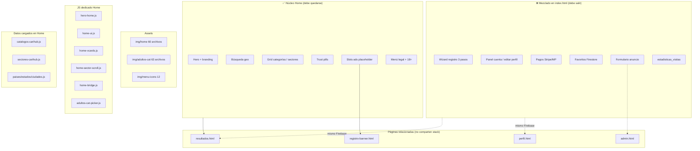

# Análisis profundo — ecosistema Home CariHub

| Campo | Valor |
|-------|-------|
| **Versión** | 1.0.0 |
| **Fecha** | 2026-06-09 |
| **Alcance** | Todo el proyecto — Home y dependencias |
| **Archivos de código** | **No modificados** |

Canónico: [`ANALISIS-HOME-ECOSISTEMA.json`](./ANALISIS-HOME-ECOSISTEMA.json)

Referencia modular: [`OBSERVACION-ARQUITECTONICA-MODULARIZACION-APLICACIONES.json`](./OBSERVACION-ARQUITECTONICA-MODULARIZACION-APLICACIONES.json)

---

## Resumen ejecutivo

**Home hoy es un monolito:** `index.html` (~2.200 líneas) + ~1.330 líneas de JavaScript inline + 8 módulos JS + 5 hojas CSS + **Firebase completo** (Auth, Firestore, Storage).

El diseño nuevo (mockup v4) convive con el **runtime legacy** embebido: registro con INE, panel de cuenta, pagos, favoritos y solicitudes de publicidad viven en la misma página que el hero y el buscador.

**Estimación:** el **55–65%** del bundle actual **no debería pertenecer a Home** según el plano modular P0.

---

## Mapa del ecosistema Home

---

## Inventario completo

### HTML

| Archivo | Rol |
|---------|-----|
| `public/index.html` | **Home producción** — monolito |
| `public/index-legacy.html` | Backup pre-`migrate-home.mjs` |
| `tmp/preview/v3/home-html-real-mockup-v4.html` | Origen diseño |

### CSS (5 archivos)

| Archivo | ~Líneas | Rol |
|---------|---------|-----|
| `public/css/home.css` | 3.483 | Shell, hero, layout, breakpoints |
| `public/css/home-vcards.css` | — | Tarjetas categoría/sector |
| `public/css/home-sector-scroll.css` | — | Scroll animado sectores |
| `public/css/home-modals.css` | — | Modales legacy `.modal` |
| `public/css/home-adultos-cat-picker.css` | — | Picker adultos premium |

### JavaScript

| Archivo | Rol |
|---------|-----|
| `hero-home.js` | Datos slides → `CARIHUB_HERO_SLIDES` |
| `home-ui.js` | Carousel, slots, sectores, rotación ads |
| `home-vcards.js` | Plantillas visuales (6 templates) |
| `home-sector-scroll.js` | Animación scroll |
| `home-bridge.js` | Puente UI nueva ↔ funciones inline |
| `adultos-cat-picker.js` | Modal categorías adultos |
| `catalogos-carihub.js` | ~34 categorías home |
| `sectores-carihub.js` | 15 sectores |
| `sector-scroll-data.js` | Items por sector |
| `categoria-iconos.js` | Iconos |
| `paises.js` / `estados.js` / `ciudades.js` | Geo |
| **Inline en index.html** | ~1.330 líneas — auth, registro, panel, favoritos, anuncios |

**No cargados en Home:** `precios-publicidad.js`, `banner-inventario-rotacion.js` (solo `registro-banner.html`).

### Videos

**Ninguno** en el ecosistema Home — solo imágenes estáticas.

### Imágenes

| Carpeta | Archivos | Uso |
|---------|----------|-----|
| `public/img/home/` | 60 | Logos, heroes, sectores, banners promo |
| `public/img/adultos-cat/` | 63 | Picker categorías adultos |
| `public/img/menu-icons/` | 12 | Menú lateral |

### Fuentes externas

7 familias Google Fonts (Allura, Great Vibes, Italianno, Montserrat, Pinyon Script, Sacramento).

---

## Firebase, Firestore y Storage

| Recurso | Uso en Home | Módulo correcto |
|---------|-------------|-----------------|
| `usuarios/{uid}` | Registro, panel, edición | Registro / Dashboards |
| `usuarios/{uid}/favoritos` | CRUD favoritos | Interacciones / Cuenta |
| `solicitudes_anuncios` | Formulario anuncio | Banners |
| `estadisticas_visitas` | Write en cada `load` | Analytics / Admin |
| Storage `perfiles/`, `verificaciones/` | Registro y edición | Registro / Dashboards |

**Auth:** email/password, **signInAnonymously** automático en `onAuthStateChanged` para favoritos.

**Pagos:** links Stripe y Mercado Pago hardcoded en inline script.

---

## localStorage

| Clave | Uso |
|-------|-----|
| `carihub_acceso_ok` | Puerta 18+ (checkboxes) — sin expiración, sin verificación real |

---

## Modales: dos sistemas conviviendo

### Sistema nuevo (`home-modal`)

Trust (verificados, privacidad, mensajes, favoritos info), copy registro, búsqueda avanzada, pickers sectores/categorías.

### Sistema legacy (`.modal`)

| Modal | Contenido | ¿Debe estar en Home? |
|-------|-----------|----------------------|
| `modalAntiBot` | 18+ | Sí (concepto) |
| `modalSelector` | País/estado/ciudad | Sí |
| `modalRegistro` | **Wizard 3 pasos + INE** | **No** → `/registro` |
| `modalMiPerfil` / `modalPanel` / `modalEditar` | **Cuenta completa** | **No** → `/cuenta` |
| `modalFavoritos` | **CRUD Firestore** | **No** |
| `modalAnuncio` | **Solicitud publicidad** | **No** → `/anuncios` |
| `modalContacto` / `modalDenuncia` | WhatsApp admin | Parcial (liviano OK) |
| `modalLegal` | Textos legales | Mejor `/legal/*` |

---

## Navegación y dependencias cruzadas

| Destino | Desde Home | Comparte stack visual |
|---------|------------|------------------------|
| `resultados.html?categoria&pais&estado&ciudad` | Buscar ahora | **No** — CSS inline Arial |
| `registro-banner.html` | Slots ads, banner inferior | **No** — página propia grande |
| `perfil.html` | No enlazado directo | **No** |
| `admin.html` | No visible | — |

**Inconsistencia de marca:** Home = «Cariñosas»; resultados/perfil = «CariHub».

---

## Qué pertenece a Home vs qué está mezclado

### ✅ Pertenece correctamente

- Hero, buscador, grids categoría/sector, trust pills (copy)
- CTA → resultados
- Slots publicitarios (placeholder)
- Menú legal + soporte WhatsApp
- Puerta 18+ (mejorar implementación)

### ❌ Mezclado incorrectamente

| Bloque | Destino modular |
|--------|-----------------|
| Wizard registro + INE/selfie | `/registro` |
| Login, panel, editar perfil | `/cuenta` |
| Renovación Stripe/MP | `/cuenta/contratos` |
| Favoritos CRUD | `/cuenta/favoritos` |
| Solicitud anuncio + upload | `/anuncios` |
| `estadisticas_visitas` | Backend / Admin |
| `CATEGORIAS_BUSCADOR` duplicado | Catálogo único |

---

## Producto, negocio y conversión

| Dimensión | Elementos de mayor valor |
|-----------|--------------------------|
| **Usuario** | Hero multi-categoría, búsqueda geo, exploración 15 sectores |
| **Registros** | CTA «Registrarse», primer mes gratis — **pero** wizard en modal alarga fricción |
| **Conversiones** | «Buscar ahora» → resultados (flujo principal sano) |
| **SEO** | H1 hero, meta description — **falta** landings, OG, schema |
| **Monetización** | Slots `home-ad`, hero `home_hero_1..5` preparados; rentals vacíos |
| **Anunciantes** | Enlaces `registro-banner.html`, modal anuncio en home |
| **Perfiles** | Vcards con fotos por categoría — **falta** teaser perfiles reales |
| **Negocios** | Sectores spa, antros, moteles en grid |

---

## Rendimiento y escalabilidad

### Riesgos rendimiento

- Firebase Auth + Firestore + Storage en visita fría
- 7 fuentes Google + ~123 imágenes referenciables
- `home.css` ~3.483 líneas (incluye reglas `proto-*` de mockup)
- Hero carousel interval 4.5s
- Write Firestore en cada carga (`estadisticas_visitas`)

### Riesgos escalabilidad

- Imposible desplegar Home sin wizard/pagos
- Inline JS no versionable por módulo
- Catálogo home (~34 cat.) vs diseño 462 subcategorías
- Migración `usuarios→perfiles` romperá favoritos y panel embebido

---

## UX / UI y móvil

**Fortalezas:** jerarquía clara, aria-labels, picker adultos diferenciado.

**Debilidades:**

- Doble sistema modal — estilos inconsistentes
- `home-modals.css` usa `--rosa` **no definido** en `home.css` (hallazgo Bugbot)
- «Buscar cerca» solo muestra `alert` — no pre-llena ciudad
- Favoritos prometidos pero auth anónima puede fallar
- Animaciones sparkles + scroll sector — posible jank móvil

---

## SEO

| Presente | Ausente |
|----------|---------|
| `<title>`, `<meta description>` | canonical, Open Graph, Twitter Card |
| H1 en hero (rotativo) | schema.org, sitemap, landings `/s/:slug` |

---

## Observaciones por capa futura

| Capa | Observación |
|------|-------------|
| **RenderEngine** | `home-vcards.js` es prototipo de tarjetas dinámicas; unificar con resultados/perfil vía snapshot |
| **ThemeEngine** | `data-tema=escort` fijo; templates vcard (neon/bloom/…) anticipan skins futuras |
| **Interacciones** | Favoritos + pill «mensajes» deben salir de home; conflicto anonymous vs Messenger auth |
| **IA** | `data-agente-context="home"` — hook sin runtime; asistente búsqueda como oportunidad **lazy** |

---

## Oportunidades

| ID | Oportunidad | Impacto |
|----|-------------|---------|
| O-H01 | Bundle público < 200KB JS | Alto |
| O-H02 | Hero banner rentals dinámicos | Monetización |
| O-H03 | Landings SEO desde sectores home | Tráfico |
| O-H04 | Teaser 3 perfiles sin navegar | Conversión |
| O-H05 | Unificar marca Cariñosas/CariHub | Confianza |

---

## Riesgos

| ID | Nivel | Riesgo |
|----|-------|--------|
| R-H01 | Alto | Monolito bloquea modularización P0 |
| R-H02 | Alto | INE/verificación en bundle público |
| R-H03 | Alto | CSS `--rosa` roto en modales |
| R-H04 | Medio | Favoritos anonymous falla |
| R-H05 | Medio | Catálogo home ≠ 462 subcategorías |
| R-H06 | Medio | Peso móvil fonts+firebase+imágenes |
| R-H07 | Medio | Migración perfiles rompe panel/favoritos |

---

## Recomendaciones prioritarias

1. **Congelar contrato núcleo** — lista blanca scripts/modales permitidos en Home
2. **Extraer inline JS** a módulos lazy (sin cambiar UX visible aún)
3. **Firebase defer** — cargar solo al abrir cuenta/registro/anuncio
4. **Corregir tokens CSS** modales legacy
5. **OG + canonical** mínimo
6. **Cablear hero banner slots** a inventory o `registro-banner`

### Mejoras rápidas

- Quitar `signInAnonymously` automático en load
- Preload solo logo + primer hero
- Confirmar y eliminar `plantillaCardPerfil` si está muerto
- Unificar title marca

### Mejoras futuras

- Dynamic import `/cuenta`, `/registro`, `/anuncios`
- Turnstile real (Seguridad MVP diseño)
- Service worker cache estáticos
- A/B CTA registrarse vs buscar

---

## Si yo fuera el arquitecto principal de CariHub

### Agregaría

- Teaser social proof («N perfiles verificados»)
- Enlaces SEO por ciudad/sector
- Lazy Firebase + code splitting
- Inventory dinámico banners
- Footer legal compacto

### Quitaría

- Wizard 3 pasos y `modalPanel` del index
- Stripe/MP del HTML home
- Auth anónima automática
- `CATEGORIAS_BUSCADOR` hardcoded
- CSS `proto-*` muerto en `home.css`
- `estadisticas_visitas` desde cliente

### Movería

| Desde Home | Hacia |
|------------|-------|
| `modalRegistro` | `/registro` |
| `modalMiPerfil` / `modalPanel` / `modalEditar` | `/cuenta` |
| `modalAnuncio` | `/anuncios` o `registro-banner` |
| `modalFavoritos` CRUD | `/cuenta/favoritos` |
| Legales largos | `/legal/*` |

### Dejaría exactamente como está

- Estructura visual mockup v4 (hero → búsqueda → categorías → sectores)
- `home-ui.js` + `hero-home.js` + `home-vcards.js` como núcleo presentación
- Flujo **Buscar → `resultados.html`** con query params
- Enlaces `registro-banner.html` desde slots publicitarios
- `sectores-carihub` + picker adultos
- Puerta 18+ (mejorar, no eliminar)
- `home-bridge.js` hasta tener router formal

---

*Análisis documental — sin modificación de archivos de producción.*
