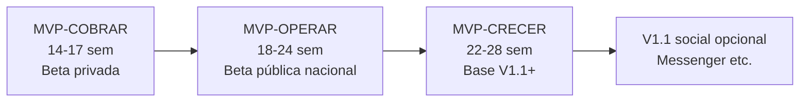

# Revisión MVP — Dashboard mínimo operativo

**Fecha:** 2026-06-11  
**Modo:** Solo análisis — no modifica documentos existentes  
**JSON:** [ANALISIS-REVISION-MVP-DASHBOARD.json](./ANALISIS-REVISION-MVP-DASHBOARD.json)

## Contexto

Confirmación del enfoque: validar primero el negocio principal de Cariñosas (registro → contacto WhatsApp/teléfono → admin). Social, propinas, cripto, lives, stories, red contactos, IA avanzada, i18n y marketplace **fuera del MVP inicial**.

Esta revisión responde si el **dashboard básico del perfil** debe entrar en ese MVP, y si el camino propuesto es realmente el más corto para cobrar.

---

## Hallazgo principal

La clasificación anterior trataba **“Dashboard perfil MVP”** como recomendado V1.1 porque confundía dos cosas distintas:

| Concepto | Qué es | Clasificación revisada |
|----------|--------|------------------------|
| **Panel mínimo operativo** | 1 página `/cuenta/perfil`: widgets lectura + CTAs | **MVP obligatorio** (operar/cobrar en producción) |
| **Shell SPEC-DASHBOARDS completo** | Router `/cuenta`, 11 módulos, EventBus, historial, IA | **Post-MVP V1.1** |

El panel mínimo **no es social** — es operación del negocio principal (estado, plan, pagos, verificación, contacto).

---

## Clasificación por componente (10 capacidades)

| ID | Componente | Clasificación | ¿Puede esperar? | Dónde vive |
|----|------------|---------------|-----------------|------------|
| DM-01 | Editar información | **MVP obligatorio** | No | Registro/Cuenta → `/registro/editar/{perfilId}` |
| DM-02 | Editar fotografías | **MVP obligatorio** | No | Registro/Cuenta (wizard FieldEngine) |
| DM-03 | Estado de aprobación | **MVP obligatorio** | No | Panel dashboard |
| DM-04 | Vigencia del plan | **MVP obligatorio** | No | Panel dashboard |
| DM-05 | Pagos realizados | **MVP obligatorio** | No | Panel dashboard |
| DM-06 | CTA renovación | **MVP obligatorio** | No | Panel dashboard + Pagos |
| DM-07 | Estadísticas básicas | **MVP recomendado** | Sí (V1.1 beta privada) | Panel dashboard |
| DM-08 | Estatus verificación | **MVP obligatorio** | No | Panel dashboard |
| DM-09 | Contacto activo | **MVP obligatorio** | No | Panel dashboard |
| DM-10 | Observaciones admin | **MVP obligatorio** | No | Panel dashboard |

**Resumen:** 9 obligatorios + 1 recomendado. Edición (DM-01/02) es obligatoria pero implementada en **Cuenta**, no en el shell dashboard (frontera ya definida en PLAN-MAESTRO-DASHBOARDS y SPEC-DASHBOARDS congelado).

### Justificación transversal (panel obligatorio)

- **UX:** El usuario que paga debe ver plan, pagos y estado sin llamar a soporte.
- **Carga admin:** Sin panel, admin responde “¿me aprobaron?”, “¿cuándo vence?”, “¿por qué rechazaron?” manualmente.
- **Operación diaria:** Vigencia, verificación y observaciones son el ciclo normal del producto.
- **Retención:** Sin CTA renovación (DM-06) el churn estimado sube a 40–60%.
- **Renovaciones:** DM-04 + DM-06 son prerequisito de ingreso recurrente self-service.
- **Escalabilidad:** Panel de 1 página + rutas Cuenta evita perpetuar modales en `index.html`.

---

## ¿Sigue siendo el camino más corto?

**Sí en dirección**, pero incompleto para cobrar a escala sin panel mínimo.

### Funcionalidades que siguen sobrando

- Shell SPEC completo (11 módulos) — ahorro ~4–6 sem
- Notificaciones in-app / EventBus — ~2–3 sem
- Historial subcolecciones — ~1–2 sem
- IA asistente perfil — ~2–4 sem
- Messenger en dashboard — ~6–10 sem
- ThemeEngine 12 temas — ~1–2 sem
- dashboard_banners shell (basta `registro-banner.html`) — ~2–3 sem
- Landings SEO dinámicas — ~3–4 sem

### Funcionalidades que faltaban en el MVP anterior

- Panel `/cuenta/perfil` mínimo (+2–3 sem)
- Ruta editar extraída de Home (+1–2 sem)
- Observaciones admin visibles al usuario (+0.5 sem)
- CTA renovación/checkout en panel (+1 sem, con Pagos)
- Email transaccional básico (+1 sem, recomendado)

**Tiempo revisado:** MVP-OPERAR **18–24 semanas** (vs 16–22 anterior; +2 sem netas por panel, evitando costo soporte mayor).

---

## Riesgos

### Lanzar sin dashboard (panel mínimo)

| Riesgo | Severidad |
|--------|-----------|
| Soporte manual insostenible | Alta |
| Churn renovación (sin CTA) | **Crítica** |
| Ciclos moderación ineficientes (sin observaciones admin) | Alta |
| Producto percibido incompleto tras pagar | Media |
| Dependencia eterna de modales en Home | Alta |

### Incluir demasiado dashboard

| Riesgo | Severidad |
|--------|-----------|
| Retraso 4–8 semanas | Alta |
| Scope creep hacia Messenger/notificaciones | Media |
| Sobre-ingeniería UI (12 temas) | Media |
| Implementar SPEC 100% antes de tracción | Media |

---

## Respuestas explícitas

### 1. ¿MVP más pequeño posible para **cobrar**?

**MVP-COBRAR** — 14–17 semanas

- Pasarela + contratos_perfiles + webhook activación
- Registro, verificación, publicación, visualización, contacto WhatsApp/teléfono
- Admin perfiles, pagos, publicidad
- Checkout vía `/cuenta/plan` o **link pasarela por email** (beta privada <100 usuarios)
- **Sin panel completo** — viable solo cohort cerrado; renovación manual/admin

### 2. ¿MVP más pequeño posible para **operar**?

**MVP-OPERAR** — 18–24 semanas

- Todo MVP-COBRAR
- Panel `/cuenta/perfil` con DM-03 a DM-10 (+ DM-07 recomendado)
- Edición vía `/registro/editar/{perfilId}`
- CTA renovación + emails básicos
- Beta pública: server-side, SEO mínimo, RBAC admin

Cumple las **9 capacidades núcleo** con self-service real.

### 3. ¿MVP más pequeño posible para **crecer sin rehacer arquitectura**?

**MVP-CRECER** — 22–28 semanas

- Todo MVP-OPERAR
- Shell `/cuenta` con router `rolesCuenta[]` (arquitectura SPEC, no todos los módulos)
- `perfilId` + RenderEngine + ValidationEngine server + Shared/Core módulo
- Slug canónico `/perfil/{slug}`
- **Extension points vacíos** (notificaciones, historial) para V1.1+

Añadir Messenger o propinas en V1.1 = módulo en shell existente, no reescribir monolito.

### 4. ¿Qué componentes del dashboard son obligatorios y cuáles pueden esperar?

**Obligatorios (MVP-OPERAR):**

- Editar info y fotos (Cuenta)
- Estado aprobación, vigencia plan, pagos, CTA renovación
- Verificación, contacto activo, observaciones admin

**Recomendado:**

- Estadísticas básicas (vistas)

**Pueden esperar V1.1:**

- Notificaciones in-app, historial, shell multi-módulo completo, OTP teléfono en panel

**Pueden esperar V1.2+:**

- IA asistente, mensajes, dashboard_banners shell, centro actividad red, ThemeEngine

---

## Recomendación de fases

1. **MVP-COBRAR** — Validar willingness to pay (cohort cerrado).
2. **MVP-OPERAR** — Panel mínimo **antes** de beta pública (no postergar a V1.1).
3. **MVP-CRECER** — Shell extensible antes de economía social / Messenger.

---

## Veredicto

| Pregunta | Respuesta |
|----------|-----------|
| ¿Dashboard mínimo operativo? | **MVP obligatorio** en MVP-OPERAR/producción |
| ¿Shell SPEC completo? | **Post-MVP V1.1** |
| ¿Enfoque negocio principal correcto? | **Sí** — panel mínimo no contradice exclusión social |
| ¿Camino más corto para cobrar? | **MVP-COBRAR** (beta privada); escala nacional requiere panel |
| Ajuste vs MATRIZ-MVP anterior | Reclasificar panel mínimo: recomendado → **obligatorio** en operación |

**Confirmación:** El MVP social puede quedar fuera; el **panel mínimo de operación del perfil no es opcional** si el objetivo es cobrar y operar sin soporte manual masivo.
