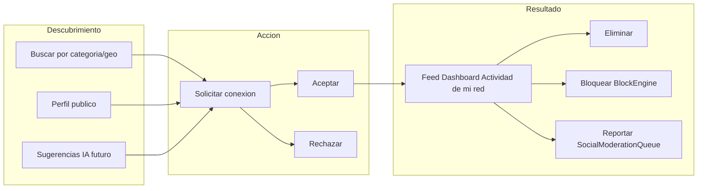

# ANEXO — Red de Contactos / Conexiones de Negocio v1.0.0

**Fecha:** 2026-06-11 · **Estado:** ANEXO DE ANÁLISIS DOCUMENTAL
**Complemento de:** `PLAN-MAESTRO-INTERACCIONES`, `PLAN-MAESTRO-ECONOMIA-SOCIAL`, `PLAN-MAESTRO-DASHBOARDS` (no los modifica)
**Modo:** Solo análisis y documentación. No runtime · no carpetas · no mover · no Firestore · no deploy · no commit · no modifica documentos existentes.

> **Principio rector:** CariHub/Cariñosas **no** es una red social de amistades. Es una red de **conexiones tipadas** (proveedor/negocio/anunciante) orientada a descubrimiento, relación comercial/profesional y conversión en el nicho real (acompañantes, hoteles, moteles, spas, sex shops, fotógrafos, cirujanos, abogados, contadores, restaurantes, bares, antros y demás proveedores).

---

## 1. Análisis de conceptos

| Concepto | Veredicto |
|---|---|
| **Amigos** (simétrico, social puro) | **DESCARTAR** — no encaja; implica red social genérica |
| **Seguidores** (asimétrico, FollowGraph) | **MANTENER** — consumidor→proveedor, sin aprobación; visibilidad/feed público |
| **Contactos** (genérico) | **ACOTAR** — solo término UI ("Mis contactos"); modelo técnico = Conexión tipada |
| **Conexiones de negocio** | **ADOPTAR** — núcleo del modelo bidireccional con aceptación |
| **Red profesional** | **ADOPTAR** — etiqueta/filtro (cirujano, abogado, contador, fotógrafo) |
| **Red de contactos** | **ADOPTAR** — nombre del grafo y sección Dashboard |
| **Solicitudes de conexión** | **ADOPTAR** — ciclo explícito aceptar/rechazar |
| **Solicitudes entre categorías distintas** | **PERMITIR** — con tipo de arista y reglas por categoría/edad |

---

## 2. Veredicto: ¿Reemplazar "Amistad"?

**SÍ.** Reemplazar por modelo de **DOS planos**:

| Plano | Módulo | Dirección | Aprobación | Uso |
|---|---|---|---|---|
| **Seguir** | FollowGraph (Interacciones) | asimétrico: consumidor → proveedor | no | visibilidad pública, seguidores, feed público |
| **Conexión** | ConnectionGraph / ConexionesEngine (nuevo) | bidireccional: A ↔ B tipada | sí (solicitud + aceptación) | feed privado Dashboard "Actividad de mi red de contactos" |

**Terminología UI:** adoptar "Red de contactos", "Conexiones de negocio", "Contactos profesionales"; **descartar** "Amigos", "Agregar amigo", "Lista de amigos".

---

## 3. Modelo de aristas tipadas

| Tipo arista | Origen → Destino | Ejemplos |
|---|---|---|
| `perfil_negocio_servicio` | Perfil → Negocio | Perfil→Hotel, Motel, Spa, Sex Shop, Restaurante, Bar, Antro, Fotógrafo, Cirujano, Abogado, Contador |
| `negocio_negocio_alianza` | Negocio ↔ Negocio | Hotel↔Spa, Restaurante↔Bar (cross-promo) |
| `anunciante_perfil_patrocinio` | Anunciante → Perfil | campaña dirigida |
| `anunciante_negocio_patrocinio` | Anunciante → Negocio | banner local / co-marketing |
| `perfil_perfil_profesional` | Perfil ↔ Perfil | colaboración/referido (no amistad genérica) |
| `internacional_futura` | Cualquiera ↔ Cualquiera | cross-país; reglas legales por mercado |

---

## 4. Ciclo de vida de conexión

| Acción | Cómo | Efecto |
|---|---|---|
| **Descubrir** | búsqueda categoría/geo, perfil público, sugerencias IA (deny-write), QR/enlace | — |
| **Solicitar** | botón "Solicitar conexión" + mensaje opcional; ValidationEngine + rate-limit | notificación al receptor |
| **Aceptar** | receptor en Dashboard (cola pendientes) | arista activa; feed mutuo |
| **Rechazar** | receptor rechaza | cierre; ventana re-solicitud (ej. 30 días) |
| **Eliminar** | cualquiera de las partes | arista removida; historial auditado |
| **Bloquear** | BlockEngine (Interacciones) | silencioso; termina conexión y Messenger |
| **Reportar** | SocialModerationQueue → Admin | cola moderación |

**Estados:** `pendiente` · `aceptada` · `rechazada` · `eliminada` · `bloqueada` · `suspendida_admin`

---

## 5. Límites y sugerencias

**Límites propuestos (por tipo de cuenta / plan):**

| Tipo cuenta | Conexiones activas máx. | Pendientes enviadas | Pendientes recibidas |
|---|---|---|---|
| Perfil básico | 50 | 10 | 20 |
| Negocio | 200 | 30 | 50 |
| Anunciante | 500 | 50 | 100 |

Planes destacado/premium/vip aumentan cupo (+25% / +50% / +100%). Antifraude: rate-limit, no auto-conexión, señales ANEXO-AUTOPROPINAS.

**Sugerencias futuras:** misma categoría/geo, 2º grado, visitas/favoritos, Banners locales; IA solo recomienda (deny-write).

---

## 6. Actividad de contactos y feeds

**Tipos de contenido en el feed:** estados · lives · publicaciones · promociones · historias (stories) · actividad reciente · eventos futuros · contenido premium (PremiumContentGate).

| Feed | Contenido | Orden default |
|---|---|---|
| `feed_actividad` | publicaciones, actividad, eventos | cronológico |
| `feed_promociones` | ofertas de contactos (etiqueta "Promoción") | cronológico |
| `feed_estados` | estados/stories temporales | cronológico |
| `feed_lives` | lives activos/recientes | live activo primero |
| `feed_mixto` | todo mezclado | configurable por usuario |

**Priorización:** MVP = cronológico; futuro = relevancia (plan contacto, interacción, categoría, geo; IA sugiere orden, solo lectura). Lives en curso arriba en `feed_lives` y `feed_mixto`.

---

## 7. Objetivo funcional

> Buscar por categoría → encontrar perfil/negocio → solicitar conexión → una vez aceptada → ver en **Dashboard** toda la actividad relevante de esa conexión.

**Ejemplos documentados:** Perfil→Hotel/Motel/Spa/Cirujano/Fotógrafo/Sex Shop/Restaurante · Negocio↔Negocio · Anunciante→Perfil · Anunciante→Negocio.

---

## 8. Dashboard: "Actividad de mi red de contactos"

**Veredicto: SÍ** — sección central/widget del **CentroActividad** (Dashboards).

- **Ubicación:** Dashboard Perfil, Negocio, Anunciante (cada uno ve actividad de **sus** contactos aceptados).
- **Contenido:** estados, lives, publicaciones, promociones, eventos futuros, stories de contactos aceptados.
- **No incluye:** actividad de no-contactos (Resultados/Home), Messenger, métricas propias (widgets existentes).
- **Ruta sugerida:** `/cuenta/red-contactos` o tab en `/cuenta/actividad`.

---

## 9. Integraciones (quién hace qué)

| Módulo | Rol | Modifica plan host |
|---|---|---|
| **Dashboard** | host del feed + cola solicitudes | NO |
| **Interacciones** | ConnectionGraph + reutiliza FollowGraph, BlockEngine, ActivityFeed, NotificationsBridge | NO |
| **Messenger** | conexión aceptada puede habilitar chat; bloqueo sincronizado | NO |
| **Economía Social** | estados/lives/publicaciones/premium en feed; propinas orgánicas | NO |
| **Notificaciones** | solicitud, aceptación, actividad destacada | NO |
| **Agentes IA** | sugerencias contactos + orden feed; deny-write (RT-08) | NO |
| **Banners** | promociones en feed_promociones etiquetadas | NO |
| **Seguridad MVP** | gates edad/email/rate-limit/duplicadoPotencial | NO |

---

## 10. Privacidad, edad y moderación

- Feed **privado** (solo contactos aceptados); **noindex**; no público.
- Contenido adulto: previews moderados, mayoría de edad; `ADR-INDEXACION-ADULTOS`.
- Premium: `PremiumContentGate`; noindex.
- Bloqueo/reporte: `BlockEngine` + `SocialModerationQueue` (Interacciones).
- Internacional: conexiones cross-país con reglas legales por mercado (futuro).

---

## 11. Riesgos

| ID | Nivel | Riesgo | Mitigación |
|---|---|---|---|
| RC-R01 | alto | Deriva a red de "amigos" | terminología + aristas tipadas; no feed público infinito |
| RC-R02 | alto | Spam de solicitudes | rate-limit, límites plan, ventana re-solicitud |
| RC-R03 | alto | Confundir conexión con fraude/autopropina | señales ANEXO-AUTOPROPINAS |
| RC-R04 | medio | Promociones sin etiquetar | etiqueta "Promoción"; feed separado |
| RC-R05 | medio | Contenido sensible indexado | feed privado; noindex; PrivacyGuard |
| RC-R06 | medio | Sobrecarga de feed | límites; silenciar contacto; paginación |
| RC-R07 | bajo | Duplicar FollowGraph y ConnectionGraph | dos planos documentados con frontera clara |

---

## 12. Orden de implementación

1. **P0:** definir ConnectionGraph + tipos arista en SPEC.
2. **P1:** FollowGraph + solicitar/aceptar conexión perfil↔negocio + widget Dashboard feed cronológico.
3. **P2:** negocio↔negocio, anunciante↔perfil/negocio + feed_promociones + límites por plan.
4. **P2-P3:** estados/lives/publicaciones en feed + feed_mixto + relevancia IA.
5. **P3:** conexiones internacionales + sugerencias avanzadas + eventos.

---

## 13. Procedencia

**Sí procede** este anexo (`.json` + `.md`) — entregados. **Siguientes pasos:** `SPEC-RED-CONTACTOS` o extensión SPEC-INTERACCIONES · `ADR-SEGUIR-VS-CONEXION` (frontera dos planos) · wireframe widget Dashboard.

> No modifica `PLAN-MAESTRO-INTERACCIONES`, `PLAN-MAESTRO-ECONOMIA-SOCIAL`, `PLAN-MAESTRO-DASHBOARDS` ni demás capas/actas/ADRs. Sin cambios en producción/Firestore/deploy/commit.
