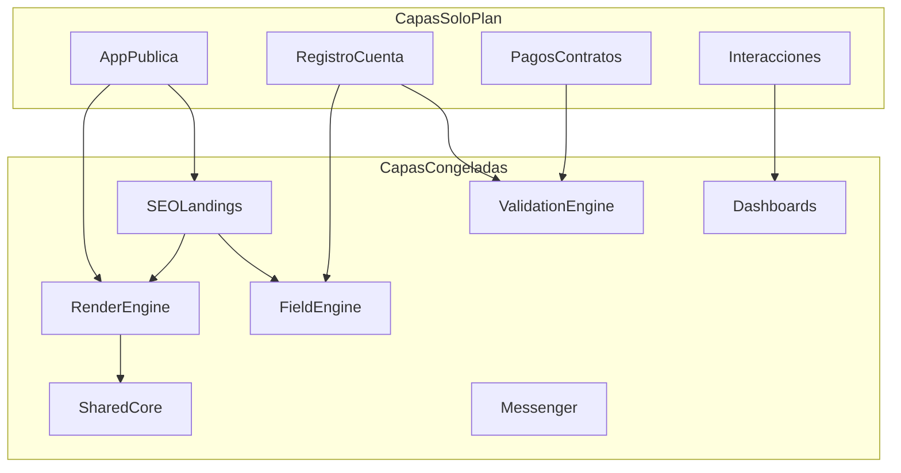

# Auditoría Maestra CariHub/Cariñosas v1.0.0

**Fecha:** 2026-06-11  
**Modo:** Solo documentación — sintetiza el corpus `scripts/` sin modificar artefactos existentes  
**Compañero JSON:** [AUDITORIA-MAESTRA-CARIHUB.json](./AUDITORIA-MAESTRA-CARIHUB.json)

## Resumen ejecutivo

La Auditoría Maestra consolida **89 referencias documentales** del ecosistema CariHub/Cariñosas al 11 de junio de 2026. El corpus de diseño es **coherente y suficientemente completo** para la fase arquitectónica actual.

| Dimensión | Veredicto | % |
|-----------|-----------|---|
| Auditoría documental maestra | **PASS** | 76% documental |
| Arquitectura de diseño cerrada | Parcial | ~45% (10/22 dominios) |
| Listo para implementación | **FAIL parcial** | ~12% |
| MVP operativo (runtime) | **FAIL parcial** | ~18% |
| Operación nacional | Doc ~25% / Runtime ~5% | — |
| Operación internacional | Doc ~10% / Runtime 0% | — |

**Veredicto global:** `PASS` (auditoría documental) con `FAIL` parcial en runtime/MVP.

## Artefactos satélite

| Archivo | Contenido |
|---------|-----------|
| [MATRIZ-MADUREZ-CARIHUB.json](./MATRIZ-MADUREZ-CARIHUB.json) | 92 módulos, escala inexistente→implementado |
| [MATRIZ-DEPENDENCIAS-CARIHUB.json](./MATRIZ-DEPENDENCIAS-CARIHUB.json) | Grafo, 10 bloqueadores, 5 SPOF, 6 cadenas cascada |
| [ROADMAP-MAESTRO-CARIHUB.json](./ROADMAP-MAESTRO-CARIHUB.json) | Top 25 pendientes, Top 10 bloqueadores/riesgos/implementaciones |
| [MATRIZ-MVP-CARIHUB.json](./MATRIZ-MVP-CARIHUB.json) | Delimitación MVP: obligatorio/recomendado/post-MVP/futuro + reducción complejidad |

## Delimitación MVP

### MVP-MIN Cariñosas Nacional

El **MVP más pequeño posible** que satisface las 9 capacidades núcleo **sin depender de funcionalidades futuras**:

| # | Capacidad | Cómo se cumple en MVP-MIN |
|---|-----------|---------------------------|
| 1 | Registrar perfiles | Auth + Wizard FieldEngine + bridge perfilId |
| 2 | Verificar perfiles | Email + INE/selfie + admin revisión |
| 3 | Publicar perfiles | Flujo borrador→aprobado→activo + plan vigente |
| 4 | Cobrar perfiles | Pasarela Stripe/MP + 4 planes MXN + contratos |
| 5 | Mostrar perfiles | Home + resultados server-side + perfil slug/id |
| 6 | Recibir contactos | **WhatsApp/teléfono en perfil** (NO Messenger) |
| 7 | Administrar perfiles | Admin moderación + denuncias + RBAC básico |
| 8 | Administrar pagos | Admin conciliación + webhook + vencimientos |
| 9 | Administrar anuncios | solicitudes_anuncios + inventario banners |

**No requiere:** Messenger, Economía Social, Propinas, Cripto, Lives, Stories, Red Contactos, IA avanzada, i18n, Marketplace.

### Funciones indispensables por umbral

| Umbral | Indispensables clave |
|--------|---------------------|
| Beta privada | Auth, wizard, verificación, admin aprobar, perfil visible, contacto externo, Turnstile |
| Beta pública | + server-side resultados, RenderEngine head, robots/sitemap, VE server, rules, RBAC |
| Cobrar | + pasarela, contratos, webhook activación, 4 planes MXN |
| Producción | + slug canónico, dashboard perfil, renovaciones, banners operativos, denuncias SLA |

### Análisis funciones postergadas

| Función | Clasificación | Versión | Impacto si se elimina del MVP |
|---------|---------------|---------|-------------------------------|
| Economía Social | Post-MVP | V1.2 | Ninguno en 9 capacidades |
| Propinas | Post-MVP | V1.2 | Solo membresía; sin upsell social |
| Criptomonedas | Futuro | V2.0+ | MXN suficiente |
| Lives / Stories | Futuro | V2.0 | Sin escaparate temporal/live |
| Red Contactos | Post-MVP | V1.2 | WhatsApp cubre contacto |
| IA avanzada | Post-MVP | V1.2-V2.0 | Operación manual admin |
| i18n / Hreflang / SEO int. | Futuro | V2.0+ | MX monolingüe |
| Multimoneda | Futuro | V2.0 | MXN congelado |
| Marketplace | Experimental | Futuro | Modelo vitrina permanece |

### Reducción al acotar MVP

| Métrica | Visión completa | MVP-MIN | Reducción |
|---------|-----------------|---------|-----------|
| Módulos | 92 | 28 | **70%** |
| Tiempo estimado | 80-120 sem | 16-22 sem | **78%** |
| Índice riesgo | 100 | 38 | **62%** |
| Funciones obligatorias | 60 clasificadas | 29 | 52% scope eliminado |

## Inventario global

### Capas congeladas (10)

Diseño v1.0.x, `runtimeAutorizado: false`:

1. Shared/Core 1.0.0  
2. RenderEngine 1.0.0  
3. FieldEngine 1.0.1  
4. ValidationEngine 1.1.0  
5. Messenger 1.0.0  
6. Dashboards 1.0.0  
7. Catálogo 1.0.0  
8. Cuentas 1.0.0  
9. Seguridad MVP 1.0.0  
10. **SEO-Landings 1.0.0** *(nuevo 2026-06-11)*

### Planes sin SPEC/ACTA (9)

App Pública, Registro-Cuenta, Admin, Pagos-Contratos, Banners, Interacciones, Agentes-IA, ThemeEngine, Economía Social.

### ADRs (3)

- ADR-RENDER-STRATEGY  
- ADR-URL-CANONICA-PERFILES  
- ADR-INDEXACION-ADULTOS  

### Anexos (5, no congelados)

Criptomonedas, Autopropinas, Red-Contactos, Banners estratégico, Messenger-Dashboards.

### Novedades desde baseline 2026-06-09

- SPEC-SEO-LANDINGS + AUDITORIA PASS 19/19 + ACTA congelamiento  
- PLAN-MAESTRO-ECONOMIA-SOCIAL + 3 anexos (autopropinas, red contactos, cripto)  
- ANALISIS-REEVALUACION-INDEXACION-PERFILES-ADULTOS  

## Escala de madurez

```
inexistente → conceptual → documentado → especificado → auditado → congelado → listoImplementacion → implementado
```

**Resumen (92 módulos):**

| Nivel | Count |
|-------|-------|
| inexistente | 18 |
| conceptual | 8 |
| documentado | 22 |
| especificado | 3 |
| auditado | 2 |
| congelado | 14 |
| listoImplementacion | 0 |
| implementado | 25* |

*25 entradas "implementado" = funcionalidad parcial en monolito `public/`, **no alineada** al diseño congelado.

## Auditoría de consistencia — PASS

- Planes vs SPECs: coherente (SPECs cubren capas congeladas)  
- SPECs vs Actas: 8/8 con acta correspondiente  
- ADRs vs SPECs: 3 ADRs consumidos sin conflictos  
- Anexos vs Planes: complementarios, sin contradicciones  
- SEO adultos vs ADR indexación: alineado (MVP noindex)  
- ValidationEngine 1.1.0 vs Messenger: MINOR aplicado PASS  

**Conflictos detectados:** 0

## Auditoría de cobertura — PASS parcial

Gaps principales:

| ID | Área | Severidad |
|----|------|-----------|
| GAP-01 | Registro runtime formal (sin SPEC) | alta |
| GAP-02 | Pagos pasarela integrada | crítica |
| GAP-09 | Shared/Core no extraído | crítica |
| GAP-03–08 | Interacciones, ThemeEngine, IA, Economía Social, Admin, i18n | media-baja |

## Auditoría de riesgo — ATENCIÓN

| ID | Riesgo | Nivel |
|----|--------|-------|
| RSK-01 | Filtrado client-side resultados | crítico |
| RSK-02 | Gap usuarios uid vs perfilId | crítico |
| RSK-03 | Indexación contenido adulto | alto |
| RSK-04 | Autopropinas/fraude | alto |
| RSK-05 | Pagos sin KYC/fiscal | alto |

Ver [ROADMAP-MAESTRO-CARIHUB.json](./ROADMAP-MAESTRO-CARIHUB.json) Top 10 riesgos.

## Auditoría de implementación — FAIL parcial

**Producción real** (AUDITORIA-ARQUITECTONICA-GLOBAL):

- Monolito `public/index.html` mezclado (Home + registro + dashboard + favoritos)  
- Resultados: filtro **client-side** — no escala, riesgo privacidad  
- Perfil: `?id=` legacy, no slug canónico  
- Sin RenderEngine head, sin robots/sitemap runtime  
- 10 capas congeladas sin implementación runtime  

## Métricas globales

| Dimensión | % |
|-----------|---|
| Documental | 76 |
| Arquitectura congelada | 45 |
| Funcional runtime | 8 |
| Gobernanza | 85 |
| Monetización doc | 45 |
| SEO doc | 90 |
| IA doc | 55 |
| Seguridad doc | 80 |
| i18n doc | 15 |
| **Global ponderado** | **75** |

## Dependencias críticas



**Top bloqueadores:** migración perfiles, pagos pasarela, RenderEngine deploy, resultados server-side, Firestore rules, SEO robots/sitemap, RBAC Admin, Shared/Core extracción, ThinContentGuard, Turnstile deploy.

**SPOF:** Catálogo, FieldEngine snapshot, PrivacyGuard, Firebase Auth uid legacy, monolito index.html.

## Recomendación — Fase P0 Runtime Foundation

**Duración estimada:** Q3–Q4 2026

1. Migración usuarios→perfiles (bridge perfilId)  
2. RenderEngine snapshot deploy (head Home/Perfil)  
3. Pagos pasarela MVP  
4. Seguridad MVP gates (Turnstile)  
5. Extracción Shared/Core  
6. ValidationEngine server-side  
7. Resultados server-side + noindex  
8. robots.txt + sitemap.xml  
9. Firestore rules alineadas  
10. URL canónica `/perfil/{slug}`  

Detalle completo en [ROADMAP-MAESTRO-CARIHUB.json](./ROADMAP-MAESTRO-CARIHUB.json).

## Restricciones cumplidas

- ✅ 5 archivos nuevos en `scripts/`  
- ✅ Sin modificar PLAN/SPEC/ADR/ACTA/anexos existentes  
- ✅ Sin runtime, deploy, commit ni Firestore  
- ✅ Referencia REPORTE-CONGELAMIENTOS-CONSOLIDADO (10 capas vs 7 baseline)
