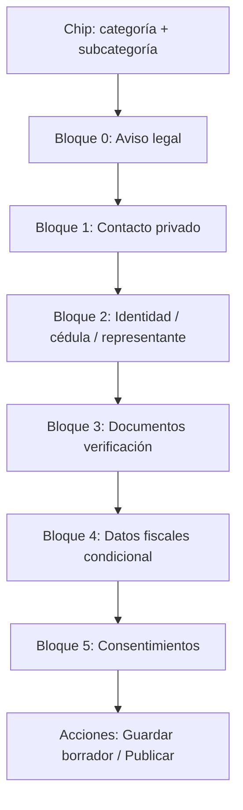

# Diseño Paso 4 — Datos privados en registro-perfil

**Versión:** 2026-06-15  
**Fuentes:** `config-registro-*-schema.json`, `SPEC-FIELDENGINE`, `SPEC-REGISTRO-CUENTA`  
**Artefacto máquina:** `DISENO-DATOS-PRIVADOS-REGISTRO-PERFIL.json` (462 subcategorías resueltas)

---

## 1. Objetivo

Definir **qué datos privados** pide el wizard `registro-perfil.html` (pantalla 4), **en qué orden** se muestran y **qué lista aplica** a cada subcategoría según el schema congelado.

Regla de merge (FieldEngine):

```
camposPrivados = base.camposPrivados
              ∪ plantillaArquetipo.camposPrivados
              ∪ deltaSubcategoria.camposPrivados
```

Hoy no hay `delta.camposPrivados` en ningún schema; las diferencias vienen solo de **base + arquetipo**.

---

## 2. Pantalla 4 — Estructura UI propuesta

Reemplazar el placeholder actual (`fldNombreReal`, un solo INE, comprobante genérico) por **bloques dinámicos** según `subcategoriaId` + `formularioId`.

### 2.1 Flujo visual (orden fijo de bloques)



### 2.2 Bloques estándar (títulos en UI)

| Orden | Bloque ID | Título en pantalla | Cuándo aparece |
|------|-----------|-------------------|----------------|
| 0 | `legal` | Qué recabamos y por qué | Siempre |
| 1 | `contacto` | Contacto privado | Si hay tel/whatsapp privado |
| 2a | `cedula` | Cédula profesional | Solo formulario **Profesionista** |
| 2b | `representante` | Representante legal | Solo formulario **Negocio** (y negocios adultos) |
| 3 | `verificacion` | Verificación de identidad | Según `verificacionTipo` |
| 4 | `fiscal` | Facturación y datos fiscales | Toggle `deseoFacturar` o negocio regulado |
| 5 | `consentimientos` | Confirmaciones legales | Siempre al final |

### 2.3 Orden de campos dentro de cada bloque

#### Bloque 0 — Aviso legal
- Texto fijo + lista resumen (`#rpPrivateFieldsList`) generada desde schema.
- Chip: `Adultos · Escort` / `Independiente · Plomero` / etc.

#### Bloque 1 — Contacto privado
1. `telefonoContacto` *(adultos — etiqueta: Teléfono contacto)*  
2. `telefonoPrivado` *(independiente, profesionista, negocio)*  
3. `whatsappPrivado` *(si aplica arquetipo)*  

> El WhatsApp **público** vive en pantalla 1 (`contactoPublico`). El privado solo en pantalla 4.

#### Bloque 2a — Cédula (profesionista)
1. `cedulaNumero`  
2. `cedulaProfesion`  
3. `cedulaEspecialidad`  
4. `cedulaInstitucion`  
5. `cedulaAnio`  
6. `cedulaComprobante` (upload)  
7. `cedulaEstado` (solo lectura tras revisión admin)

#### Bloque 2b — Representante (negocio)
1. `responsable` (nombre completo)  
2. `ineRepresentante` (upload)

#### Bloque 3 — Verificación
Según `verificacionTipo`:

| Tipo | Campos en orden |
|------|-----------------|
| `persona_estandar` | INE frente → INE reverso → Selfie CariHub |
| `creador_plataformas` | INE frente → Selfie CariHub |
| `pareja_dual` | Consentimiento dual → INE frente → Selfie CariHub |
| `negocio_estandar` | RFC → Razón social → Licencia operación → INE representante* |
| `profesionista_cedula` | (cédula en bloque 2a) + INE frente → INE reverso → Selfie |
| `persona_o_microempresa` | INE frente → INE reverso → Selfie → RFC (opcional) |

\* `ineRepresentante` puede mostrarse en bloque 2b y repetirse como requisito en verificación.

#### Bloque 4 — Fiscal (condicional)
1. Toggle `deseoFacturar` — "Deseo facturar (CFDI)"  
2. Si activo, en orden: `rfc` → `razonSocial` → `codigoPostalFiscal` → `emailFacturacion` → `regimenFiscal` → `usoCFDI`  
3. `licenciaOperacion` — obligatoria si giro regulado (alimentos, institución, adultos negocio), aunque no facture.

#### Bloque 5 — Consentimientos (siempre al final)
1. `mayorEdadConfirmado` — checkbox "Confirmo ser mayor de 18 años" *(adultos + independiente)*  
2. `consentimientoDual` — checkbox pareja *(solo `pareja_grupo`)*  
3. `terminosAceptados` — checkbox términos + privacidad  

---

## 3. Resumen por formulario (4 listas maestras)

### 3.1 Formulario Adultos (`formularioId: adultos`) — 34 subcategorías, 9 arquetipos

**Base privados (todas):** `telefonoContacto`, `terminosAceptados`, `mayorEdadConfirmado`

| Arquetipo | Subcategorías | Campos privados adicionales | Verificación |
|-----------|---------------|----------------------------|--------------|
| `persona_acompanante` | 16 | `whatsappPrivado`, `ineFrente`, `ineReverso`, `selfieVerificacion` | persona_estandar |
| `persona_dominatrix` | 3 | igual que acompañante | persona_estandar |
| `persona_creador` | 1 | `ineFrente`, `selfieVerificacion` (sin WhatsApp privado en plantilla) | creador_plataformas |
| `persona_espectaculo` | 2 | `ineFrente`, `selfieVerificacion` | persona_estandar |
| `pareja_grupo` | 3 | `consentimientoDual`, `ineFrente`, `selfieVerificacion`, `whatsappPrivado` | pareja_dual |
| `negocio_retail` | 1 | `rfc`, `razonSocial`, `licenciaOperacion` | negocio_estandar |
| `negocio_bienestar` | 2 | `rfc`, `razonSocial`, `licenciaOperacion` | negocio_estandar |
| `negocio_hospedaje` | 1 | `rfc`, `razonSocial`, `licenciaOperacion` | negocio_estandar |
| `negocio_venue` | 5 | `rfc`, `razonSocial`, `licenciaOperacion` | negocio_estandar |

**Lista completa por subcategoría (Adultos):**

| # | subcategoriaId | Nombre | Arquetipo | Campos privados (orden UI) |
|---|----------------|--------|-----------|----------------------------|
| 1 | escort | Escort | persona_acompanante | tel contacto → whatsapp privado → INE F/R → selfie → mayor edad → términos |
| 2 | escort_gay | Escort Gay | persona_acompanante | ↑ igual |
| 3 | escort_vip | Escort VIP | persona_acompanante | ↑ igual |
| 4 | edecan | Edecán | persona_acompanante | ↑ igual |
| 5 | modelos | Modelos | persona_acompanante | ↑ igual |
| 6 | gigolo | Gigoló | persona_acompanante | ↑ igual |
| 7 | acompanante | Acompañante | persona_acompanante | ↑ igual |
| 8 | petit | Petit | persona_acompanante | ↑ igual |
| 9 | trans | Trans | persona_acompanante | ↑ igual |
| 10 | femboy | Femboy | persona_acompanante | ↑ igual |
| 11 | singles | Singles | persona_acompanante | ↑ igual |
| 12 | lesbians | Lesbians | persona_acompanante | ↑ igual |
| 13 | tom_boy | Tom Boy | persona_acompanante | ↑ igual |
| 14 | tom_fem | Tom Fem | persona_acompanante | ↑ igual |
| 15 | dotados | Dotados | persona_acompanante | ↑ igual |
| 16 | fetiche | Fetiche | persona_dominatrix | ↑ igual |
| 17 | sado | Sado | persona_dominatrix | ↑ igual |
| 18 | dominatrix | Dominatrix | persona_dominatrix | ↑ igual |
| 19 | contenido | Creador(a) de Contenido | persona_creador | tel contacto → INE frente → selfie → mayor edad → términos |
| 20 | stripper | Stripper | persona_espectaculo | tel contacto → INE frente → selfie → mayor edad → términos |
| 21 | table_dance | Table Dance | persona_espectaculo | ↑ igual |
| 22 | swinger | Swinger | pareja_grupo | tel → whatsapp → consentimiento dual → INE frente → selfie → mayor edad → términos |
| 23 | unicorns | Unicorns | pareja_grupo | ↑ igual |
| 24 | cuckold_hotwife | Cuckold / Hotwife | pareja_grupo | ↑ igual |
| 26 | sex_shop | Sex Shop | negocio_retail | tel → RFC → razón social → licencia → mayor edad → términos |
| 27 | spa | Spa | negocio_bienestar | ↑ igual |
| 28 | masajes | Masajes | negocio_bienestar | ↑ igual |
| 29 | club_sw | Club Swinger | negocio_venue | ↑ igual |
| 30 | antro | Antro / Restaurant Bar | negocio_venue | ↑ igual |
| 31 | antro_lgbt | Antro LGBT | negocio_venue | ↑ igual |
| 32 | cabinas | Cabinas / Glory Holes | negocio_venue | ↑ igual |
| 33 | cine_xxx | Cine para Adultos | negocio_venue | ↑ igual |
| 34 | hotel_motel | Hotel / Motel | negocio_hospedaje | ↑ igual |

---

### 3.2 Formulario Independiente (`persona_independiente`) — 297 subcategorías, 5 arquetipos

**Base privados (todas):** `telefonoPrivado`, `whatsappPrivado`, `deseoFacturar`, `terminosAceptados`, `mayorEdadConfirmado`

| Arquetipo | # subs | Campos extra (plantilla) | Verificación |
|-----------|--------|--------------------------|--------------|
| `persona_servicio_general` | 243 | `ineFrente`, `ineReverso`, `selfieVerificacion` | persona_estandar |
| `persona_servicio_oficio` | 5 | hereda general (+ oficio en públicos) | persona_estandar |
| `persona_servicio_movil` | 6 | hereda general | persona_estandar |
| `persona_servicio_profesional` | 41 | hereda general | persona_estandar |
| `persona_bienestar_individual` | 2 | **⚠ plantilla faltante** — solo base hoy | persona_estandar* |

**Orden UI estándar (243+ subs con verificación completa):**

1. Teléfono privado  
2. WhatsApp privado  
3. INE frente  
4. INE reverso  
5. Selfie verificación  
6. Toggle deseo facturar → bloque CFDI si activo  
7. Mayor de edad  
8. Términos  

**Subcategorías `persona_bienestar_individual` (coaching-de-vida, coaching-espiritual):**  
Hasta corregir schema, usar misma lista que `persona_servicio_bienestar` (general + certificaciones en público): añadir INE F/R + selfie en implementación.

---

### 3.3 Formulario Profesionista — 25 subcategorías, 3 arquetipos

**Base privados (todas — no hay extras por plantilla):**

`cedulaNumero`, `cedulaProfesion`, `cedulaEspecialidad`, `cedulaInstitucion`, `cedulaAnio`, `cedulaComprobante`, `cedulaEstado`, `telefonoPrivado`, `ineFrente`, `ineReverso`, `selfieVerificacion`, `deseoFacturar`, `terminosAceptados`

| Arquetipo | # subs | Diferencia |
|-----------|--------|------------|
| `profesional_salud` | 15 | Misma lista privada; más campos **públicos** (seguros, consulta en línea) |
| `profesional_salud_mental` | incl. en salud | hereda salud |
| `profesional_tecnico_legal` | 6 | Misma lista privada |
| `profesional_veterinario` | 4 | Misma lista privada |

**Orden UI (único para las 25 subs):**

1. Cédula (7 campos)  
2. Teléfono privado  
3. INE frente → reverso → selfie  
4. Deseo facturar → CFDI  
5. Términos  

> No lleva `mayorEdadConfirmado` en schema base profesionista.

---

### 3.4 Formulario Negocio — 106 subcategorías, 6 arquetipos

**Base privados (todas):** `razonSocial`, `responsable`, `telefonoPrivado`, `rfc`, `licenciaOperacion`, `ineRepresentante`, `deseoFacturar`, `terminosAceptados`

| Arquetipo | # subs | Notas de obligatoriedad |
|-----------|--------|-------------------------|
| `negocio_servicios_local` | 74 | Licencia según giro |
| `negocio_inmobiliario` | 22 | ↑ |
| `negocio_institucion` | 3 | Licencia obligatoria (clínica, farmacia…) |
| `negocio_alimentos` | 3 | Licencia obligatoria |
| `negocio_comercio` | 1 | ↑ |
| `negocio_venue` | 3 | ↑ |

**Orden UI (único para las 106 subs):**

1. Responsable (nombre)  
2. Teléfono privado  
3. INE representante  
4. RFC  
5. Razón social  
6. Licencia / permiso (upload)  
7. Deseo facturar → CFDI  
8. Términos  

---

## 4. Matriz rápida: qué pide cada “tipo de perfil”

| Campo privado | Adultos persona | Adultos pareja | Adultos negocio | Independiente | Profesionista | Negocio |
|---------------|-----------------|----------------|-----------------|---------------|---------------|---------|
| telefonoContacto | ✓ | ✓ | ✓ | — | — | — |
| telefonoPrivado | — | — | — | ✓ | ✓ | ✓ |
| whatsappPrivado | ✓* | ✓ | — | ✓ | — | — |
| ineFrente / reverso | ✓ / ✓** | frente | — | ✓ / ✓ | ✓ / ✓ | — |
| selfieVerificacion | ✓** | ✓ | — | ✓ | ✓ | — |
| consentimientoDual | — | ✓ | — | — | — | — |
| cédula (bloque) | — | — | — | — | ✓ | — |
| responsable | — | — | — | — | — | ✓ |
| ineRepresentante | — | — | — | — | — | ✓ |
| rfc / razonSocial | — | — | ✓ | si factura | si factura | ✓ |
| licenciaOperacion | — | — | ✓ | — | — | ✓† |
| deseoFacturar | — | — | — | ✓ | ✓ | ✓ |
| mayorEdadConfirmado | ✓ | ✓ | ✓ | ✓ | — | — |
| terminosAceptados | ✓ | ✓ | ✓ | ✓ | ✓ | ✓ |

\* Excepto `persona_creador` y `persona_espectaculo` (sin whatsapp en plantilla).  
\** Creador: solo INE frente + selfie. Espectáculo: idem.  
† Obligatoria si giro regulado.

---

## 5. Persistencia Firestore (recomendado)

```json
{
  "privado": {
    "telefonoPrivado": "...",
    "whatsappPrivado": "...",
    "verificacion": {
      "ineFrente": "storage://...",
      "ineReverso": "storage://...",
      "selfieVerificacion": "storage://..."
    },
    "cedula": { },
    "fiscal": null,
    "consentimientos": {
      "mayorEdadConfirmado": true,
      "terminosAceptados": true,
      "consentimientoDual": false
    }
  }
}
```

Nunca mezclar en `publico` ni en lectura de perfil web.

---

## 6. Huecos a cerrar antes de implementar

| ID | Problema | Acción |
|----|----------|--------|
| GAP-01 | `persona_bienestar_individual` sin plantilla en schema | Crear plantilla heredando `persona_servicio_bienestar` |
| GAP-02 | UI actual: un solo `fldIne` | Separar `ineFrente` + `ineReverso` |
| GAP-03 | `fldNombreReal` no está en registry | Mapear a `responsable` (negocio) o campo cuenta |
| GAP-04 | `comprobanteDomicilio` en UI, no en schema | Eliminar o añadir a registry |
| GAP-05 | `mayorEdadConfirmado` / `terminosAceptados` sin checkbox | Render dinámico bloque 5 |
| GAP-06 | `empresa_servicios` sin subcategorías asignadas | Decidir si coaches van a independiente o nueva sub |

---

## 7. Implementación sugerida (siguiente paso)

1. `resolvePrivateFields(subcategoriaId)` → lee JSON de este diseño o schema en runtime.  
2. `renderPrivateScreen(blocks)` → sustituye HTML estático de `#screen4`.  
3. Validación en `ValidationEngine` usando `obligatorios` del schema mergeado.  
4. Subir archivos a Storage; guardar URLs en `privado.verificacion`.

---

## 8. Referencia

- Listado completo 462 subcategorías con `ordenUI` campo a campo: **`DISENO-DATOS-PRIVADOS-REGISTRO-PERFIL.json`**
- Schemas fuente: `scripts/config-registro-{adultos,independiente,profesionista,negocio}-schema.json`
