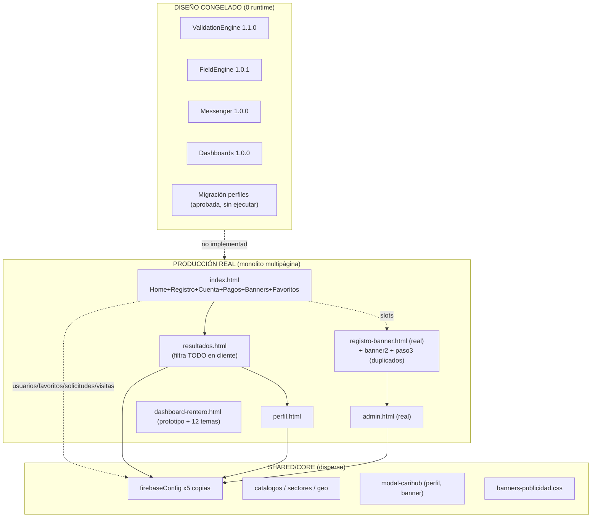
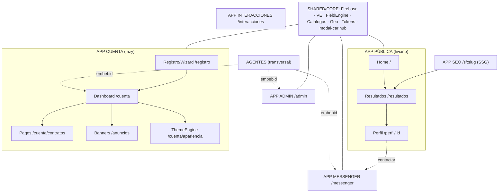

# Mapa Maestro CariHub

| Campo | Valor |
|-------|-------|
| **Versión** | 1.0.0 |
| **Fecha** | 2026-06-09 |
| **Modo** | Solo documentación — sin runtime/cambios |

Canónico: [`MAPA-MAESTRO-CARIHUB.json`](./MAPA-MAESTRO-CARIHUB.json)

---

## PARTE 2 — Mapa actual del ecosistema

### Estado por aplicación

| App | Estado actual |
|-----|---------------|
| PÚBLICA | Parcial + mezclada |
| REGISTRO | Mezclada en Home |
| DASHBOARD | Parcial + mezclada |
| ADMIN | **Parcial real** |
| MESSENGER | Congelada (diseño, sin runtime) |
| PAGOS | Pendiente + mezclada |
| BANNERS | **Parcial real** |
| INTERACCIONES | Observación + mezclada |
| SEO | Observación |
| THEMEENGINE | Observación |
| AGENTES | Futura |
| SHARED/CORE | Parcial disperso |

---

## PARTE 3 — Plano Maestro Futuro

### Detalle por aplicación

**APP PÚBLICA** (bundle liviano)
- **Home** `/` — Hero, BuscadorGeo, GridCategorías/Sectores, TrustPills, AdSlot · *parcial*
- **Resultados** `/resultados` — FiltroGeo, ResultCard, Paginación, BannerLateral · *parcial — pendiente crítico: query server-side + índices*
- **Perfil público** `/perfil/:perfilId` — PerfilHeader, Galería, ContactoWhatsApp · *parcial — página SEO canónica*

**APP REGISTRO** (lazy)
- Registro Perfil / Negocio / Anunciante · Wizard (`/registro/wizard/:formularioId`) · Verificaciones (INE/selfie, sensible)
- Motor: FieldEngine 1.0.1 + ValidationEngine 1.1.0 + 5 config schemas

**APP DASHBOARD** (lazy)
- Perfil · Negocio · Anunciante · Empresa · Operador
- Shell modular por `tipoCuentaPrincipal`/`rolesCuenta` (SPEC-DASHBOARDS)

**APP MESSENGER** (lazy realtime)
- Conversaciones · Solicitudes · Reportes · Traducción futura · Admin `/admin/mensajeria`
- Colecciones: `conversaciones`, `conversaciones_meta`, `reportes_mensajeria`, `messenger_*`

**APP ADMIN** (pesado interno)
- Moderación · Seguridad · Pagos · Revisiones · IA Admin (8 módulos `config-admin` schema)

**APP PAGOS** (lazy)
- Contratos · Renovaciones · Facturación · Cobros (Stripe/MP — no autorizado live)

**APP BANNERS** (lazy)
- Espacios · Campañas · Creativos · Estadísticas

**APP INTERACCIONES** (lazy futuro)
- Stories · Lives · Seguidores · Comentarios · Reacciones

**APP THEMEENGINE** (lazy)
- Temas · Widgets · Plantillas · Editor Visual (Canva) — fuente tokens hoy: `dashboard-rentero` (12 temas) + `home-vcards`

**APP SEO** (SSG/islas)
- País · Estado · Ciudad · Categoría · Landings (`/s/:slug`, `/sitemap.xml`)

**APP AGENTES** (transversal)
- Auditoría · Soporte · Moderación · Seguridad · Traducción · SEO · Diseño — UI embebida en Dashboard/Admin/Messenger

**SHARED/CORE**
- Firebase (init único, hoy x5) · Firestore helpers · ValidationEngine · FieldEngine · Helpers (`textoSeguro`…) · Catálogos (462) · modal-carihub · banners-publicidad.css · Tokens visuales · Config global

---

## Orden ideal de construcción

| Fase | Prioridad | Contenido |
|------|-----------|-----------|
| 0 | **P0** | SHARED/Core (config único, catálogo, geo, tokens) + delimitar núcleo Home |
| 1 | P1 | Resultados server-side + Perfil + RenderEngine mínimo + SEO head |
| 2 | P1 | Registro/Wizard + Dashboard shell (tras migración perfiles) |
| 3 | P1 | Admin separado + RBAC fase 2 |
| 4 | P2 | Messenger (runtime + rules) |
| 5 | P2 | Pagos + Banners consolidados |
| 6 | P2 | SEO landings masivas |
| 7 | P3 | Interacciones |
| 8 | P4 | ThemeEngine |
| 9 | P5 | Agentes IA |

## Orden ideal de migración

1. **Datos** — `usuarios/{uid}` → `usuarios` hub + `perfiles/{perfilId}` (acta migración; anexo operacional TBD)
2. **Config** — extraer `firebaseConfig` a core único
3. **Código** — extraer inline `index.html` a módulos
4. **UI** — unificar modales en `modal-carihub`
5. **Catálogo** — alinear producción (34) a diseño (462)

---

*Mapa documental — no modifica código, Firestore ni producción.*
