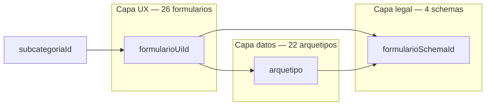

# Matriz formularioUiId — 26 experiencias UX para 462 subcategorías

**Versión:** 2026-06-15  
**Artefacto máquina:** [`MATRIZ-FORMULARIO-UI-REGISTRO.json`](./MATRIZ-FORMULARIO-UI-REGISTRO.json)  
**Relacionado:** [`DISENO-DATOS-PRIVADOS-REGISTRO-PERFIL.md`](./DISENO-DATOS-PRIVADOS-REGISTRO-PERFIL.md)

---

## 1. Problema que resuelve

Hoy el usuario percibe **4 formularios** para **462 subcategorías**. Técnicamente es correcto (cobertura 100%), pero **297 subs** caen en un solo bucket (`persona_servicio_general`).

Esta matriz introduce **26 formularios de experiencia** (`formularioUiId`) sin romper los **4 schemas legales** congelados.

---

## 2. Modelo de tres capas



| Capa | Campo | Cantidad | Función |
|------|-------|----------|---------|
| UX | `formularioUiId` | **26** | Títulos, labels, campos visibles, ayudas, tono |
| Legal | `formularioSchemaId` | **4** | Verificación, privados, facturación, obligatorios Firestore |
| Datos | `arquetipo` | **22** | Merge FieldEngine: campos públicos + plantilla |

**Regla:** `formularioUiId` nunca cambia `formularioSchemaId`. Solo cambia la **presentación** y los **obligatorios UI** del Paso 1 (público). El Paso 4 (privado) sigue el schema legal + arquetipo.

---

## 3. Los 4 schemas legales (sin cambios)

| formularioSchemaId | Subs | Verificación |
|--------------------|------|--------------|
| `persona_independiente` | 297 | INE estándar |
| `negocio_empresa` | 106 | Representante + fiscal |
| `adultos` | 34 | Adulto + INE / negocio adulto |
| `profesionista_cedula` | 25 | Cédula + INE |

---

## 4. Los 26 formularios UX

### 4.1 Adultos (9) — 34 subcategorías

| formularioUiId | Subs | Arquetipo | Público (diferencias clave) | Privado |
|----------------|------|-----------|----------------------------|---------|
| `ui_adulto_acompanante` | 16 | persona_acompanante | Edad, modalidad, físico, servicios | WhatsApp privado + INE F/R + selfie |
| `ui_adulto_dominatrix` | 3 | persona_dominatrix | Estilo dominación, límites | Igual acompañante |
| `ui_adulto_creador` | 1 | persona_creador | Plataformas, sin edad/modalidad | INE frente + selfie |
| `ui_adulto_espectaculo` | 2 | persona_espectaculo | Tipo show, precio show | INE frente + selfie |
| `ui_adulto_pareja` | 3 | pareja_grupo | Alias grupal, dinámica, qué buscan | + consentimiento dual |
| `ui_adulto_negocio_retail` | 1 | negocio_retail | Categorías producto, dirección | RFC + razón social + licencia |
| `ui_adulto_negocio_bienestar` | 2 | negocio_bienestar | Menú servicios spa/masajes | Fiscal negocio adulto |
| `ui_adulto_negocio_hospedaje` | 1 | negocio_hospedaje | Tipos habitación, tarifas | Fiscal negocio adulto |
| `ui_adulto_venue` | 5 | negocio_venue | Cover, reglas acceso (clubs/antros) | Fiscal negocio adulto |

### 4.2 Profesionista (3) — 25 subcategorías

| formularioUiId | Subs | Arquetipo | Público (diferencias clave) | Privado |
|----------------|------|-----------|----------------------------|---------|
| `ui_prof_salud` | 15 | profesional_salud | Especialidad, seguros, consulta en línea | Bloque cédula + INE + CFDI opcional |
| `ui_prof_tecnico_legal` | 6 | profesional_tecnico_legal | Servicios profesionales (abogado, contador…) | Bloque cédula completo |
| `ui_prof_veterinario` | 4 | profesional_veterinario | Servicios veterinarios, horario | Bloque cédula completo |

### 4.3 Negocio empresa (6) — 106 subcategorías

| formularioUiId | Subs | Arquetipo | Público (diferencias clave) | Privado |
|----------------|------|-----------|----------------------------|---------|
| `ui_neg_servicios_local` | 74 | negocio_servicios_local | Menú servicios, mapa, dirección | Representante + INE rep. |
| `ui_neg_inmobiliario` | 22 | negocio_inmobiliario | Catálogo propiedades, precio renta/venta | Representante + fiscal |
| `ui_neg_alimentos` | 3 | negocio_alimentos | Menú / carta, horario | **Licencia obligatoria** |
| `ui_neg_institucion` | 3 | negocio_institucion | Amenidades clínica/farmacia | **Licencia obligatoria** |
| `ui_neg_comercio` | 1 | negocio_comercio | Catálogo productos | Representante + fiscal |
| `ui_neg_venue` | 3 | negocio_venue | Salón eventos, capacidad | Representante + fiscal |

### 4.4 Independiente (8) — 297 subcategorías

| formularioUiId | Subs | Arquetipo / cluster | Público (diferencias clave) | Privado |
|----------------|------|---------------------|----------------------------|---------|
| `ui_ind_bienestar` | 49 | general · sector `bienestar` | Terapias, certificaciones holísticas | INE estándar |
| `ui_ind_salud_auxiliar` | 36 | general · sector `salud` | Cuidados sin cédula (aviso: usar Profesionista si titulado) | INE estándar |
| `ui_ind_profesiones_liberales` | 40 | general · sector `profesionales` | Honorarios, servicios liberales | INE estándar |
| `ui_ind_general` | 118 | general · residual | Hogar, tech, transporte, mascotas… | INE estándar |
| `ui_ind_consultor` | 41 | persona_servicio_profesional | Portafolio, años experiencia | INE estándar |
| `ui_ind_oficio` | 5 | persona_servicio_oficio | Materiales, atención domicilio | INE estándar |
| `ui_ind_movil` | 6 | persona_servicio_movil | Zona cobertura, urgencias | INE estándar |
| `ui_ind_coach` | 2 | persona_bienestar_individual | Coaching, certificaciones | INE estándar |

---

## 5. Split de `persona_servicio_general` (243 → 4 + 4 arquetipos)

El 64% del catálogo estaba en un solo arquetipo. La matriz lo divide en **8 experiencias UX**:

```
persona_servicio_general (243)
├── ui_ind_bienestar          (49)  sector bienestar
├── ui_ind_salud_auxiliar     (36)  sector salud
├── ui_ind_profesiones_liberales (40) sector profesionales
└── ui_ind_general            (118) resto de sectores

+ arquetipos ya específicos:
  ui_ind_consultor (41), ui_ind_oficio (5), ui_ind_movil (6), ui_ind_coach (2)
```

---

## 6. Resolución en runtime (propuesta)

```javascript
// mapa-registro-categorias + MATRIZ-FORMULARIO-UI-REGISTRO.json
function resolveFormularioExperiencia(subcategoriaId) {
  const row = CARIHUB_REGISTRO_SCHEMA_INDEX.byId[subcategoriaId];
  const uiId = MATRIZ_UI.bySubcategoriaId[subcategoriaId]; // o resolveUiId(row)
  const catalogo = MATRIZ_UI.catalogoUi.find(c => c.formularioUiId === uiId);
  return {
    formularioUiId: uiId,
    formularioSchemaId: row.formularioId,
    arquetipo: row.arquetipo,
    titulo: catalogo.titulo,
    publicoUi: catalogo.publicoUi,
    privadoUi: catalogo.privadoUi  // referencia; datos reales desde schema
  };
}
```

**Pantalla 1:** `applyUiProfile(catalogo.publicoUi)` — labels, show/hide, obligatoriosExtra.  
**Pantalla 4:** `CariHubPrivateFieldsLite` con `formularioSchemaId` + `arquetipo` (ya implementado).

---

## 7. Qué cambia por formularioUiId

### Siempre igual (legal)
- Campos privados obligatorios del schema
- Tipos de verificación (INE, cédula, representante)
- Estructura Firestore `privado` / `facturacion`

### Varía por formularioUiId (UX)
| Elemento | Ejemplo |
|----------|---------|
| Título del wizard | "Registro · oficio a domicilio" vs "Registro · coaching" |
| Labels | `servicios` → "Materiales y mano de obra" (oficio) |
| Campos visibles | Ocultar edad en negocios |
| Obligatorios UI Paso 1 | `certificaciones` en bienestar |
| Textos de ayuda | "Si eres titulado usa Profesionista" (salud auxiliar) |
| Chip Paso 4 | Muestra `formularioUiId` + subcategoría |

---

## 8. Casos especiales

| Caso | Tratamiento |
|------|-------------|
| Mismo arquetipo, distinto schema | `negocio_venue`: `ui_adulto_venue` (adultos) vs `ui_neg_venue` (negocio_empresa) |
| Mismo schema, distinto UX | `persona_servicio_general` partido por `sectorCluster` |
| `empresa_servicios` | Arquetipo en schema, **0 subs** — reservado para microempresas |
| Categoría pendiente | `ui_ind_general` + flag temporal |

---

## 9. Próximos pasos de implementación

1. Añadir `formularioUiId` a cada fila de `mapa-registro-categorias.json` (o índice derivado en `public/js/data/`).
2. Extender `carihub-field-engine-lite.js`: `UI_BY_FORMULARIO_UI` (26 entradas) además de `UI_BY_ARQUETIPO`.
3. Mostrar título dinámico en `registro-perfil.html` según `formularioUiId`.
4. Chip Paso 4: `Coaching · Bienestar` en lugar de solo subcategoría.
5. *(Opcional)* Subdividir `ui_ind_general` (118 subs) en 3–4 clusters más si hace falta.

---

## 10. Verificación

```
26 formularioUiId activos
462 subcategorías asignadas (100%)
4 formularioSchemaId sin modificar
```

Listado completo subcategoría → `formularioUiId`: ver `asignaciones[]` en el JSON.
