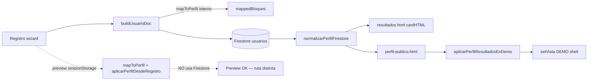

# MPS — Módulo Registro (contratos campo × etapa × arquetipo)

**Estado:** borrador formal v2 — MPS Registro Adultos prácticamente completo (evidencia objetiva, sin cambios de código)  
**Base repo:** `origin/main` post PR #104 + #105 (`a145a72`)  
**Metodología:** auditoría piloto → extensión por arquetipo → matriz transversal → backlog mini-packs agrupados

---

## 1. Propósito

Documentar **dependencias reales** y **contratos de datos** del módulo Registro (Adultos) a través del pipeline:

```
blocks → finalize* → mapToPerfil → apply*PerfilFields
  → preview (tarjeta mapToPerfil | iframe aplicarPerfilDesdeRegistro)
  → submit (buildUsuarioDoc / Firestore)
  → render público (card + ficha DEMO)
```

Cada hallazgo se clasifica:

| Nivel | Significado |
|-------|-------------|
| **Bloqueador** | Rompe contrato upstream (map/submit/seguridad) o QA gate |
| **Importante** | Paridad rota entre etapas (típico: preview iframe vs persist) |
| **Mejora futura** | Deuda / alias / campos derivados / huérfanos — no bloquea merge |

**Herramientas de evidencia usadas:** Git/shell, QA scripts existentes, auditorías VM en `agent-tools/audit-*-contract-pipeline.mjs`, Filesystem MCP, Sequential Thinking MCP.

---

## 2. Pipeline — archivos ancla (congelados post #104)

| Etapa | Archivo(s) principal(es) |
|-------|---------------------------|
| Blocks UI | `public/js/data/registro-adultos-{escort,pareja,lifestyle,...}-blocks.js` |
| Motor | `public/js/carihub-registro-public-blocks.js` |
| Preview tarjeta | `public/js/registro-perfil-preview.js` |
| Preview iframe | `public/perfil-publico.html` → `aplicarPerfilDesdeRegistro`, `mergeParejaGrupoRegistroFields` |
| Submit | `public/js/registro-perfil-submit.js` |
| Render | `public/js/carihub-public-render-lite.js`, `public/js/carihub-field-engine-lite.js` |
| Schema | `scripts/config-registro-adultos-schema.json`, `scripts/validar-schemas-registro.mjs` |
| Mapa | `scripts/mapa-registro-categorias.json` (461 entradas) |

---

## 3. Hallazgo transversal crítico — doble ruta de preview

| Ruta | Entrada | Completitud |
|------|---------|-------------|
| **A — Tarjeta registro** | `registro-perfil-preview.js` → `mapToPerfil` + `apply*PerfilFields` | Alta (QA persist) |
| **B — Iframe perfil público** | `aplicarPerfilDesdeRegistro(vista, u)` en `perfil-publico.html` | **Variable por arquetipo** |

**Evidencia:** Fase 3 (#104) cerró 4 campos Unicorn en ruta B. QA `simulatePreviewPerfil` usa ruta A → puede enmascarar gaps en B.

**Consolidación propuesta (backlog, no implementado):** helper único `copyRegistroPreviewFields(clean, u, ctx)` usado por `aplicarPerfilDesdeRegistro` y `aplicarPerfilResultadosEnDemo`.

---

## 4. Inventario arquetipos — Adultos (schema)

| Arquetipo | Subcategorías (schema) | Blocks pack | QA pack |
|-----------|------------------------|-------------|---------|
| `persona_acompanante` | 15 | `registro-adultos-escort-blocks.js` | `qa-persona-acompanante-*` (158 persist checks) |
| `pareja_grupo` | 2 (swinger, cuckold_hotwife) | `registro-adultos-pareja-blocks.js` | swinger 27 + c/h 40 persist |
| `persona_lifestyle` | 1 (unicorns) | `registro-adultos-lifestyle-blocks.js` | unicorn 39+48 render |
| `persona_dominatrix` | 3 | dominatrix blocks | `qa-dominatrix-*` |
| `persona_espectaculo` | 2 | espectaculo blocks | `qa-espectaculo-*` |
| `persona_creador` | 1 | creador blocks | `qa-creador-*` |
| `negocio_*` | 9 total | retail/bienestar/venue/hospedaje | `qa-neg-*` |

**Decisión de orden de auditoría:** tras piloto Unicorn → **pareja_grupo** (mayor acoplamiento cruzado lifestyle/pareja/anti-contaminación) → **persona_acompanante** (mayor superficie de subs, pipeline más uniforme).

---

## 5. Piloto — `persona_lifestyle` / unicorns

**Blocks:** 27 field IDs en `unicornPerfil` + bloques operativos (`serviciosLifestyle`, `modalidades`, …).

### 5.1 Matriz resumida (evidencia: `agent-tools/audit-unicorn-contract-pipeline.mjs`)

| Campo / grupo | blocks | map | submit | preview iframe | render ficha | Severidad |
|---------------|--------|-----|--------|----------------|--------------|-----------|
| `buscoConocer`, `objetivosPerfil`, `objetivoPrincipal`, `badgeUnicorn` | ✅ | ✅ | ✅ | ✅ post-Fase3 | ✅ | OK |
| `tipoUnicornio`, `tipoParejaPreferida`, `finalidadEncuentro`, `estadoPerfil` | ✅ | ✅ | ✅ | ❌ | row ficha existe | **Importante** |
| `experiencia`, `ambientePreferido`, `estilo`, `serviciosLifestyle` | ✅ | ✅ | ✅ | ❌ | row ficha existe | **Importante** |
| `unicornPerfil` nested | ✅ | ✅ | ✅ | ❌ | — | **Importante** |
| `modalidades`, `viajesDesplazamiento`, `metodosPago`, `sobreMi`, `idiomas` | ✅ | ✅ | ✅ | ✅ | ✅ | OK |
| `tipoPublico` | ❌ huérfano schema | — | — | — | — | **Mejora futura** |
| Campos viaje planos vs nested | inputs UI | nested only | nested | nested en preview | — | **Mejora futura** (diseño) |

**QA:** `qa-unicorn-persist.mjs` 39 PASS · `qa-unicorn-render.mjs` 48 PASS (incl. 9 asserts iframe Fase 3).

**Anti-contaminación:** ✅ unicorn strip `swingerPerfil` / `cuckoldHotwifePerfil` en preview iframe (Fase 3).

---

## 6. `pareja_grupo` — Swinger + Cuckold/Hotwife

**Reutilización:** shell común (`aliasPareja`, `configuracionGrupo`, `miembros`, `modalidades`, `viajesDesplazamiento`) + delta nested:

- Swinger → `swingerPerfil` / `buildSwingerPerfil`
- C/H → `cuckoldHotwifePerfil` / `buildCuckoldHotwifePerfil`

**Dependencias cruzadas:** `mergeParejaGrupoRegistroFields`, `shouldApply*Pipeline`, anti-contaminación con Unicorn/Swinger/C-H en `carihub-registro-public-blocks.js`.

### 6.1 Swinger (evidencia: `agent-tools/audit-pareja-contract-pipeline.mjs`)

| Resultado | Detalle |
|-----------|---------|
| **20/24 campos OK** en pipeline completo incl. preview iframe | Mejor paridad que Unicorn (merge pareja) |
| **Importante** | `horarioDetalle` — presente map + preview, **ausente en doc submit** (probable alias `horario`; QA persist sí valida nested en `parejaGrupoPerfil.horarioDetalle`) |
| **Mejora** | `colaboraCon` vacío cuando `haceColaboraciones=No` (esperado) |
| **Mejora** | `parejaGrupoPerfil` no en bloques raw — se **genera** en finalize/map (QA submit lo valida) |
| **Revisar** | `badgeSwinger` — no en blocks; preview iframe no lo setea para sub `swinger` (solo reglas `club_sw` en sidNorm) |

### 6.2 Cuckold/Hotwife

| Resultado | Detalle |
|-----------|---------|
| **14/17 campos OK** | Nested `cuckoldHotwifePerfil` ✅ en preview iframe |
| **Importante** | `badgeCuckold` — derivado en map/submit, no en blocks (diseño runtime) |
| **Mejora** | mismos patrones shell/`colaboraCon`/ `parejaGrupoPerfil` que swinger |

**QA:** swinger persist 27 PASS · c/h persist 40 PASS.

**Duplicación detectada:** lógica de copia lifestyle/swinger en `aplicarPerfilResultadosEnDemo` (L7455+) vs parcial en `aplicarPerfilDesdeRegistro` + `mergeParejaGrupoRegistroFields` — candidato a consolidación.

---

## 7. `persona_acompanante` — cluster Cariñosas / acompañante (+ 13 subs)

**Blocks:** `registro-adultos-escort-blocks.js` — UI compartida + deltas profesionales (`edecanProfesional`, `modelosProfesional`, `femboyPerfil`, …).

**MP-REGISTRO-SUBCATEGORIA-V3 (2026-06-29):**

| Sub | Cambio v3 |
|-----|-----------|
| `escort` / `escort vip` | UI **Cariñosas** / **Cariñosas VIP**; retirado `esBisexual` del formulario |
| `escort gay` | Orientación restringida + `rolInteraccion` (rol separado de orientación) |
| `edecan` | Sin campos escort (`serviciosIncluidos` sexuales, `nivelServicio`, modalidades hotel/recibe); bloques profesionales + `edecanPerfil` nested |
| `modelos` | Idem edecán + `modelosPerfil` nested + portafolio obligatorio |
| `acompanante` | **Deprecación suave:** oculto en registro/pickers; alias lectura → `escort`; datos legacy intactos |

**Modalidades profesionales:** edecán (`evento_venue`, `activaciones`, `expos`, `imagen_marca`, `viaja`); modelos (`estudio`, `locacion`, `pasarela`, `produccion`, `viaja`). Módulo **Viaja** reutilizado con labels de contratante/producción.

**Labels UI:** `carihub-subcategoria-labels.js` — IDs internos legacy sin cambio.

**QA:** `qa-persona-acompanante*.mjs` + `qa-viajes-desplazamiento.mjs` (matriz edecan/modelos profesional).

---

## 8. MPS v2 — arquetipos restantes (matriz completa)

**Evidencia:** `agent-tools/audit-mps-v2-contract-pipeline.mjs` (13 configs: subs representativos) + QA gates re-ejecutados (286 checks PASS total v2).

### 8.0 Hallazgo v2 transversal — preview iframe vs unicorn

| Cluster | Preview iframe (ruta B) | Notas |
|---------|-------------------------|-------|
| `persona_dominatrix` | **Paridad alta** (0 gaps preview) | `dominatrixPerfil` + campos planos BDSM en `clean` |
| `persona_espectaculo` | **Paridad alta** | `espectaculoPerfil` + mirrors show |
| `persona_creador` | **Paridad alta** | `creadorPerfil` + plataformas/redes |
| `negocio_*` (4 arquetipos) | **Paridad alta** | Promoción nested→plano en `aplicarPerfilDesdeRegistro` (L7304–7336) |
| `persona_lifestyle` unicorn | **Parcial** (9 campos) | Ver §5 — outlier del módulo |

**Conclusión:** MP-PREVIEW-01 sigue siendo necesario, pero **prioritariamente por unicorn/lifestyle**, no por negocio/dominatrix (ya maduros en ruta B).

### 8.0b Submit — persistencia Firestore (todos los nested)

**Evidencia shell:** `buildUsuarioDoc` guarda contrato nested en `camposPublicos.bloquesPublicos`; **no** denormaliza `*Perfil` ni campos específicos (ej. `estiloDominacion`, `tarifaHora`, `hospedajePerfil`) al top-level del documento.

| Campo ejemplo | En `mapToPerfil` | En doc top-level | En `bloquesPublicos` |
|---------------|------------------|------------------|----------------------|
| `dominatrixPerfil` | ✅ | ❌ | ✅ nested |
| `hospedajePerfil` / `tarifaHora` | ✅ | ❌ | ✅ nested |
| `horarioDetalle` | ✅ | ✅ como `horario` | ✅ |
| `metodosPago` | ✅ | ✅ (genérico) | ✅ |

**Clasificación:** **Importante** — riesgo en ficha pública post-Firestore si el read-path no re-ejecuta `mapToPerfil(bloquesPublicos, ctx)` antes de render. Candidato **MP-SUBMIT-HYDRATE**.

---

### 8.1 `persona_dominatrix` (dominatrix / fetiche / sado)

**Pipeline**

| Etapa | Artefacto |
|-------|-----------|
| Blocks | `registro-adultos-dominatrix-blocks.js` → bloque `dominatrixPerfil` |
| Runtime | `finalizeDominatrixValues` → `buildDominatrixPerfil` |
| Map | `mapDominatrixToPerfil` (early return en `mapToPerfil`) |
| Preview A | `registro-perfil-preview.js` → `mapToPerfil` |
| Preview B | `aplicarPerfilDesdeRegistro` → `dominatrixPerfil` + planos BDSM |
| Submit | `buildUsuarioDoc` → nested en `bloquesPublicos` |
| Render | `cardHTMLDominatrix`, `isDominatrixPerfil`, ficha `isDominatrixSubFicha` |

**Dependencias:** `ProfileLayoutAdultos`; v1 **sin** `viajesDesplazamiento`; anti-contaminación vs escort/pareja (QA).

**Reutilización:** `joinTagsList`, `buildEspecialidadBdsmMirror`, `clearProfileContractState`.

**Duplicaciones:** Campos BDSM en plano + nested (mismo patrón negocio).

**Matriz (piloto sub `dominatrix`)** — 18/19 OK en VM; único “gap blocks”: `especialidadBdsm` (derivado en map, no input UI).

| Campo | blocks | map | submit¹ | preview B | Severidad |
|-------|--------|-----|---------|-----------|-----------|
| Nested `dominatrixPerfil` | ✅ | ✅ | ✅¹ | ✅ | OK |
| `estiloDominacion`, `limitesSesion`, `equipamiento`, `protocolo` | ✅ | ✅ | ✅¹ | ✅ | OK |
| `listaFetiches` + gates `mostrarFetichesPublico` | ✅ | ✅ gated | ✅¹ | ✅ | OK (diseño) |
| `modalidades` (recibe/hotel only) | ✅ | ✅ | ✅¹ | ✅ | OK |
| `horarioDetalle` | ✅ | ✅ | ✅ `horario` | ✅ | **Importante** alias |
| `especialidadBdsm` | ❌ derivado | ✅ | ✅¹ | ✅ | **Mejora futura** |

¹ Persistido vía `camposPublicos.bloquesPublicos`, no top-level doc.

**QA:** persist 29 · render 24 · gate `qa-dom-01-cierre.mjs`.

**Riesgos:** Submit sin top-level denormalize; privacidad fetiches/equipamiento depende de gates en map.

---

### 8.2 `persona_espectaculo` (stripper / tabledance)

**Pipeline:** `finalizeViajesValues` → `finalizeEspectaculoValues` → `buildEspectaculoPerfil` → `mapEspectaculoToPerfil`.

**Dependencias:** `MODALIDADES_SHOW_LABELS`, mirrors `tipoShow`→`tipoServicio`, `disponiblePara`; **stripper v3:** módulo **Viaja** transversal (`viaja` en modalidades show + subcampos); retirado `desplazamientos` básico.

**Subs**

| Sub | Delta obligatorio | Notas v3 |
|-----|-------------------|----------|
| `stripper` | `modalidades`, `anosExperiencia` | Viaja opcional; sin `desplazamientos` |
| `tabledance` | `venueFijo` obligatorio; sin desplazamientos | Sin viajes transversal |

**Preview A vs B:** paridad completa en VM (nested `espectaculoPerfil` copiado).

**Duplicaciones:** `precioShow`/`precioDesde`/`precio`; `horarioMinimo`/`tiempoMinimo`.

**QA:** persist 23 · render 18 · `qa-espectaculo-cierre.mjs`.

**Clasificación:** sin gaps preview; submit shape igual §8.0b (**Importante**).

---

### 8.3 `persona_creador` (contenido)

**Pipeline:** `finalizeCreadorValues` → `buildCreadorPerfil` → `mapCreadorToPerfil`.

**Campos clave:** `tiposContenido`, `plataformas`, `redesSociales`, `precioSuscripcion`, `mostrarPlataformasPublico` (gate).

**Preview A vs B:** 13/13 OK VM.

**Reutilización:** patrón servicios incluidos / noRealiza compartido con escort/espectáculo.

**QA:** persist 16 · render 16 · `qa-creador-cierre.mjs`.

**Clasificación:** OK preview; **Importante** submit hydrate; **Mejora** `mostrarPlataformasPublico` no auditado en iframe asserts.

---

### 8.4 `negocio_retail` (sex_shop)

**Pipeline:** `finalizeRetailValues` → `buildRetailPerfil` → `mapRetailToPerfil`.

**Contrato:** `envioDomicilio`/`tiendaOnline` boolean en map; `categoriasProducto` string mirror.

**Anti-contaminación:** strip otros `*Perfil` en finalize venue-like pattern (retail no contamina).

**Preview A vs B:** 11/11 OK VM.

**QA:** persist 18 · `qa-neg-ret-01-cierre.mjs`.

---

### 8.5 `negocio_bienestar` (spa / masajes)

**Pipeline:** `finalizeBienestarValues` → `buildBienestarPerfil` → `mapBienestarToPerfil`.

**Subs**

| Sub | Delta | VM |
|-----|-------|-----|
| `spa` | `amenidades` obligatorio | 9/9 OK |
| `masajes` | `serviciosIncluidos` + `serviciosNoRealizo` | 7/7 OK |

**Reutilización:** shell negocio (RFC, razón social, dirección, horario) compartido con retail/hospedaje/venue.

**Preview A vs B:** paridad completa; promoción `menuServicios`/`amenidades` en iframe.

**QA:** persist 30 · render · `qa-neg-bien-01-cierre.mjs`.

---

### 8.6 `negocio_hospedaje` (hotel_motel)

**Pipeline:** `finalizeHospedajeValues` → `buildHospedajePerfil` → `mapHospedajeToPerfil`.

**Contrato distintivo:** `tiposHabitacion`, `tarifaHora`/`tarifaNoche`, `reglasEstancia`, `privacidadDiscrecion`, `mostrarDireccionExacta`.

**Preview A vs B:** 14/14 OK VM — iframe promueve nested→plano (L7310–7318).

**Render:** `cardHTMLHotelMotel`, field-engine `hotelMotel` (H4 hardening previo).

**QA:** persist 19 · render · `qa-neg-hosp-01-cierre.mjs`.

**Clasificación:** **Importante** — `tarifaHora` no en doc top-level (solo nested + map).

---

### 8.7 `negocio_venue` (5 subs)

**Pipeline:** `finalizeVenueValues` (anti-contaminación agresiva: delete escort fields) → `buildVenuePerfil` → `mapVenueToPerfil`.

**Subs auditados**

| Sub | Campos delta | VM | QA persist |
|-----|--------------|-----|------------|
| `antro` | cartelera, dressCode | 11/11 | venue 25 |
| `antro_lgbt` | + badgeLgbt derivado | 11/12 | venue 25 |
| `club_sw` | eventosTematicos, politicaParejasSingles, badgeSwinger | 11/12 | club-sw 26 |
| `cabinas` | nivelPrivacidad | 10/10 | cabinas 22 |
| `cine_xxx` | horariosFunciones, clasificacion | 12/12 | cine 20 |

**Preview A vs B:** paridad alta; badges `badgeLgbt`/`badgeSwinger` derivados en map + iframe sidNorm (no en blocks) — **Mejora futura** documentar.

**Reutilización:** `buildReglasAccesoMirror`, `inferVenueSubId`, `venueFlagFromSelect`.

**Duplicaciones:** `cartelera` ↔ `eventosTematicos` fallback en map; `areasVenue` copiado a `serviciosIncluidos` en map (diseño render).

**QA gates:** `qa-neg-ven-01/02/03-cierre.mjs`.

---


## 9. Cross-cutting — consolidación y deuda

### 9.1 Triple dialecto de IDs

Espacios (`cuckold hotwife`), snake (`cuckold_hotwife`), camel (`unicorns`) — normalización en `aplicarPerfilDesdeRegistro` sidNorm y field-engine. **Mejora futura:** tabla alias canónica en MPS v2 (Fase 4 original).

### 9.2 `tipoPublico`

Presente en schema legacy; Unicorn usa `buscoConocer`. **Mejora futura** — no usar en nuevos arquetipos.

### 9.3 `horarioDetalle` vs `horario`

Repetido en map + preview; submit a veces solo `horario`. **Importante** — unificar alias en contrato Firestore documentado.

### 9.4 Badges (`badgeUnicorn`, `badgeSwinger`, `badgeCuckold`, …)

Derivados en runtime (`apply*PerfilFields` / `mapVenueToPerfil`), no en blocks. Preview iframe: badges venue OK (sidNorm); swinger sub pareja aún inconsistente. **Mejora futura** (pareja) / OK (venue v2).

### 9.5 Anti-contaminación entre arquetipos

| Par | Estado |
|-----|--------|
| unicorn ↔ swinger/C-H | ✅ map + preview iframe |
| swinger ↔ unicorn | ✅ finalize guards |
| C/H ↔ swinger | ✅ pipeline guards |
| escort ↔ pareja deltas | ✅ QA cross-checks en persist packs |
| negocio ↔ escort/persona | ✅ finalizeVenue/Hospedaje delete modalidades/edad |

### 9.6 Submit — shape Firestore vs render

`buildUsuarioDoc` optimizado para pilares legacy (escort/pareja/unicorn campos planos). Arquetipos con `*Perfil` nested dependen de `bloquesPublicos` para reconstrucción; campos como `estiloDominacion`, `tarifaHora`, `hospedajePerfil` **no** aparecen top-level en doc (evidencia shell jun-2026). **Importante** en todos los arquetipos v2.

### 9.7 QA — sesgo ruta A

`registro-perfil-preview.js` usa solo `mapToPerfil` (ruta A). Unicorn/pareja lifestyle pueden PASS QA mientras iframe falla. Negocio/dominatrix v2 enmascaran menos porque ruta B ya copia nested.

---

## 10. Mapa de reutilización (no duplicar)

| Primitiva | Usado por |
|-----------|-----------|
| `buildViajesDesplazamiento` | escort, pareja, lifestyle |
| `mergeParejaGrupoRegistroFields` | pareja preview iframe + pareja shell |
| `ProfileLayoutAdultos` | escort cluster + unicorn |
| `ProfileLayoutPareja` | swinger + C/H |
| `clearProfileContractState` | todos los `apply*PerfilFields` |
| `aplicarPerfilDesdeRegistro` | **todos** los previews iframe — consolidación unicorn; negocio ya OK |
| `buildUsuarioDoc` + read hydrate | Persist → render producción — **MP-SUBMIT-HYDRATE** |
| Shell negocio `finalize*Values` | retail, bienestar, hospedaje, venue — anti-contaminación compartida |

---

## 11. Backlog mini-packs agrupados (post-MPS — no implementar durante auditoría)

| Pack | Alcance | Hallazgos que cierra | Impacto | Riesgo |
|------|---------|----------------------|---------|--------|
| **MP-SUBMIT-HYDRATE** | Hidratar `mapToPerfil(bloquesPublicos)` en read-path público **o** denormalizar `*Perfil` en `buildUsuarioDoc` | Submit shape §8.0b — **todos** arquetipos nested | **Alto** | Medio |
| **MP-PREVIEW-01** | Unificar copia preview iframe (helper + mirror resultados) | 9 campos Unicorn + lifestyle planos | **Alto** (unicorn) | Bajo–medio |
| **MP-ALIAS-HORARIO** | Contrato `horarioDetalle` ↔ `horario` en submit doc + schema | Transversal escort/pareja/dominatrix/negocio | Medio | Bajo |
| **MP-QA-IFRAME** | Asserts iframe en QA persist/render (unicorn, pareja, lifestyle) | Falsa confianza ruta A | Medio | Bajo |
| **MP-BADGES** | Tabla derivación badges runtime (`badgeSwinger`, `badgeLgbt`, …) | Mejora paridad visual | Bajo | Bajo |
| **MP-ALIAS-01** | Tabla canónica IDs + deprecar `tipoPublico` | Dialecto triple | Bajo | Bajo |
| **MP-NEG-SHELL** | Consolidar primitivas negocio (RFC block, dirección, flags) | Duplicación 4 packs blocks | Medio | Medio |

**Orden recomendado post-MPS (impacto × riesgo):**

1. **MP-SUBMIT-HYDRATE** — beneficia 10+ arquetipos; no depende de unicorn.
2. **MP-PREVIEW-01** — cierra outlier lifestyle; menor urgencia en negocio/dominatrix.
3. **MP-ALIAS-HORARIO** — quick win transversal.
4. **MP-QA-IFRAME** — blindaje antes de siguientes categorías proyecto.
5. **MP-BADGES** + **MP-ALIAS-01** — deuda documental.
6. **MP-NEG-SHELL** — refactor blocks (opcional, mayor diff).

**Explícitamente diferido:** mini-pack 3b Unicorn aislado — absorbido en **MP-PREVIEW-01**.

---

## 12. Evidencia reproducible

```bash
# Piloto unicorn
node agent-tools/audit-unicorn-contract-pipeline.mjs
node scripts/qa-unicorn-persist.mjs
node scripts/qa-unicorn-render.mjs

# Pareja grupo
node agent-tools/audit-pareja-contract-pipeline.mjs
node scripts/qa-pareja-swinger-persist.mjs
node scripts/qa-cuckold-hotwife-persist.mjs

# Persona cluster
node agent-tools/audit-persona-contract-pipeline.mjs
node scripts/qa-persona-acompanante-persist.mjs

# MPS v2 — arquetipos restantes
node agent-tools/audit-mps-v2-contract-pipeline.mjs
node scripts/qa-dominatrix-persist.mjs
node scripts/qa-espectaculo-persist.mjs
node scripts/qa-creador-persist.mjs
node scripts/qa-neg-retail-persist.mjs
node scripts/qa-neg-bienestar-persist.mjs
node scripts/qa-neg-hospedaje-persist.mjs
node scripts/qa-neg-venue-persist.mjs
node scripts/qa-neg-venue-club-sw-persist.mjs
node scripts/qa-neg-venue-cabinas-persist.mjs
node scripts/qa-neg-venue-cine-xxx-persist.mjs

# Gate global
node scripts/qa-harden-01-cierre.mjs
node scripts/validar-schemas-registro.mjs
```

---

## 13. Resumen ejecutivo — MPS Registro Adultos completo

### 13.1 Cobertura

| Arquetipo adultos (schema) | MPS matriz | QA gate |
|------------------------------|------------|---------|
| `persona_acompanante` (15 subs) | ✅ v1 muestra | 158 persist |
| `pareja_grupo` (2 subs) | ✅ v1 completa | 67 persist |
| `persona_lifestyle` (unicorns) | ✅ v1 completa | 87 |
| `persona_dominatrix` (3 subs) | ✅ v2 | 53 |
| `persona_espectaculo` (2 subs) | ✅ v2 | 41 |
| `persona_creador` (1 sub) | ✅ v2 | 32 |
| `negocio_retail` | ✅ v2 | 18 |
| `negocio_bienestar` (2 subs) | ✅ v2 | 30 |
| `negocio_hospedaje` | ✅ v2 | 19 |
| `negocio_venue` (5 subs) | ✅ v2 | 113 |

**Total arquetipos adultos auditados:** 10/10. **Checks QA v2 re-ejecutados:** 286 PASS.

### 13.2 Hallazgos que se repiten entre arquetipos

| Patrón | Arquetipos afectados | Severidad |
|--------|----------------------|-----------|
| Preview dual: ruta A `mapToPerfil` vs ruta B iframe | **Todos**; gap real concentrado en **unicorn/lifestyle** | **Importante** (unicorn) / OK (v2) |
| Submit: nested `*Perfil` solo en `bloquesPublicos` | dominatrix, espectáculo, creador, negocio_* | **Importante** |
| `horarioDetalle` → doc `horario` | escort, pareja, dominatrix, espectáculo, creador, negocio_* | **Importante** |
| Badges derivados runtime (no blocks) | unicorn, club_sw, antro_lgbt, pareja C/H | **Mejora futura** |
| Campos derivados en map (no blocks) | `especialidadBdsm`, `tipoServicio`, mirrors precio | **Mejora futura** |
| Anti-contaminación `*Perfil` cruzados | pareja↔lifestyle; negocio↔escort | OK (QA) |
| Triple dialecto IDs | todos | **Mejora futura** |
| QA sesgo ruta A | todos con preview registro | **Importante** (proceso) |

### 13.3 Mini-packs que resuelven varios problemas a la vez

| Pack | Problemas cruzados | Arquetipos beneficiados |
|------|-------------------|-------------------------|
| **MP-SUBMIT-HYDRATE** | Persist shape + render producción | **10 arquetipos** (todos nested) |
| **MP-PREVIEW-01** | Iframe incompleto | unicorn (+ defensa futura pareja lifestyle) |
| **MP-ALIAS-HORARIO** | Alias submit | **8+** arquetipos |
| **MP-QA-IFRAME** | Falsa confianza QA | todos |
| **MP-NEG-SHELL** | Duplicación blocks negocio | 4 arquetipos negocio |

### 13.4 Candidatos reales de consolidación arquitectónica

1. **`copyRegistroPreviewFields(clean, u, ctx)`** — un solo helper iframe (MP-PREVIEW-01); negocio ya demuestra patrón inline replicable.
2. **`hydratePerfilFromBloques(doc)`** — read-path único antes de `cardHTML*` / ficha (MP-SUBMIT-HYDRATE).
3. **`buildNegocioPerfilShell(values)`** — RFC, dirección, horario, flags compartidos (MP-NEG-SHELL).
4. **Tabla alias canónica** — IDs + horario + badges (MP-ALIAS-01 + MP-BADGES).

### 13.5 Orden recomendado de implementación

| Orden | Pack | Por qué primero | Riesgo |
|-------|------|-----------------|--------|
| 1 | **MP-SUBMIT-HYDRATE** | Afecta producción real de **todos** los perfiles nested; independiente de unicorn | Medio |
| 2 | **MP-PREVIEW-01** | Cierra outlier unicorn (único gap preview iframe confirmado) | Bajo–medio |
| 3 | **MP-ALIAS-HORARIO** | Diff pequeño, contrato claro | Bajo |
| 4 | **MP-QA-IFRAME** | Evita regresiones antes de expandir a otras categorías proyecto | Bajo |
| 5 | MP-BADGES / MP-ALIAS-01 | Deuda documental y visual | Bajo |
| 6 | MP-NEG-SHELL | Refactor blocks; hacer tras packs funcionales | Medio–alto |

**No autorizar aún:** ningún pack — MPS completo listo para revisión humana.

---

## 14. Cierre MPS v2 — Registro Adultos

| Pilares | Estado |
|---------|--------|
| 10 arquetipos schema adultos | ✅ Matriz + QA |
| Transversal preview dual | ✅ Documentado; outlier = unicorn |
| Transversal submit shape | ✅ Documentado (**Importante**) |
| Backlog mini-packs agrupados | ✅ Priorizado con impacto/riesgo |
| Resumen ejecutivo | ✅ §13 |

**Siguiente paso recomendado:** revisión humana de este documento → autorización ordenada de mini-packs (empezar por **MP-SUBMIT-HYDRATE**, no MP-PREVIEW-01 aislado si se busca máximo impacto transversal).

---

## 15. Validación E2E — Submit → Firestore → Lectura → Resultados / Perfil (MP-SUBMIT-HYDRATE)

**Objetivo:** confirmar con evidencia objetiva si la diferencia de shape en submit produce **pérdida funcional real** en producción, o si existe rehidratación posterior que lo compensa.

**Restricciones:** sin cambios de código productivo, commit, push ni deploy.

**Herramienta:** `node agent-tools/audit-e2e-submit-hydrate-validation.mjs`

### 15.1 Pipeline real (producción)



| Etapa | Archivo | ¿Ejecuta `mapToPerfil`? | Evidencia |
|-------|---------|-------------------------|-----------|
| **Submit** | `registro-perfil-submit.js` | **Sí** (interno, no persiste objeto plano completo) | L178–182 |
| **Persistencia** | mismo | Nested v2 en `camposPublicos.bloquesPublicos`; pareja/unicorn también top-level parcial | L388 `camposPublicos: cp` |
| **Lectura Firestore** | `resultados-registrados.js` | **No** | L66–107: ~20 campos genéricos escort-like |
| **Perfil Firestore** | `perfil-publico-init.js` | **No** — reutiliza `normalizar` | L84–85 |
| **Render tarjeta** | `carihub-public-render-lite.js` | **No** — detectores (`isDominatrixPerfil`, etc.) fallan sin campos | L1182–1206 |
| **Render ficha** | `perfil-publico.html` | **No** — perfiles reales → `aplicarPerfilResultadosEnDemo`, no `aplicarPerfilDesdeRegistro` | L7711–7714 |
| **Preview registro** | `registro-perfil-preview.js` | **Sí** | Ruta A — **no es read-path Firestore** |
| **Functions/backend** | — | **No** hydrate encontrado | — |

**Conclusión transversal:** no existe rehidratación posterior en el read-path de producción. El preview de registro funciona por una ruta paralela (sessionStorage + `aplicarPerfilDesdeRegistro`).

### 15.2 Resultados VM — 9 arquetipos nested

Simulación: `buildUsuarioDoc` → `normalizarPerfilFirestore` → `enriquecerPerfilPublico` → `cardHTML` **vs** `mapToPerfil(bloquesPublicos, ctx)`.

| Arquetipo | Campos críticos read | Campos críticos hydrate | Tarjeta read | Tarjeta hydrate | Vista perfil read | Clasificación |
|-----------|---------------------|-------------------------|--------------|-----------------|-------------------|---------------|
| `persona_dominatrix` | 0/7 | 7/7 | `cardHTMLAdultos` | `cardHTMLDominatrix` | `adult` (esp. `dominatrix`) | **Bloqueador** |
| `persona_creador` | 0/5 | 5/5 | `cardHTMLAdultos` | `cardHTMLCreador` | `adult` (esp. `creador`) | **Bloqueador** |
| `persona_espectaculo` | 0/5 | 5/5 | `cardHTMLAdultos` | `cardHTMLStripper` | `adult` (esp. `stripper`) | **Bloqueador** |
| `negocio_bienestar` | 0/5 | 5/5 | `cardHTMLAdultos` | `cardHTMLSpa` | `adult` (esp. `spa`) | **Bloqueador** |
| `negocio_hospedaje` | 0/4 | 4/4 | `cardHTMLAdultos` | `cardHTMLNegocio` | `adult` (esp. `hotelMotel`) | **Bloqueador** |
| `negocio_retail` | 0/4 | 4/4 | `cardHTMLAdultos` | `cardHTMLSexShop` | `adult` (esp. `sexShop`) | **Bloqueador** |
| `negocio_venue` | 0/5 | 5/5 | `cardHTMLAdultos` | `cardHTMLNegocio` | `adult` (esp. `clubSw`) | **Bloqueador** |
| `pareja_grupo` | 0/5 | 5/5 | `cardHTMLAdultos` | `cardHTMLPareja` | `adult` (esp. `pareja`) | **Bloqueador** |
| `persona_lifestyle` | 0/6 | 6/6 | `cardHTMLAdultos` | `cardHTMLUnicorn` | `adult` (esp. `unicorn`) | **Bloqueador** |

**Totales:** Bloqueador **9** · Importante **0** · Mejora futura **0** · Diseño intencional **0**

### 15.3 Dónde se pierden los datos (por pantalla)

#### Resultados (`resultados.html`)

1. `normalizarPerfilFirestore` no lee `subcategoriaId`, `arquetipo`, `bloquesPublicos` ni nested `*Perfil`.
2. `enriquecerPerfilPublico` recibe solo `categoria: "Adultos"` → resuelve componente genérico.
3. `cardHTML` cae en `cardHTMLAdultos` porque detectores (`isDominatrixPerfil`, `isUnicornPerfil`, `isHospedajePerfil`, …) requieren campos ausentes en `u`.

**Efecto visible:** tarjeta genérica escort-like; badges, precios especializados, chips BDSM/lifestyle/negocio **no aparecen**.

#### Perfil público (`perfil-publico.html?id=…`)

1. `cargarPerfilFirestore` → mismo `normalizar` (sin campos v2).
2. `resolverVistaPerfil` usa `u.subcategoriaId` **inexistente** tras normalizar → **vista `adult` para los 9 arquetipos**.
3. `aplicarPerfilResultadosEnDemo` (L7413+) merge parcial sobre shell DEMO; **no incluye** `dominatrixPerfil`, `venuePerfil`, `hospedajePerfil`, `creadorPerfil`, etc.
4. Pareja/unicorn: campos **sí persistidos top-level** en Firestore (`swingerPerfil:Y`, `unicornPerfil:Y`, …) pero **tampoco llegan a `u`** por el mismo normalizador.

**Efecto visible:** ficha shell genérica `adult` con placeholders DEMO; contenido registrado (estilo dominación, tarifas motel, menú spa, objetivos swinger, tipo unicornio, etc.) **no se muestra**.

#### Preview registro (contraste — no es producción)

- Ruta A: `mapToPerfil` + `aplicarPerfilDesdeRegistro` → **funciona**.
- Esto **no demuestra** paridad Firestore; demuestra que el mapper existe pero **no se invoca en lectura**.

### 15.4 Nota pareja / unicorn (top-level en doc)

Submit **sí** denormaliza parcialmente pareja/unicorn al top-level del documento. Aun así, la lectura sigue en **0/N campos** porque `normalizarPerfilFirestore` no proyecta esos campos. **No hay compensación** por rehidratación posterior.

### 15.5 Veredicto MP-SUBMIT-HYDRATE

| Pregunta | Respuesta |
|----------|-----------|
| ¿Es solo diferencia de shape? | **No** — hay pérdida funcional demostrable en Resultados y Perfil |
| ¿Existe rehidratación en read-path? | **No** |
| ¿Preview registro lo compensa? | **No** — ruta distinta, no post-Firestore |
| ¿Recomendar pack? | **Sí — MP-SUBMIT-HYDRATE como primer pack de implementación** |

**Implementación sugerida (referencia, no autorizada):** `hydratePerfilFromBloques(doc)` en read-path único (`normalizarPerfilFirestore` o wrapper compartido con `perfil-publico-init`) invocando `mapToPerfil(bloquesPublicos, ctx)` + metadatos `subcategoriaId`/`arquetipo` del doc.

**Alternativa descartada por alcance:** extender solo `normalizar` con campos top-level — no cubriría arquetipos negocio cuyos datos viven **solo** en `bloquesPublicos`.

### 15.6 Criterio de evidencia (Cursor / mini-packs)

Usa MCP/evidencia objetiva y no afirmes pérdida funcional sin prueba reproducible.

No quiero suposiciones: quiero **ruta**, **archivo**, **campo**, **pantalla afectada** y **evidencia**.

Con esto queda explícito que **no** se propone un cambio grande de submit solo por diferencia de shape — solo cuando el flujo E2E demuestra pérdida visible para el usuario (como en §15.2–15.5).

---

## 16. MP-REGISTRO-SUBCATEGORIA-V3 — registro de implementación

**Fecha:** 2026-06-29 · **Estado:** implementado en repo (sin deploy).

**Fases entregadas:**

1. **UX transversal:** `carihub-ui-notices.js`; `alert()` → modal CariHub en geo-picker y wizard; aviso INE oculto en field-engine.
2. **Edecan/Modelos:** bloques profesionales, `finalizeEdecanValues` / `finalizeModelosValues`, map dedicado, schema delta, QA.
3. **Cariñosas cluster:** retirado `esBisexual`; `rolInteraccion` en gay.
4. **Stripper:** `stripper` en `VIAJES_SUBCATEGORIAS`; viajes en `modalidadesShow`; sin `desplazamientos`.
5. **Rename UI:** Escort → Cariñosas (IDs `escort`, `escort gay`, `escort vip` legacy).
6. **Acompañante:** oculto registro; alias lectura `acompanante` → `escort`; redirect URL `?sub=acompanante`.

**Archivos núcleo:** `registro-adultos-escort-blocks.js`, `carihub-registro-public-blocks.js`, `config-registro-adultos-schema.json`, `carihub-subcategoria-labels.js`, `registro-adultos-espectaculo-blocks.js`, `carihub-viajes-desplazamiento.js`.

**Riesgos restantes:** ficha pública legacy con campos escort en perfiles edecan/modelos antiguos (solo lectura); submit nested sin denormalize top-level (§8.0b); regenerar `registro-schema-index.js` en build si aplica.

---

*Actualizado post-implementación MP-REGISTRO-SUBCATEGORIA-V3.*
