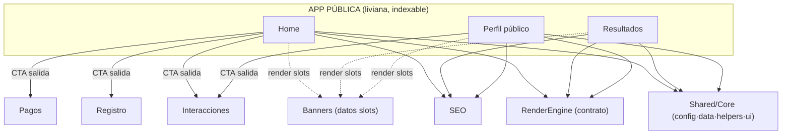

# Plan Maestro — App Pública CariHub

| Campo | Valor |
|-------|-------|
| **Versión** | 1.0.0 |
| **Fecha** | 2026-06-10 |
| **Estado** | Plan de diseño documental |
| **Modo** | Solo análisis — **sin runtime/carpetas/mover/Firestore/deploy/commit** |
| **Alcance** | Home · Resultados · Perfil público |

Canónico: [`PLAN-MAESTRO-APP-PUBLICA.json`](./PLAN-MAESTRO-APP-PUBLICA.json)
Base: [`ANALISIS-HOME-ECOSISTEMA.md`](./ANALISIS-HOME-ECOSISTEMA.md) · [`PLAN-MAESTRO-SHARED-CORE.md`](./PLAN-MAESTRO-SHARED-CORE.md) · [`AUDITORIA-ARQUITECTONICA-GLOBAL-CARIHUB.md`](./AUDITORIA-ARQUITECTONICA-GLOBAL-CARIHUB.md)

---

## Objetivo y principio rector

Definir la **App Pública liviana** compuesta únicamente por **Home, Resultados y Perfil público**, separando todo lo que hoy está mezclado en `index.html`.

> **Principio rector:** la App Pública es la capa de **adquisición y descubrimiento**: rápida, indexable, sin lógica privada. Todo lo que requiera sesión, escritura de dominio o panel se delega a otra app. Consume **Shared/Core** y **RenderEngine**; no implementa nada transversal.

---

## Inventario funcional actual (evidencia)

### Home — `index.html`
- **CSS (5):** `home.css`, `home-vcards.css`, `home-sector-scroll.css`, `home-modals.css`, `home-adultos-cat-picker.css`
- **JS externo (13):** `paises/estados/ciudades.js`, `catalogos-carihub.js`, `categoria-iconos.js`, `sectores-carihub.js`, `hero-home.js`, `sector-scroll-data.js`, `home-sector-scroll.js`, `home-vcards.js`, `adultos-cat-picker.js`, `home-ui.js`, `home-bridge.js`
- **Firebase SDK (4):** app, **auth**, firestore, **storage**
- **JS inline:** ~1330 líneas · **~38 referencias cruzadas** a otros dominios · **17 modales**

**Funciones propias de Home:** hero/carrusel, grids de sectores y categorías, buscador, picker adultos, rotación banners, vcards destacados.

**Funciones mezcladas (deben salir):** `abrirRegistro()` wizard · `abrirMiPerfil()/crearCuentaMinima()` login · `modalPanel/modalEditar` panel · `toggleFavorito()` favoritos · `enviarSolicitudAnuncio()` + `LINK_STRIPE/LINK_MERCADO_PAGO` · `modal-mensajes` · `modalDenuncia` · `registrarVisita()` · `signInAnonymously` automático.

### Resultados — `resultados.html`
- CSS inline · JS: firebase app + firestore.
- **Consulta actual (riesgo crítico):** `usuarios.where(aprobado==true).where(activo==true).where(vencido==false).get()` **+ filtrado en cliente**.
- Propias: render tarjetas, SEO línea `categoria·pais·estado·ciudad`, link a `perfil.html?id`, banner-slots → `registro-banner.html`.

### Perfil público — `perfil.html`
- CSS: `banners-publicidad.css` + `:root` inline · JS: firebase app + firestore + `modal-carihub.js`.
- Consulta: `usuarios.doc(id).get()`.
- Mezcladas: favorito, denunciar, `registrarVisita`, `banners-publicidad.css`.

---

## Qué se queda en cada pantalla

| Home | Resultados | Perfil público |
|------|------------|----------------|
| Hero/carrusel | Listado + paginación (server-side) | Render perfil aprobado/activo |
| Buscador (texto+categoría+geo) | Filtros por query (no cliente) | Galería pública |
| Grids sectores/categorías | Tarjetas (RenderEngine) | Contacto público (WhatsApp/tel) |
| Picker adultos | SEO de listado | SEO de perfil (meta/OG/JSON-LD) |
| Vcards destacados (RenderEngine) | Slots banner (render) | Slots banner (render) |
| Slots banner (render) | Link a perfil | |
| Navegación/CTAs + footer legal | | |

---

## Qué debe salir de la App Pública → destino

| Elemento actual en público | Destino |
|----------------------------|---------|
| Wizard registro (3 pasos, INE/selfie), `modalAntiBot` | **REGISTRO/WIZARD** |
| Login / alta cuenta (`abrirMiPerfil`, `crearCuentaMinima`, `modalMiPerfil`) | **REGISTRO/CUENTA** |
| Panel usuario / edición (`modalPanel`, `modalEditar`) | **DASHBOARDS** |
| Favoritos (`toggleFavorito`, `modal-favoritos`) | **INTERACCIONES** |
| Visitas (`registrarVisita` → `estadisticas_visitas`) | **INTERACCIONES** |
| Denuncias (`modalDenuncia`) | **INTERACCIONES → ADMIN** |
| Solicitud anuncio (`enviarSolicitudAnuncio`, `modalAnuncio`) | **BANNERS** |
| Links de pago (`LINK_STRIPE`, `LINK_MERCADO_PAGO`) | **PAGOS / CONTRATOS** |
| Mensajería/soporte (`modal-mensajes`, `modalContacto`) | **MESSENGER / SOPORTE** |
| firebaseConfig, helpers, catálogo, geo, `modal-carihub`, tokens | **SHARED/CORE** |

---

## Dependencias

| Dependencia | Estado actual | Futuro App Pública |
|-------------|---------------|--------------------|
| **Firebase** | 4 SDK en Home (incl. auth/storage) | Solo firestore (lectura) vía Core; auth/storage salen con sus apps |
| **Catálogo** | `catalogos-carihub.js` directo | Vía Shared/Core |
| **Geo** | `paises/estados/ciudades.js` directo | Vía Shared/Core |
| **Shared/Core** | inexistente (duplicado) | **Consumidor puro** |
| **RenderEngine** | inexistente (vcards inline) | Tarjetas/perfil vía contrato (sin SPEC aún) |
| **SEO** | render cliente débil | meta/OG/JSON-LD server-side |
| **ThemeEngine** | tokens dispersos | usa tokens base Core; extiende (no obligatorio v1) |
| **Banners** | links + slots inline | **solo render slots**; datos en BANNERS |
| **Registro** | wizard embebido | **CTA/enlace** |
| **Messenger** | `modal-mensajes` | NO contiene chat; perfil enlaza contacto público |

---

## Mapa de dependencias



---

## Riesgos actuales

| ID | Nivel | Riesgo | Mitigación |
|----|-------|--------|------------|
| AP-R01 | **Crítico** | Resultados lee toda la colección y filtra en cliente | Consultas server-side + índices + paginación |
| AP-R02 | Alto | `index.html` monolito ~1330 líneas, 8+ dominios | Extraer a apps + Core |
| AP-R03 | Alto | 4 SDK Firebase + `signInAnonymously` en Home | Solo firestore lectura; auth diferida |
| AP-R04 | Medio | 17 modales en Home (varios de otras apps) | Mover modales a sus apps; lazy |
| AP-R05 | Medio | Tokens `--rosa` divergentes / `home-modals.css` roto | Tokens Core |
| AP-R06 | Medio | SEO débil en Resultados/Perfil | SSR/prerender + meta dinámico |

## Deuda técnica actual

JS inline masivo · firebaseConfig ×6 · filtrado client-side en Resultados · reglas `proto-*` muertas · `--rosa` indefinida · `home-bridge.js` como parche · mezcla de responsabilidades en Home · `index-legacy.html` obsoleto en repo.

## Recomendaciones de limpieza

1. Extraer firebaseConfig/helpers/catálogo/geo a **Shared/Core** (P0).
2. **Resultados server-side** + paginación (P0).
3. Sacar wizard/cuenta/panel/favoritos/pagos/soporte de Home.
4. Reducir Home a hero + buscador + grids + vcards + slots + CTAs.
5. Eliminar `proto-*` muertos y corregir `--rosa`.
6. Eliminar `index-legacy.html` (verificando hosting ignore).
7. Diferir auth (visitante no necesita `signInAnonymously` salvo favoritos).
8. Reemplazar `home-bridge.js` por integración limpia tras la extracción.

---

## Límites de responsabilidad por pantalla

- **Home** — descubrir y dirigir: presentar oferta, buscar, enrutar. **No** gestiona sesión ni escribe dominio.
- **Resultados** — listar y filtrar perfiles públicos server-side. **No** lógica de cuenta ni escritura.
- **Perfil público** — mostrar un perfil e impulsar contacto. **No** panel del dueño (eso es Dashboard).

---

## Estructura ideal futura (lógica, sin crear carpetas)

```
APP PÚBLICA (consume Core + RenderEngine + SEO)
├── Home        index.html liviano · home.css · js/home-* (presentación)
├── Resultados  resultados.html · consultas server-side · ResultCard · SEO listado
└── Perfil      perfil.html · render perfil · SEO perfil
```

---

## Orden recomendado de extracción futura

| Paso | Acción | Prioridad | Depende |
|------|--------|-----------|---------|
| 1 | Adoptar Shared/Core en las 3 páginas | **P0** | PLAN-MAESTRO-SHARED-CORE |
| 2 | Resultados server-side + paginación + índices | **P0** | — |
| 3 | Extraer Registro/Cuenta fuera de Home | P1 | — |
| 4 | Extraer Favoritos/Visitas/Denuncias → Interacciones | P1 | — |
| 5 | Extraer Pagos/Anuncios → Banners/Pagos | P1 | — |
| 6 | Extraer Panel/Edición → Dashboard | P1 | — |
| 7 | RenderEngine para vcards/ResultCard/perfil | P2 | SPEC-RENDERENGINE |
| 8 | SEO server-side (meta/OG/JSON-LD) | P2 | — |
| 9 | Limpieza: `proto-*`, `--rosa`, `index-legacy`, `home-bridge` | P2 | — |

---

## ¿Procede crear PLAN-MAESTRO-APP-PUBLICA.md/json?

**Sí — ya entregados ambos.** La App Pública es el núcleo de adquisición; necesita plan propio para delimitar responsabilidades y guiar la extracción del monolito `index.html`.

**Depende de:** `PLAN-MAESTRO-SHARED-CORE` (P0) y `SPEC-RENDERENGINE` (P1, pendiente).

---

*Plan documental — no modifica código, Firestore, producción ni capas congeladas (VE 1.1.0 · FieldEngine 1.0.1 · Messenger 1.0.0 intactos). No inicia runtime ni SPEC.*
