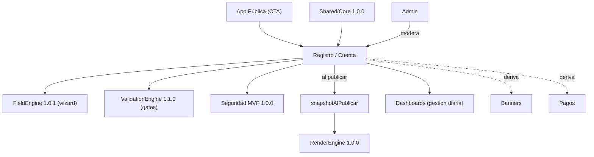

# Plan Maestro — Registro / Cuenta CariHub

| Campo | Valor |
|-------|-------|
| **Versión** | 1.0.0 |
| **Fecha** | 2026-06-10 |
| **Estado** | Plan de diseño documental |
| **Modo** | Solo análisis — **sin runtime/carpetas/mover/Firestore/deploy/commit** |

Canónico: [`PLAN-MAESTRO-REGISTRO-CUENTA.json`](./PLAN-MAESTRO-REGISTRO-CUENTA.json)
Base: [`PLAN-MAESTRO-APP-PUBLICA.md`](./PLAN-MAESTRO-APP-PUBLICA.md) · [`ACTA-CONGELAMIENTO-SHARED-CORE.md`](./ACTA-CONGELAMIENTO-SHARED-CORE.md) · [`ACTA-CONGELAMIENTO-RENDERENGINE.md`](./ACTA-CONGELAMIENTO-RENDERENGINE.md) · [`ACTA-CONGELAMIENTO-FIELDENGINE.json`](./ACTA-CONGELAMIENTO-FIELDENGINE.json) · [`AUDITORIA-ARQUITECTONICA-GLOBAL-CARIHUB.md`](./AUDITORIA-ARQUITECTONICA-GLOBAL-CARIHUB.md)

---

## Objetivo y principio rector

Extraer de Home **toda** la lógica de registro, wizard, verificación, perfil privado, edición y acceso a cuenta hacia un módulo separado **Registro/Cuenta**.

> **Principio rector:** Registro/Cuenta es la capa de **identidad y onboarding**: alta, autenticación, verificación, creación/edición de perfil (vía FieldEngine) y gestión de credenciales. Lo público (descubrimiento) es **App Pública**; la gestión diaria post-login es **Dashboards**. Consume Shared/Core + FieldEngine + ValidationEngine; **no** renderiza superficies públicas.

### Fronteras
| Capa | Responsabilidad |
|------|-----------------|
| **Registro/Cuenta** | Auth, alta, verificación (correo/teléfono/INE/selfie), wizard, recuperación/cambio de credenciales, estados de cuenta |
| Dashboards | Gestión diaria post-login (panel, métricas, renovaciones, notificaciones) |
| App Pública | Home/Resultados/Perfil — solo CTA de entrada |
| Interacciones | Favoritos/visitas/denuncias (Cuenta solo aporta sesión) |

---

## Inventario actual (evidencia en `index.html`)

**Modales:** `modal-registro` (445) · `modalAntiBot` (590) · `modalMiPerfil` (701, login/alta) · `modalPanel` (725, → Dashboards) · `modalEditar` (733).

**Funciones:** `abrirRegistro` (875) · `abrirMiPerfil` (885) · `crearCuentaMinima` (904, `createUserWithEmailAndPassword`) · login `signInWithEmailAndPassword` (1546) · `validarImagen` (1903) · `validarPaso1` (1922) · `validarPaso2` (1952) · `subirImagen` (Storage `verificaciones/{uid}/`).

**Estados:** `actualizacionPendiente` (1584/1861/2062) · `estadoRevision=actualizacion_pendiente` · `selfieURL`/`ineFrente` · escritura de perfil completo en `usuarios/{uid}` (monolito).

**Verificaciones presentes:** correo (Auth), INE frente, selfie, anti-bot.
**Ausentes (a añadir):** verificación de **teléfono**, **recuperación de cuenta**, **cambio de contraseña**.

**Schemas FieldEngine:** visitante · adultos · independiente · profesionista · negocio · componentes-ui.

---

## Qué está mezclado en Home

Wizard completo · alta/login (`modalMiPerfil`) · subida INE/selfie · anti-bot/edad/voluntariedad · panel de cuenta (`modalPanel`, → Dashboards) · edición (`modalEditar`) · lógica `actualizacionPendiente` · **4 SDK Firebase (incl. auth/storage) cargados en Home**.

## Qué debe moverse a Registro/Cuenta

`abrirRegistro` + wizard · `crearCuentaMinima`/login · `modalAntiBot` (edad/voluntariedad/anti-bot) · `validarPaso1/2`, `validarImagen`, `subirImagen` · `modalEditar` · estados de cuenta/perfil + `actualizacionPendiente` · INE/selfie/documentos.

## Qué debe quedar fuera de Registro/Cuenta

| Elemento | Destino |
|----------|---------|
| Panel diario, métricas, renovaciones, notificaciones | **Dashboards** |
| Favoritos / visitas / denuncias | **Interacciones** |
| Render de perfil público y resultados | **App Pública / RenderEngine** |
| Reglas de validación de valores | **ValidationEngine** |
| Resolución de schema de campos | **FieldEngine** |
| Contratos / cobros | **Pagos** |
| Solicitud de banners | **Banners** |
| Moderación / aprobación | **Admin** |

---

## Pantallas y rutas sugeridas

| Pantalla | Ruta | Visibilidad |
|----------|------|-------------|
| Acceso (login) | `/cuenta/acceso` | privada |
| Crear cuenta | `/cuenta/crear` | privada |
| Recuperar cuenta | `/cuenta/recuperar` | privada |
| Cambiar contraseña | `/cuenta/seguridad` | privada |
| Wizard de registro | `/registro/wizard` | privada (FieldEngine por subcategoriaId) |
| Verificación (correo/teléfono/INE/selfie) | `/registro/verificacion` | privada |
| Edición de perfil | `/registro/editar/{perfilId}` | privada |
| Estado de revisión | `/cuenta/estado` | privada |

> Todas **noindex** (coherente con RenderEngine: no renderiza superficies privadas).

---

## Flujos principales

1. **Registro de perfil** (persona/independiente/profesionista/adultos): crear cuenta → anti-bot+edad+voluntariedad → wizard FieldEngine → INE/selfie → enviar a revisión.
2. **Registro de negocio**: crear cuenta → wizard negocio → documentos → revisión.
3. **Registro de anunciante**: cuenta (`anuncianteId=usuarioId` MVP) → datos → deriva a **Banners**.
4. **Verificación de correo**: `sendEmailVerification` → gate `emailVerificado` para `enviar_revision`.
5. **Verificación de teléfono** *(nuevo)*: OTP SMS → `telefonoVerificado`.
6. **Verificación INE/selfie**: `validarImagen` → Storage → revisión admin.
7. **Edición de perfil**: wizard en modo edición → si cambia campos → `actualizacionPendiente`/re-revisión.
8. **Acceso a cuenta**: login email/password → gates de `estadoCuenta`.
9. **Recuperación** *(nuevo)*: `sendPasswordResetEmail`.
10. **Cambio de contraseña** *(nuevo)*: reauth → `updatePassword`.

---

## Validaciones y documentos

**Validaciones:**
- *Formato ligero (Core):* email, password fuerte, imagen tipo/tamaño, teléfono.
- *Reglas (ValidationEngine):* anti-bot/Turnstile, rate limits, mayoría de edad, voluntariedad, coherencia.
- *Resolución (FieldEngine):* obligatorios/opcionales por subcategoría, fotos min/max, verificación por arquetipo.
- *Gates de seguridad:* `enviar_revision` requiere `emailVerificado` + estado normal/observación; `guardar_borrador` permitido en restringido.

**Documentos:** persona/adultos → INE frente + selfie (+ voluntariedad) · profesionista → cédula + INE · negocio → comprobante/razón social. Almacenamiento en `Storage perfiles/{perfilId}/` (post-migración; hoy `verificaciones/{uid}/`). **Nunca públicos** (PrivacyGuard los excluye).

---

## Relación con módulos

| Módulo | Relación |
|--------|----------|
| **FieldEngine 1.0.1** | Fuente del wizard: `resolveRegistrationSchema(subcategoriaId)` |
| **ValidationEngine 1.1.0** | Valida valores/gates/anti-bot/rate limits; Registro no reimplementa |
| **Shared/Core 1.0.0** | initFirebase, helpers, catálogo, geo, modal, `fieldClient`/`validationClient` |
| **RenderEngine 1.0.0** | No usa (privado); al publicar genera `snapshotAlPublicar` que RE consume |
| **Seguridad MVP 1.0.0** | Estados, gates por acción, Turnstile, reputación |
| **Dashboards** | Tras login, gestión diaria; Registro entrega cuenta/perfil/estado |
| **Messenger** | Requiere cuenta activa (contexto de sesión) |
| **Banners** | Anunciante deriva a Banners; Registro crea cuenta/`anuncianteId` |
| **Pagos** | `contratar_plan` es gate aparte; Registro no cobra |
| **Admin** | Modera verificaciones/INE y aprueba revisión |



---

## Riesgos

| ID | Nivel | Riesgo | Mitigación |
|----|-------|--------|------------|
| RC-R01 | Alto | Datos sensibles (INE/selfie) en cliente o rutas indexables | Rutas privadas noindex + Storage protegido + PrivacyGuard |
| RC-R02 | Alto | Wizard escribe en `usuarios/{uid}` (no `perfiles/{perfilId}`) | Alinear con migración + bridge perfilId=usuarioId |
| RC-R03 | Alto | auth/storage SDK cargados en Home | Mover a app Registro |
| RC-R04 | Medio | Faltan verificación de teléfono, recuperación y cambio de contraseña | Incluir en diseño (flujos NUEVO) |
| RC-R05 | Medio | Solapamiento Registro vs Dashboards | Frontera: onboarding/identidad vs gestión diaria |
| RC-R06 | Medio | Reimplementar reglas de VE/FieldEngine | Consumir clientes |
| RC-R07 | Bajo | Estados inconsistentes en cutover | `config-estados-revision-publicacion` + lectura dual |

---

## Dependencias

- **Congeladas:** Shared/Core 1.0.0 · FieldEngine 1.0.1 · ValidationEngine 1.1.0 · Cuentas/Seguridad/Catálogo 1.0.0 · RenderEngine 1.0.0 (snapshot).
- **Precondiciones:** ejecución de migración usuarios→perfiles (para escribir en `perfiles/{perfilId}`) · decisión perfilId opaco (`URL-R02`).
- **Consumidores:** Dashboards · App Pública (CTA) · Banners/Pagos (derivaciones).

---

## Estructura ideal futura (lógica)

```
APP REGISTRO / CUENTA (privada, noindex)
├── auth/       acceso · crear · recuperar · seguridad(contraseña)
└── registro/   wizard(FieldEngine) · verificacion(correo/teléfono/INE/selfie) · editar/{perfilId} · estado
   consume: Shared/Core (fieldClient, validationClient, helpers, modal) · FieldEngine · ValidationEngine · Seguridad
   entrega: Dashboards (cuenta/perfil/estado) · RenderEngine (snapshotAlPublicar)
```

---

## Orden recomendado de extracción futura

| Paso | Acción | Prioridad | Depende |
|------|--------|-----------|---------|
| 1 | Extraer Auth (login/crear/recuperar/contraseña) a `/cuenta` | **P0** | Shared/Core |
| 2 | Extraer wizard a `/registro/wizard` con `fieldClient` | **P0** | FieldEngine + Core |
| 3 | Verificación (INE/selfie/correo) + añadir teléfono | P1 | VE + Seguridad |
| 4 | Edición de perfil + `actualizacionPendiente` | P1 | FieldEngine + estados |
| 5 | Escribir en `perfiles/{perfilId}` + `snapshotAlPublicar` | P1 | Migración + RenderEngine |
| 6 | Mover panel/gestión a Dashboards (quitar `modalPanel`) | P2 | Plan Dashboards |
| 7 | Limpieza Home: quitar auth/storage SDK y modales | P2 | — |

---

## ¿Procede crear PLAN-MAESTRO-REGISTRO-CUENTA.md/json?

**Sí — ya entregados ambos.** Es el módulo que **más descarga al monolito Home** y habilita el runtime del wizard.

**Siguientes pasos sugeridos:** `PLAN-MAESTRO-DASHBOARDS` (frontera post-login) y el **anexo operacional de migración** (precondición de runtime).

---

*Plan documental — no modifica código, Firestore, producción ni capas congeladas (Shared/Core 1.0.0 · RenderEngine 1.0.0 · VE 1.1.0 · FieldEngine 1.0.1 · Messenger 1.0.0 · Dashboards 1.0.0 intactas). No inicia runtime ni SPEC.*
