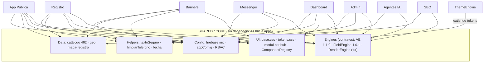

# Plan Maestro — Shared/Core CariHub

| Campo | Valor |
|-------|-------|
| **Versión** | 1.0.0 |
| **Fecha** | 2026-06-09 |
| **Estado** | Plan de diseño documental |
| **Modo** | Solo análisis — **sin runtime/carpetas/mover/Firestore/deploy/commit** |

Canónico: [`PLAN-MAESTRO-SHARED-CORE.json`](./PLAN-MAESTRO-SHARED-CORE.json)
Base: [`AUDITORIA-ARQUITECTONICA-GLOBAL-CARIHUB.md`](./AUDITORIA-ARQUITECTONICA-GLOBAL-CARIHUB.md) · [`MAPA-MAESTRO-CARIHUB.md`](./MAPA-MAESTRO-CARIHUB.md) · [`MATRIZ-MODULARIZACION-CARIHUB.md`](./MATRIZ-MODULARIZACION-CARIHUB.md)

---

## Objetivo y principio rector

Definir **Shared/Core** como base común para eliminar duplicación y habilitar la separación modular futura.

> **Regla de admisión:** un elemento entra en Core solo si lo consumen **2+ apps** y es **estable**. Si pertenece a un dominio, vive en su app. Core **no depende de ninguna app** (grafo acíclico).

---

## Inventario de elementos compartidos actuales

| Elemento | Ubicación actual | Consumidores | ¿Core? |
|----------|------------------|--------------|--------|
| **firebaseConfig + init** | Inline en 6 páginas activas | Todas | **Sí** |
| **Catálogo** (`catalogos-carihub`, `sectores-carihub`, `categoria-iconos`) | `public/js/` | Home, Banners, Registro, SEO | **Sí** |
| **Geo** (`paises`, `estados`, `ciudades`) | `public/` | Home, Banners | **Sí** (segmentar) |
| **Tokens visuales** | `home.css`, `home-modals.css`, `dashboard-rentero` (12 temas), `home-vcards` (6 templates), inline | Todas | **Base sí** / ThemeEngine extiende |
| **Helpers** (`textoSeguro`, `limpiarTelefono`, `normalizarTexto`, fecha) | Inline duplicado | Todas | **Sí** |
| **Validación cliente** (formato/imagen) | Inline | Registro, Banners | Solo formato ligero (reglas → VE) |
| **Constantes** (`WHATSAPP_ADMIN`, `ETIQUETAS_ESTADO`, `LINK_STRIPE`, `ADMIN_EMAIL`, `LIMITE_USUARIOS`) | Inline | Varias | Config sí / dominio no |
| **Assets** (logos, promo) | `img/home/` | Home, Resultados | Branding sí / creativos → Banners |
| **Scripts comunes** (`modal-carihub`) | `public/js/` | Perfil, Banner | **Sí** |
| **Estilos base** (`modal-carihub.css`, `banners-publicidad.css`, resets inline) | `public/css/` + inline | Varias | modal/reset sí / banners → Banners |
| **Componentes** (modal, ResultCard/Vcard, selector geo) | dispersos | Varias | modal/selector sí / ResultCard → RenderEngine |

---

## Matriz de duplicados detectados (evidencia real)

| Elemento | Copias activas | Páginas | Severidad | Acción |
|----------|----------------|---------|-----------|--------|
| `firebaseConfig` / init | **6** | index, resultados, perfil, admin, registro-banner, registro-banner2 | **Alta** | Core (init único) |
| `textoSeguro()` | **5** | index, admin, resultados, perfil, dashboard-rentero | Media | Core |
| reset CSS `*{box-sizing}` | ≥5 inline | casi todas | Baja | Core (`base.css`) |
| `:root` tokens `--rosa` | ≥4 divergentes | home.css, admin, resultados, perfil | Media | Core (`tokens.css`) + corregir home-modals |
| `ETIQUETAS_ESTADO_SOLICITUD_PUBLICIDAD` | **2** | index, admin | Media | → Banners/Admin (no Core) |
| `limpiarTelefono()` | **2** | index, perfil | Baja | Core |
| `CATEGORIAS_BUSCADOR` vs `catalogos-carihub` | 2 | index | Media | Eliminar duplicado → Core |
| catálogo/sectores/geo | 1 archivo, multi-consumidor | varias | Baja | Core (formalizar) |
| `modal-carihub.js/css` | 1 archivo, multi-consumidor | perfil, banner | Baja | Core (formalizar) |

> Nota: `index-legacy.html` también duplica todo, pero ya está excluido del hosting (`firebase.json` ignore) → candidato a eliminación, no se cuenta como activo.

---

## Qué debe entrar en Shared/Core

- **Core-Config:** firebase init único, `appConfig` (projectId, WhatsApp admin, RBAC/adminEmail, flags), endpoints.
- **Core-Data:** catálogo (alineado a 462), sectores, iconos, geo, `mapa-registro-categorias` (contrato).
- **Core-Helpers:** `textoSeguro`, `limpiarTelefono`, `normalizarTexto`, formato fecha, validación de formato ligera.
- **Core-UI:** `base.css` (reset), `tokens.css` (variables base), `modal-carihub`, ComponentRegistry (contrato).
- **Core-Engines (contratos/clientes):** ValidationEngine 1.1.0, FieldEngine 1.0.1, RenderEngine (contrato futuro).

## Qué NO debe entrar en Shared/Core

Reglas de negocio de validación (→ VE) · links de pago (→ Pagos) · etiquetas/lógica de anuncios (→ Banners/Admin) · wizard/INE/panel (→ Registro/Dashboard) · lógica admin (→ Admin) · editor de temas dinámico (→ ThemeEngine) · creativos de banners (→ Banners) · LLM/prompts (→ Agentes) · `home-vcards` específico de Home.

## Qué se queda local en cada app

| App | Local |
|-----|-------|
| PÚBLICA | `hero-home`, `home-ui`, `home-sector-scroll`, `adultos-cat-picker`, `home.css` |
| REGISTRO | wizard UI, uploaders INE/selfie |
| DASHBOARD | shell modular, panel estado, notificaciones UI |
| ADMIN | colas, `ETIQUETAS`, `LIMITE_USUARIOS` |
| MESSENGER | UI chat, listeners realtime |
| PAGOS | links pago, checkout |
| BANNERS | `precios-publicidad`, `banner-inventario-rotacion`, creativos |
| SEO | plantillas landing, head meta |
| THEMEENGINE | editor, skins dinámicos |

---

## Módulos que consumirán Shared/Core

| Sub-capa Core | Consumidores |
|---------------|--------------|
| Config | **Todas** |
| Data (catálogo/geo) | Pública, Registro, Banners, SEO, Admin |
| Helpers | **Todas** |
| UI (modal/tokens/base) | Todas con UI |
| Engine VE | Registro, Dashboard, Messenger, Admin, Banners, Pagos |
| Engine FieldEngine | Registro |
| Engine RenderEngine | Pública (Resultados/Perfil), SEO, ThemeEngine |

---

## Mapa de dependencias



**Antipatrón a evitar:** `App → App`. Toda compartición pasa por Core (grafo acíclico).

---

## Relación con motores y módulos

- **ValidationEngine 1.1.0** — Core expone **cliente/contrato**, NO reimplementa reglas. VE congelado es la fuente.
- **FieldEngine 1.0.1** — Core expone resolver de schemas; consumido por Registro.
- **RenderEngine** — sin SPEC. Core **reserva el contrato** (ResultCard, snapshot), sin anticipar implementación.
- **ThemeEngine** — extiende los tokens base de Core; su editor es app aparte.
- **Agentes IA** — consumen config y contratos VE; prompts/LLM no son Core.

---

## Riesgos

| ID | Nivel | Riesgo | Mitigación |
|----|-------|--------|------------|
| SC-R01 | Alto | God-module (lógica de dominio en Core) | Regla 2+ apps & estable |
| SC-R02 | Alto | Romper páginas al centralizar firebaseConfig | Extracción futura con verificación por página |
| SC-R03 | Medio | Tokens divergentes (`--rosa`) → regresión visual | Mapear cada valor antes de unificar |
| SC-R04 | Medio | Catálogo 462 rompe Home (espera 34) | Capa compatibilidad / gradual |
| SC-R05 | Medio | Geo grande en bundle Core | Segmentar/lazy por país |
| SC-R06 | Bajo | Duplicar reglas VE en Core | Core solo contrato/cliente |

### Riesgos si se extrae mal

- Core se vuelve un monolito de utilidades global (mismo problema que `index.html`, pero peor).
- Dependencias circulares App↔Core↔App.
- Cambios en Core obligan re-test de **todas** las apps (radio de impacto alto).
- Versionado sin disciplina rompe apps congeladas.
- Mezclar config sensible (RBAC, apiKey) sin control de acceso.

---

## Recomendaciones

1. Definir Core por **sub-capas** (config, data, helpers, ui, engines) con límites claros.
2. **Regla de admisión** estricta: 2+ apps consumidoras y estabilidad demostrada.
3. Core **sin dependencias hacia apps** (grafo acíclico).
4. **Versionar Core** con semver propio y changelog.
5. **`firebaseConfig` primero** (máxima duplicación, bajo riesgo de lógica).
6. Tokens: mapear divergencias antes de unificar; **corregir `home-modals.css`**.
7. **No anticipar RenderEngine** — solo reservar contrato.
8. Mantener VE/FieldEngine como fuentes; Core expone clientes.

---

## Estructura ideal futura (lógica, sin crear carpetas)

```
SHARED / CORE
├── config/     firebase.init · appConfig · rbac · flags · endpoints
├── data/       catálogo(462) · sectores · iconos · geo · mapa-registro
├── helpers/    text · phone · date · format-validation
├── ui/         base.css · tokens.css · modal-carihub · component-registry
└── engines/    validation-engine(cliente) · field-engine(cliente) · render-engine(contrato)
```

---

## Orden recomendado de extracción futura

| Paso | Elemento | Prioridad | Riesgo | Impacto |
|------|----------|-----------|--------|---------|
| 1 | Core-Config: `firebaseConfig` único | **P0** | Bajo | Alto |
| 2 | Core-Helpers: `textoSeguro`/`limpiarTelefono`/`normalizarTexto`/fecha | **P0** | Bajo | Medio |
| 3 | Core-UI base: `reset` + `tokens.css` (corregir `--rosa`) | P1 | Medio | Medio |
| 4 | Core-UI: `modal-carihub` formalizado | P1 | Bajo | Medio |
| 5 | Core-Data: catálogo+geo (alinear 462, segmentar geo) | P1 | Medio | Alto |
| 6 | Core-Engines: clientes VE/FieldEngine | P1 | Medio | Alto |
| 7 | Core-UI: ComponentRegistry / RenderEngine contrato | P2 | Medio | Alto |

### Prioridad por elemento

- **P0:** firebaseConfig único · helpers
- **P1:** tokens+base · modal-carihub · catálogo+geo · clientes VE/FieldEngine
- **P2:** ComponentRegistry / RenderEngine contrato
- **P3:** branding/assets base consolidados

---

## ¿Procede crear PLAN-MAESTRO-SHARED-CORE.md/json?

**Sí — ya entregados ambos.** Shared/Core es precondición **P0 transversal** sin la cual ninguna separación modular es segura.

**Siguientes planes sugeridos:** `SPEC-RENDERENGINE` (P1, hoy inexistente) y `PLAN-MAESTRO-APP-PUBLICA` (P0/P1).

---

*Plan documental — no modifica código, Firestore, producción ni capas congeladas (VE 1.1.0 · FieldEngine 1.0.1 · Messenger 1.0.0 intactos). No inicia runtime ni SPEC.*
