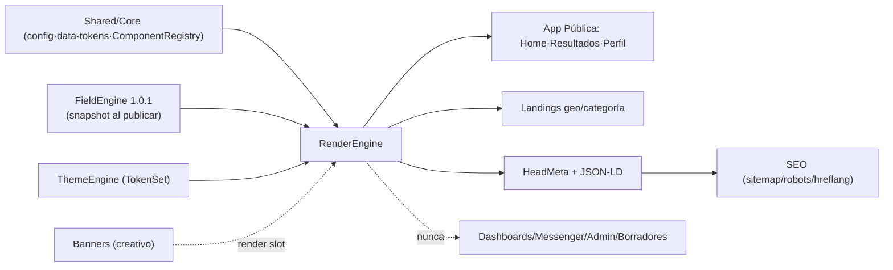

# SPEC-RENDERENGINE — Especificación técnica

| Campo | Valor |
|-------|-------|
| **Versión SPEC** | 1.0.0 |
| **Fecha** | 2026-06-10 |
| **Estado** | Diseño inicial |
| **Implementación autorizada** | **No** |
| **Modo** | Solo diseño y documentación — **sin runtime/carpetas/mover/Firestore/deploy/commit** |

Canónico: [`SPEC-RENDERENGINE.json`](./SPEC-RENDERENGINE.json) · Fixtures: [`fixtures-renderengine-golden.json`](./fixtures-renderengine-golden.json) · Auditoría: [`AUDITORIA-SPEC-RENDERENGINE.md`](./AUDITORIA-SPEC-RENDERENGINE.md)

Base/contrato: [`config-renderizado-dinamico-schema.json`](./config-renderizado-dinamico-schema.json) · [`PLAN-MAESTRO-SHARED-CORE.md`](./PLAN-MAESTRO-SHARED-CORE.md) · [`PLAN-MAESTRO-APP-PUBLICA.md`](./PLAN-MAESTRO-APP-PUBLICA.md) · [`OBSERVACION-ARQUITECTONICA-SEO.json`](./OBSERVACION-ARQUITECTONICA-SEO.json) · [`OBSERVACION-ARQUITECTONICA-THEMEENGINE.json`](./OBSERVACION-ARQUITECTONICA-THEMEENGINE.json)

---

## Propósito y principio rector

**RenderEngine** es el motor único de renderizado de **superficies públicas** de CariHub. Convierte **datos publicados** (snapshot del perfil + catálogo + geo) en HTML/DOM + metadatos, usando **componentes registrados** y **tokens visuales**.

> **Principio rector:** solo superficies públicas indexables. Datos por **snapshot congelado**, nunca lectura viva de campos privados. **Cero hardcode por subcategoría**. **Siempre fallback, nunca throw** que rompa la página. **PrivacyGuard obligatorio** antes de pintar.

**No hace:** persistir · validar valores (ValidationEngine) · resolver schema de registro (FieldEngine) · renderizar dashboards/messenger/admin/wizard/borradores.

---

## Superficies

| Renderiza (público indexable) | NO renderiza |
|-------------------------------|--------------|
| Home | Dashboards |
| Resultados | Admin |
| Perfil público publicado | Messenger |
| Landing país / estado / ciudad | Wizard registro |
| Landing categoría / categoría+geo | Borradores / perfil no publicado |
| Banner público (solo render) | Stories/live expirados · contenido login · preview borrador tema |

---

## API

| Método | Entrada | Salida |
|--------|---------|--------|
| `renderHome` | `HomeContext` | `RenderOutput` |
| `renderResults` | `ResultsContext` | `RenderOutput` (server-side, paginado) |
| `renderProfile` | `ProfileContext` | `RenderOutput` |
| `renderResultCard` | `ProfileSnapshot + RenderContext` | `ComponentHtml` |
| `renderProfileLayout` | `ProfileSnapshot + RenderContext` | `ComponentHtml` |
| `renderLanding` | `LandingContext` | `RenderOutput` |
| `renderBannerSlot` | `BannerSlotContext` | `ComponentHtml` (solo pinta creativo) |
| `renderHead` | `HeadContext` | `HeadMeta` (title/canonical/OG/Twitter/JSON-LD) |
| `resolveComponent` | `ProfileSnapshot + tipo` | `componentId` |
| `resolveUrl` | `UrlContext` | `{ canonical, slug, breadcrumb }` |
| `applyPrivacyGuard` | `ProfileSnapshot + camposPermitidos` | `SafeProfileView` |

---

## Entradas, salidas y datos mínimos

- **Entradas:** `RenderContext` (superficie, dispositivo, locale, tema, modoRender), `ProfileSnapshot` (publicado/activo), `LandingContext`, `BannerSlotContext`, `HeadContext`.
- **Salidas:** `RenderOutput` (`html`, `head`, `componentesUsados`, `assetsDiferidos`, `indexable`, `fallbacksAplicados`, `renderHash`).
- **Datos mínimos:**
  - **ResultCard:** foto, nombre/alias, `geo.ciudad`, label subcategoría, `componenteResultados`.
  - **Perfil:** snapshot público + `camposPublicosPerfil` + `componentePerfil` + `schemaVersion`.
  - **Regla:** si faltan mínimos → tarjeta/perfil mínimo seguro (foto, nombre, ciudad, etiqueta). Nunca página rota.

---

## Algoritmo de render

```
0. Validar superficie indexable; si privada → RENDER_SUPERFICIE_PRIVADA (403)
1. Cargar snapshot(s) — solo estadoPublicacion publicado|activo
2. applyPrivacyGuard(snapshot, camposPublicos*) — eliminar lista negra
3. resolveComponent → cargar plantilla del ComponentRegistry
4. FieldEngine (vía snapshot.schemaVersion) aporta labels/orden — NO re-resolver schema vivo
5. Aplicar TokenSet (Core base o ThemeEngine)
6. renderHead → meta/OG/JSON-LD desde datos públicos
7. Marcar assets diferidos (lazy) + dimensiones de imagen
8. Emitir RenderOutput + renderHash
```

### Resolución de componente (reusa contrato base)

```
1. snapshot.componenteResultados | componentePerfil
2. ¿en ComponentRegistry? → usar
3. fallbackPorArquetipo(arquetipoFinal)
4. fallbackPorTipoPerfil(tipoPerfilFinal)
5. desconocido/error → ResultCardGenerico | ProfileLayoutGenerico
6. NUNCA throw → fallback + log interno
```

---

## URLs, slugs y metadatos

| Superficie | URL canónica |
|------------|--------------|
| Perfil | `/perfil/{perfilId}[/{slug}]` (perfilId canónico) |
| Landing país | `/{pais}` |
| Landing estado | `/{pais}/{estado}` |
| Landing ciudad | `/{pais}/{estado}/{ciudad}` |
| Landing categoría | `/c/{subcategoriaId}` |
| Landing categoría+geo | `/{pais}/{estado}/{ciudad}/{subcategoriaId}` |
| Resultados | `/resultados?categoria=&pais=&estado=&ciudad=` (canonical normalizado) |

**Reglas:** slug estable, cambio → 301 (capa SEO) · sin PII en slug · normalización unicode · canonical único para evitar duplicados faceted.

**Schema.org (JSON-LD):** Person · LocalBusiness · ProfessionalService · ItemList · BreadcrumbList · WebSite+SearchAction.
**Open Graph:** `ogImage` = foto pública o fallback por tipoPerfil (mín 1200px). **Adultos:** noindex donde aplique, OG moderado.

---

## Rendimiento, Mobile-first y Core Web Vitals

- **Mobile-first:** render base móvil; paridad de contenido desktop/móvil (indexación móvil).
- **CWV:** LCP (hero/foto optimizada + dimensiones) · INP (JS mínimo en público) · CLS (reservar espacio imagen/banner).
- **Lazy loading:** imágenes fuera de viewport, banners, galería tras el fold.
- **Caché futura (diseño):** snapshot inmutable por `(perfilId, schemaVersion)` cacheable en CDN/edge; invalidación al republicar.
- **Presupuesto:** render público **sin auth ni storage SDK**; solo lectura firestore vía Core.

---

## Seguridad — PrivacyGuard (obligatorio)

Lista negra **nunca mostrar** (alineada al contrato base):

```
INE, ine, selfie, telefonoPrivado, telefono, rfc, razonSocial, datosFiscales,
facturacion, verificacion, cedula, numeroCedula, comprobanteCedula, notasAdmin,
documentosPrivados, comprobantePago, estadoRevision, decisionAdminCategoria, solicitudCategoriaId
```

- Elimina campos prohibidos **aunque vengan mal guardados** en el snapshot; intento de render privado → **log seguridad, no mostrar**.
- **No renderiza borradores:** solo `publicado|activo`; lo demás noindex y sin render público.
- **No renderiza superficies privadas:** dashboards, messenger, admin, wizard.

---

## Compatibilidad

| Capa | Relación |
|------|----------|
| **Shared/Core** | Consume firebase init, helpers, catálogo, geo, tokens, ComponentRegistry. No duplica utilidades. |
| **FieldEngine 1.0.1** | Resuelve schema en registro → genera snapshot al publicar. RenderEngine **consume snapshot**, no llama FE vivo. |
| **ValidationEngine 1.1.0** | Valida antes de publicar; no afecta render de campos ya aprobados. RenderEngine no valida. |
| **SEO 1.0.0** | RenderEngine produce `HeadMeta`/JSON-LD; SEO define sitemap/robots/hreflang y consume el output. Sin HTML legacy paralelo. |
| **ThemeEngine 1.3.0** | Provee `TokenSet`/plantillas autorizadas; RenderEngine las aplica. Sin HTML/JS crudo del usuario. |
| **Interacciones (futuro)** | Stories/live efímeros → noindex/noarchive. Sin dependencia en v1.0.0. |
| **Banners (futuro)** | RenderEngine pinta el creativo recibido; inventario/rotación/precios viven en Banners. |
| **Migración usuarios→perfiles** | Renderiza `perfiles/{perfilId}` con snapshot; **perfilId/URL canónica estable** para no perder ranking. |



---

## Errores y fallback

| Error | HTTP | Nota |
|-------|------|------|
| `RENDER_SUPERFICIE_PRIVADA` | 403 | dashboards/messenger/admin/borrador |
| `SNAPSHOT_NO_PUBLICADO` | 404 | estado ≠ publicado/activo |
| `COMPONENTE_DESCONOCIDO` | 200 | fallback genérico — no rompe |
| `CAMPO_PRIVADO_BLOQUEADO` | 200 | PrivacyGuard elimina + log |
| `GEO_INVALIDO_LANDING` | 404 | — |
| `SLUG_NO_CANONICO` | 301 | redirección (capa SEO) |

**Fallback:** componente inexistente → genérico · error render → tarjeta mínima (foto, nombre/alias, ciudad, etiqueta).

---

## Golden fixtures (15)

`R01` home móvil · `R02` resultados geo+categoría (**server-side**) · `R03` perfil escort adultos (**noindex**) · `R04` perfil negocio (LocalBusiness) · `R05` fallback por arquetipo · `R06` fallback genérico · `R07` PrivacyGuard bloquea privados · `R08` landing ciudad · `R09` landing categoría+geo · `R10` banner slot (solo render) · `R11` bloqueo superficie privada · `R12` borrador no renderiza · `R13` head dinámico profesionista · `R14` TokenSet ThemeEngine · `R15` URL canónica estable (migración).

Detalle en [`fixtures-renderengine-golden.json`](./fixtures-renderengine-golden.json).

---

## Fuera de alcance

Persistencia/escritura Firestore · ValidationEngine · FieldEngine (resolución viva) · wizard/registro · dashboards/admin/messenger · inventario/precios de Banners · editor ThemeEngine · sitemap/robots/hreflang runtime (capa SEO) · migración de datos · runtime/SSR real/CDN.

---

## Riesgos (resumen)

| ID | Nivel | Riesgo |
|----|-------|--------|
| RE-R01 | Alto | Fuga de datos privados si PrivacyGuard no es universal |
| RE-R02 | Alto | Indexar borradores/dashboards/messenger por error |
| RE-R03 | Medio | URLs inestables al migrar → pérdida ranking |
| RE-R04 | Medio | Thin content masivo (462 subcategorías × geo) |
| RE-R05 | Medio | Schema.org engañoso (verificaciones) |
| RE-R06 | Medio | Acoplar RenderEngine a FieldEngine vivo |

---

## ¿Procede ACTA-CONGELAMIENTO-RENDERENGINE?

**No todavía.** La auditoría detecta **3 hallazgos bloqueantes**:

1. **Shared/Core no congelado** (RenderEngine lo consume).
2. **Estrategia de render no decidida** (SSR / prerender / snapshot estático → impacta CWV, SEO y caché).
3. **URL canónica de migración** usuarios→perfiles sin confirmar.

**Ruta para congelar:** congelar Core → decidir estrategia de render → confirmar URL canónica → cerrar ajustes menores (`RE-AM-01..05`) → aprobación del product owner → **entonces** `ACTA-CONGELAMIENTO-RENDERENGINE`.

> Por eso **no se generó el acta** en esta entrega; permanece en estado de diseño.

---

*SPEC documental — no modifica código, Firestore, producción ni capas congeladas (VE 1.1.0 · FieldEngine 1.0.1 · Messenger 1.0.0 · Dashboards 1.0.0 intactos). No inicia runtime.*
