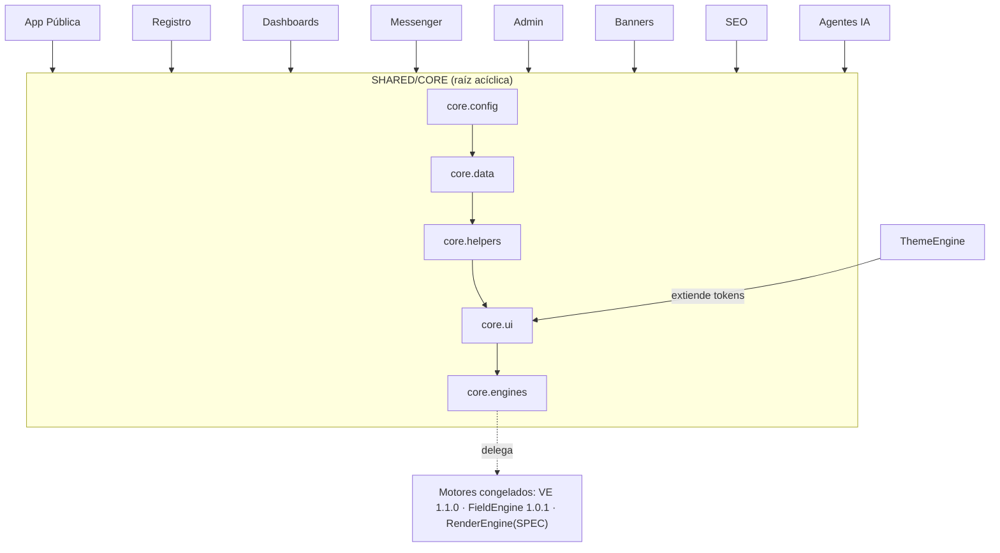

# SPEC-SHARED-CORE — Especificación técnica

| Campo | Valor |
|-------|-------|
| **Versión SPEC** | 1.0.0 |
| **Fecha** | 2026-06-10 |
| **Estado** | Diseño completo (SC-AO-01..06 cerrados) |
| **Implementación autorizada** | **No** |
| **Congelamiento aprobado** | **No** |
| **Modo** | Solo diseño y documentación — **sin runtime/carpetas/mover/Firestore/deploy/commit** |

Canónico: [`SPEC-SHARED-CORE.json`](./SPEC-SHARED-CORE.json) · Fixtures: [`fixtures-shared-core-golden.json`](./fixtures-shared-core-golden.json) · Auditoría: [`AUDITORIA-SPEC-SHARED-CORE.md`](./AUDITORIA-SPEC-SHARED-CORE.md)

Base: [`PLAN-MAESTRO-SHARED-CORE.md`](./PLAN-MAESTRO-SHARED-CORE.md) · [`AUDITORIA-SHARED-CORE.md`](./AUDITORIA-SHARED-CORE.md) · [`ADR-RENDER-STRATEGY.md`](./ADR-RENDER-STRATEGY.md) · [`ADR-URL-CANONICA-PERFILES.md`](./ADR-URL-CANONICA-PERFILES.md)

---

## Propósito y principio rector

**Shared/Core** es la capa base común: configuración, datos compartidos, helpers, UI base y **clientes de motores**. **No** implementa reglas de negocio (VE), **no** resuelve schemas (FE), **no** renderiza (RenderEngine) — expone **clientes/contratos** a esos motores.

> **Principio rector:** un elemento entra a Core solo si lo consumen **2+ apps** y es **estable**. Superficie pública explícita por sub-capa. **Grafo acíclico:** apps → Core; nunca Core → app.

---

## Superficie pública (exports por sub-capa)

| Namespace | Exports |
|-----------|---------|
| `core.config` | `initFirebase()`, `getApp/getAuth/getDb/getStorage`, `appConfig`, `rbac` |
| `core.data` | `catalog`, `geo` |
| `core.helpers` | `text`, `phone`, `date`, `format` |
| `core.ui` | `tokens`, `baseStyles`, `modal`, `componentRegistry` |
| `core.engines` | `validationClient`, `fieldClient`, `renderClient` |

**Regla de import:** apps importan desde `core.*`; **prohibido** que Core importe de apps.

---

## API (resumen)

| Método | Entrada → Salida |
|--------|------------------|
| `core.config.initFirebase()` | → `FirebaseHandles` (singleton idempotente) |
| `core.data.catalog.getSubcategoria(id)` | → `SubcategoriaCanonica\|null` |
| `core.data.catalog.compatProduccion()` | → `Subcategoria[]` (subconjunto ≈34) |
| `core.data.geo.listPaises()` | → `Pais[]` (índice liviano) |
| `core.data.geo.loadEstados(pais)` | → `Promise<Estado[]>` (lazy) |
| `core.helpers.text.textoSeguro(s)` | → `string` (HTML-escaped) |
| `core.helpers.phone.limpiarTelefono(s)` | → `string` |
| `core.helpers.format.slugify(s)` | → `string` (ADR-URL) |
| `core.ui.tokens.get(name)` | → valor CSS var |
| `core.ui.componentRegistry.get(id)` | → `ComponentDef\|fallback` |
| `core.engines.validationClient.evaluate(accion,ctx)` | → `Promise<VEResultado>` (delega) |
| `core.engines.fieldClient.resolve(ctx)` | → `ResolvedRegistrationSchema` (delega) |
| `core.engines.renderClient.resolveUrl(ctx)` | → `{canonical, slug, breadcrumb}` |

---

## Semver

- **PATCH:** correcciones, helpers no-breaking, fixtures, docs.
- **MINOR:** nuevos exports retrocompatibles, nuevos tokens/datos.
- **MAJOR:** cambio de firma, eliminación de export, cambio de contrato de cliente o tokens canónicos.
- Apps declaran rango compatible; MAJOR requiere acta y migración de consumidores.

---

## Cierre de ajustes obligatorios

### SC-AO-01 — SPEC formal ✔
API + tipos + semver + superficie pública definidos arriba.

### SC-AO-02 — Catálogo 34 vs 462 ✔
- **Core expone el catálogo CANÓNICO de diseño (462)** como fuente de verdad (`catalogo-2026-06-10@1.0.0`).
- `catalog.compatProduccion()` devuelve el **subconjunto activo (≈34)** vía flag `activoProduccion`.
- Superficies no migradas → compat (34); nuevas/migradas → 462. **No modifica producción.**

### SC-AO-03 — Tokens / `--rosa` ✔
Convención canónica con prefijo `--ch-`:

| Token | Valor | Uso |
|-------|-------|-----|
| `--ch-rosa` | `#ec2d7a` | Marca pública canónica (home/resultados/perfil) |
| `--ch-rosa-2` | `#d81b60` | Shade intermedio (gradientes) |
| `--ch-rosa-suave` | `#fce4ec` | Fondo suave |
| `--ch-rosa-admin` | `#c2185b` | Variante admin (alias documentado) |

`home-modals.css` (que usaba `--rosa/--rosa2/--rosa-suave` **no definidas**) referenciará los tokens `--ch-rosa*`. Corrección **documentada**, no implementada aquí.

### SC-AO-04 — Geo (segmentación) ✔
Índice de países liviano siempre cargado; **estados y ciudades lazy** por país/estado. MX puede precargarse.

### SC-AO-05 — Frontera clientes vs motores ✔
| Cliente | Delega a | No hace |
|---------|----------|---------|
| `validationClient` | ValidationEngine 1.1.0 | no implementa reglas/eventos |
| `fieldClient` | FieldEngine 1.0.1 | no resuelve merge |
| `renderClient` | RenderEngine 1.0.0 | no renderiza HTML |

Core = fachada delgada y estable; los motores son la fuente de verdad y pueden permanecer congelados.

### SC-AO-06 — Anti god-module + acíclico ✔
- **Admisión:** 2+ apps consumidoras y estabilidad demostrada; prohibido dominio en Core.
- **Acíclico:** apps → `core.*` permitido; `core → app` **prohibido** (falla build-time `CORE_IMPORT_CICLICO`).
- Capas: `core.config` (raíz) → `data` → `helpers` → `ui` → `engines` (solo referencia contratos de motores).

---

## Qué entra / qué NO entra

**Entra:** config Firebase/RBAC · catálogo canónico + compat · geo + segmentación · helpers puros · tokens base + `base.css` · modal · ComponentRegistry (contrato) · clientes VE/FE/RenderEngine.

**No entra:** reglas de VE · merge de FE · render HTML · links de pago · etiquetas/lógica de Banners · wizard/INE · lógica admin · editor ThemeEngine · LLM/prompts de Agentes · CSS específico de Home/Banners.

---

## Compatibilidad por módulo

| Módulo | Consume de Core |
|--------|-----------------|
| App Pública | config, data, helpers, ui, renderClient (consumidor puro) |
| Registro | fieldClient, validationClient, catalog, geo, modal |
| Dashboards | config, validationClient, helpers |
| Messenger | config, validationClient, helpers |
| Admin | config.rbac (fuente única), helpers |
| Banners | catalog, geo, modal, helpers |
| ThemeEngine | extiende tokens base |
| SEO | renderClient (head/canonical), data |
| Agentes IA | config, validationClient |

---

## Errores

| Error | Tipo | Nota |
|-------|------|------|
| `CORE_FIREBASE_NO_INIT` | 500 | `getDb`/`getAuth` antes de `initFirebase` |
| `CORE_SUBCATEGORIA_NO_ENCONTRADA` | 404 | — |
| `CORE_GEO_NO_DISPONIBLE` | 404 (retry) | lazy load falló |
| `CORE_TOKEN_NO_DEFINIDO` | 200 | fallback a token base + log |
| `CORE_IMPORT_CICLICO` | build-time | violación del grafo acíclico |

---

## Fixtures golden (20)

Config (singleton, sin-init, rbac) · helpers (textoSeguro, limpiarTelefono, normalizarTexto, slugify) · catálogo (462 canónico + compat 34) · geo (índice + lazy) · tokens (`--ch-rosa` + fallback) · UI (componentRegistry get/fallback) · clientes (validation/field/render) · arquitectura (acíclico, admisión anti god-module, rbac fuente única).

Detalle en [`fixtures-shared-core-golden.json`](./fixtures-shared-core-golden.json).

---

## Riesgos · Dependencias · Fuera de alcance

**Riesgos:** adopción parcial (páginas con config propia en transición) · `compatProduccion` desincronizado hasta migración · convivencia `--ch-*` con `--rosa` legacy · impacto de MAJOR de Core.

**Dependencias congeladas:** VE 1.1.0 · FieldEngine 1.0.1 · Catálogo/Cuentas/Seguridad/Dashboards/Messenger. **En diseño:** RenderEngine 1.0.0 · App Pública · SEO/ThemeEngine. **ADRs previos:** render-strategy, url-canónica.

**Fuera de alcance:** runtime de Core · migración real catálogo 34→462 · reglas VE / merge FE / render · editor ThemeEngine · reescritura de páginas · decisión perfilId opaco (Seguridad).

---

## Recomendación sobre congelamiento

**Puede congelarse — tras aprobación del product owner.** La auditoría de consistencia no encuentra hallazgos bloqueantes (SC-AO-01..06 cerrados).

**Ajustes recomendados no bloqueantes:** `validar-spec-shared-core.mjs` · `SPEC-SHARED-CORE-ALCANCE.md` · plan de adopción por página · decisión perfilId opaco con Seguridad.

> **No se generó `ACTA-CONGELAMIENTO-SHARED-CORE`** porque indicaste **no aprobar el congelamiento todavía**.

Al congelar Core → **cierra RE-AU-01** → habilita `ACTA-CONGELAMIENTO-RENDERENGINE`.

---

*SPEC documental — no modifica código, Firestore, producción ni capas congeladas. No aprueba congelamiento. No inicia runtime.*
